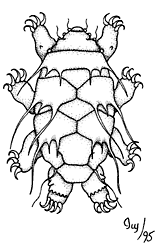

# [[Tardigrade]] 

Water Bears 

 

## #has_/text_of_/abstract 

> Tardigrades, known colloquially as water bears or moss piglets, 
> are a phylum of eight-legged segmented micro-animals. 
> 
> They were first described by the German zoologist Johann August Ephraim Goeze in 1773, who called them Kleiner Wasserbär 'little water bear'. In 1776, the Italian biologist Lazzaro Spallanzani named them **Tardigrada**, which means 'slow walkers'.
>
> They live in diverse regions of Earth's biosphere – mountaintops, the deep sea, tropical rainforests, and the Antarctic. Tardigrades are among the most resilient animals known, with individual species able to survive extreme conditions – such as exposure to extreme temperatures, extreme pressures (both high and low), air deprivation, radiation, dehydration, and starvation – that would quickly kill most other forms of life. Tardigrades have survived exposure to outer space.
>
> There are about 1,500 known species in the phylum Tardigrada, a part of the superphylum Ecdysozoa. The earliest known fossil is from the Cambrian, some 500 million years ago. They lack several of the Hox genes found in arthropods, and the middle region of the body corresponding to an arthropod's thorax and abdomen. Instead, most of their body is homologous to an arthropod's head.
>
> Tardigrades are usually about 0.5 mm (0.02 in) long when fully grown. They are short and plump, with four pairs of legs, each ending in claws (usually four to eight) or sticky pads. Tardigrades are prevalent in mosses and lichens and can readily be collected and viewed under a low-power microscope, making them accessible to students and amateur scientists. Their clumsy crawling and their well-known ability to survive life-stopping events have brought them into science fiction and popular culture including items of clothing, statues, soft toys and crochet patterns.
>
> [Wikipedia](https://en.wikipedia.org/wiki/Tardigrade) 

## Phylogeny 

-   « Ancestral Groups 
    -   [Bilateria](Bilateria)
    -   [Animals](Animals)
    -   [Eukaryotes](Eukaryotes)
    -   [Tree of Life](../../../Tree_of_Life.md)

-   ◊ Sibling Groups of  Bilateria
    -   [Deuterostomia](Deutero.md)
    -   [Arthropoda](Arthropoda)
    -   [Onychophora](Onychophora)
    -   Tardigrada
    -   [Nematoda](Nematoda)
    -   [Nematomorpha](Nematomorpha)
    -   [Kinorhyncha](Kinorhyncha)
    -   [Loricifera](Loricifera)
    -   [Priapulida](Priapulida)
    -   [Arrow_Worm](Arrow_Worm.md)
    -   [Gastrotricha](Gastrotricha)
    -   [Rotifera](Rotifera)
    -   [Gnathostomulida](Gnathostomulida)
    -   [Limnognathia maerski](Limnognathia_maerski)
    -   [Cycliophora](Cycliophora)
    -   [Mesozoa](Mesozoa)
    -   [Platyhelminthes](Platyhelminthes)
    -   [Annelida](Annelida)
    -   [Bryozoa](Bryozoa)
    -   [Sipuncula](Sipuncula)
    -   [Mollusca](Mollusca)
    -   [Nemertea](Nemertea)
    -   [Entoprocta](Entoprocta)
    -   [Phoronida](Phoronida)
    -   [Brachiopoda](Brachiopoda)

-   » Sub-Groups 
	-   *Eutardigrada*
	    -   *Apochela*
	    -   *Parachela*
	-   *Thermozodium esakii* [(Mesotardigrada)]
	-   *Heterotardigrada*[ (monophyly uncertain) ]
	    -   *Arthrotardigrada*
	    -   *Echiniscoidea*

## Title Illustrations

---------------------------------------------------------------------------

Scientific Name ::  Tardigrada
Comments          Diagram of the main external features of a tardigrade
Creator           Ivy Livingstone
Copyright ::         © 1995 [BIODIDAC](http://biodidac.bio.uottawa.ca/index.htm) 

