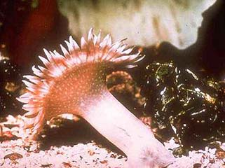
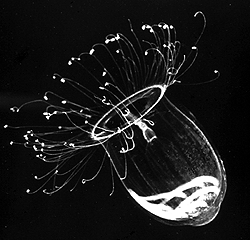

# [[Cnidaria]]

Sea anemones, corals, jellyfish, sea pens, hydra 

  

## #has_/text_of_/abstract 

> **Cnidaria** ( nih-DAIR-ee-ə, ny-) is a phylum under kingdom Animalia containing over 11,000 species of aquatic invertebrates found both in freshwater and marine environments (predominantly the latter), including jellyfish, hydroids, sea anemones, corals and some of the smallest marine parasites. Their distinguishing features are an uncentralized nervous system distributed throughout a gelatinous body and the presence of cnidocytes or cnidoblasts, specialized cells with ejectable flagella used mainly for envenomation and capturing prey. Their bodies consist of mesoglea, a non-living, jelly-like substance, sandwiched between two layers of epithelium that are mostly one cell thick. Cnidarians are also some of the few animals that can reproduce both sexually and asexually.
>
> Cnidarians mostly have two basic body forms: swimming medusae and sessile polyps, both of which are radially symmetrical with mouths surrounded by tentacles that bear cnidocytes, which are specialized stinging cells used to capture prey. Both forms have a single orifice and body cavity that are used for digestion and respiration. Many cnidarian species produce colonies that are single organisms composed of medusa-like or polyp-like zooids, or both (hence they are trimorphic). Cnidarians' activities are coordinated by a decentralized nerve net and simple receptors. Cnidarians also have rhopalia, which are involved in gravity sensing and sometimes chemoreception. Several free-swimming species of Cubozoa and Scyphozoa possess balance-sensing statocysts, and some have simple eyes. Not all cnidarians reproduce sexually, but many species have complex life cycles of asexual polyp stages and sexual medusae stages. Some, however, omit either the polyp or the medusa stage, and the parasitic classes evolved to have neither form.
>
> Cnidarians were formerly grouped with ctenophores, also known as comb jellies, in the phylum Coelenterata, but increasing awareness of their differences caused them to be placed in separate phyla. Most cnidarians are classified into four main groups: the almost wholly sessile Anthozoa (sea anemones, corals, sea pens); swimming Scyphozoa (jellyfish); Cubozoa (box jellies); and Hydrozoa (a diverse group that includes all the freshwater cnidarians as well as many marine forms, and which has both sessile members, such as Hydra, and colonial swimmers (such as the Portuguese man o' war)). Staurozoa have recently been recognised as a class in their own right rather than a sub-group of Scyphozoa, and the highly derived parasitic Myxozoa and Polypodiozoa were firmly recognized as cnidarians only in 2007.
>
> Most cnidarians prey on organisms ranging in size from plankton to animals several times larger than themselves, but many obtain much of their nutrition from symbiotic dinoflagellates, and a few are parasites. Many are preyed on by other animals including starfish, sea slugs, fish, turtles, and even other cnidarians. Many scleractinian corals—which form the structural foundation for coral reefs—possess polyps that are filled with symbiotic photo-synthetic zooxanthellae. While reef-forming corals are almost entirely restricted to warm and shallow marine waters, other cnidarians can be found at great depths, in polar regions, and in freshwater.
>
> Cnidarians are a very ancient phylum, with fossils having been found in rocks formed about 580 million years ago during the Ediacaran period, preceding the Cambrian Explosion. Other fossils show that corals may have been present shortly before 490 million years ago and diversified a few million years later. Molecular clock analysis of mitochondrial genes suggests an even older age for the crown group of cnidarians, estimated around 741 million years ago, almost 200 million years before the Cambrian period, as well as before any fossils. Recent phylogenetic analyses support monophyly of cnidarians, as well as the position of cnidarians as the sister group of bilaterians.
>
> [Wikipedia](https://en.wikipedia.org/wiki/Cnidaria) 

## Phylogeny 

-   « Ancestral Groups  
    -   [Animals](Animals)
    -   [Eukaryotes](Eukaryotes)
    -   [Tree of Life](../../Tree_of_Life.md)

-   ◊ Sibling Groups of  Animals
    -   [Bilateria](Bilateria)
    -   [Myxozoa](Myxozoa)
    -   Cnidaria
    -   [Ctenophora](Ctenophora)
    -   [Placozoa](Placozoa)
    -   [Sponge](Sponge.md)

-   » Sub-Groups
    -   [Anthozoa](Anthozoa.md)

## Introduction

[Daphne G. Fautin and Sandra L. Romano]()

The exclusively aquatic phylum Cnidaria is represented by polyps such as
sea anemones and corals, and by medusae such as jellyfish. A polypoid or
a medusoid cnidarian is a radially or biradially symmetrical,
uncephalized animal with a single body opening, the mouth. The mouth is
surrounded by tentacles studded with microscopic stinging capsules known
as nematocysts that are the agents of offense and defense. The
possession of intrinsic nematocysts is the defining characteristic of
the phylum (Hessinger and Lenhoff 1988); nematocysts are the most
diverse and widespread of three types of cnidae (cnidos = thread) \--
hence the preferred name of the phylum.

Cnidarians are diploblastic \-- that is, the body and tentacles consist
of two cell layers, the endoderm (sometimes referred to as the
gastrodermis) and the ectoderm (the epidermis). Between the two cell
layers is the mesoglea, which ranges from little more than a glue to
bind the layers (for example, in Hydra) to the vast bulk of the animal
(for example, in jellyfish of Class Scyphozoa). The body encompasses a
single sac-like body space, the coelenteron (koilos = cavity; enteron =
intestine), which communicates with the surrounding medium through the
mouth. The less preferred name of the phylum, Coelenterata, is based on
this attribute. The coelenteron (also termed the gastrovascular cavity)
serves for gas exchange and digestion.

All cnidarians are carnivorous, with cnidae and tentacles active in prey
capture. Because polyps are typically sessile, and only some medusae
possess sensory structures (the most sophisticated occur in the Cubozoa;
Pearse and Pearse 1978), cnidarians are generally believed to be passive
predators, feeding on prey items that blunder into their tentacles. Some
cnidarians can absorb dissolved organic matter directly from seawater
(e.g. Schlichter 1975), but it is not known how widespread this ability
is. Living within the tissues of anthozoans of many species and
hydrozoans and scyphozoans of a small number of species are unicellular
algae from which the animals derive reduced carbon (Shick 1991).
Dinoflagellate symbionts, termed zooxanthellae, are by far the most
common algal symbionts; they are exclusively marine. Green algal
symbionts, termed zoochlorellae, occur in both marine and freshwater
cnidarians.

The text-book depiction of the typical cnidarian life cycle is an
alternation between a medusa and a polyp (termed metagenesis), the
former the sexually reproductive stage and the latter the asexual stage.
In fact, an attribute of the entire class Anthozoa is the absence of a
medusa. At least some individuals of all anthozoan species form gametes;
those of some species may reproduce vegetatively as well. The other
three classes \-- Cubozoa, Hydrozoa, and Scyphozoa \-- are often grouped
as the \"Medusozoa\" because the medusa phase is present in them all.
Indeed, the medusa dominates the life cycle of members of the classes
Cubozoa and Scyphozoa (Cubozoa was formerly considered an order of
Scyphozoa, and some specialists still consider it as such). Life cycles
of the Hydrozoa are the most diverse in the phylum: although the polyp
is the more conspicuous and persistent stage in most taxa, some lack the
medusa phase, whereas others lack the polyp phase. Hydra, which is used
in many textbooks to illustrate the phylum, is utterly atypical: a
hydrozoan, it lacks a medusa, it has aggregations of gametogenic tissue
that function as gonads, and it is among only a handful of freshwater
cnidarian species.

The cnidarian larva is the planula, a pear-shaped, entirely ciliated
animal. In the \"typical\" cnidarian life cycle, male and female medusae
spawn freely into the sea, where fertilization occurs and a planula
develops. At metamorphosis, the planula settles on and attaches to the
substratum, where it metamorphoses into a polyp. The primary polyp
produces additional polyps asexually, by budding, stolonic outgrowth, or
some other process, to form a clone or a colony. At the appropriate
time, determined perhaps by size of the colony or environmental
conditions, rather than or in addition to polyps, medusae are produced
asexually (in Cubozoa, each polyp metamorphoses into a medusa). They are
released to take up a pelagic existence and the cycle begins anew.

Idealized lifecycle of the Cnidaria.

### Characteristics

The cnida, or nematocyst, which is the sine qua non of the phylum, is
secreted by the Golgi apparatus of a cell termed a cnidoblast (Watson
1988). A cnida therefore is technically not an organelle, but, rather,
the most complex secretory product known. Upon receiving the appropriate
physical and/or chemical stimulus, a cnida fires, everting a tubule many
times the length of the capsule. The tubule may deliver a toxin, may
stick to a prey item, or may entangle an object, depending on the type
of cnida. A cnida can fire but once. There are three major types of
cnidae: nematocysts, spirocysts, and ptychocysts. Nematocysts occur in
all classes of Cnidaria, but some of the 30-plus varieties of
nematocysts are restricted to members of certain classes (Fautin and
Mariscal 1991). Spirocysts are found only in Anthozoa; they are adhesive
in nature. Ptychocysts are the most taxonomically restricted in
distribution, occurring only in the anthozoan order Ceriantharia; their
function is to entangle bits of mud among their robust tubules to form
the feltwork that constitutes the tube of these burrowing animals.

**Left:** Fired \"basitrich\" (basitrichous isorhiza) from a sea
anemone. The now empty capsule is in the lower right of the photo; the
spiny basal part of the fired tubule extends to the upper left; beyond
the frame of the photo is the non-spiny, distal part of the tubule,
which is many times longer than the capsule. **Middle:** \"Holotrich\"
(holotrichous isorhiza) from a corallimorpharian. **Right:** Unfired
\"basitrichs\" (basitrichous isorhizas) from a sea anemone. The
longitudinal line inside each capsule is the spiny basal part of the
unfired tubule.

Two body forms are characteristic of cnidarians \-- the polyp and the
medusa. With a few exceptions, a columnar polyp is sedentary, being
attached to or burrowed into the substratum by the end opposite the
mouth. Thus its tentacles are typically considered to point upward and
outward. Polyps of some species propagate vegetatively, forming colonies
(if the progeny remain attached to one another) or clones (if the
progeny separate). Polymorphism occurs in colonies of some species of
hydrozoans and anthozoans, the polyps being specialized for functions
such as feeding, defense, and sexual reproduction. Polyps of some taxa
form a skeleton within or external to their tissues; some skeletons are
mineralic (of calcium carbonate), others are organic (of chitin or
another carbohydrate), and some are both. The spheroidal or discoidal
medusae are solitary, and those of most species are pelagic. Although
typically depicted as living with mouth and tentacles pointing down,
medusae assume all orientations in the water. Medusae of few species
possess the ability to propagate vegetatively. The common name of
medusae, jellyfish, alludes to the massive amount of mesoglea that
contributes to their buoyancy.

All cnidarians have hydrostatic skeletons, regardless of whether they
also have mineralic and/or organic exoskeletons or endoskeletons. The
muscles of the body wall operate against the fluid in the coelenteron to
extend individual polyps and to effect the swimming of medusae, for
example. The hollow tentacles of anthozoans are extended through
hydrostatic action as well.

### Discussion of Phylogenetic Relationships

Cnidaria is thought to have one of the longest fossil histories of
metazoan phlya with representatives in the Ediacaran fauna of the late
Precambrian (Scrutton 1979). These earliest fossils are both medusoid
and polypoid, and thought to represent all cnidarian classes (Scrutton
1979).

The four extant cnidarian classes are identifiable as early as the
Ordovician (Robson 1985), but evolutionary relationships among them have
been the subject of much debate (e.g. Brooks 1886, Hyman 1940, Jagersten
1955, Hand 1959, Pantin 1960, Werner 1973, Petersen 1979, Barnes 1987,
Ax 1989). Anthozoa is alternatively considered the most basal or the
most derived group. The former hypothesis posits that the polyp is the
original body form, with the medusa (and metagenesis) being derived
(Fig. 1A). The latter perspective is that, in the \"typical\" life
cycle, the medusa is gametogenic, and so constitutes the definitive, or
adult, stage, with the polyp being a persistent larva. Thus, it is
reasoned, the polyp evolved secondarily, and loss of the original body
form, the medusa, places Anthozoa as the most derived taxon (Fig. 1B). A
comprehensive morphological cladistic analysis by Schuchert (1993)
supports the basal position of Anthozoa with the Scyphozoa and Cubozoa
being more closely related to each other than to Hydrozoa.
Morphological, mtDNA, and 18S rDNA data separately and together also
support the basal position of Anthozoa but do not resolve the
relationships among Scyphozoa, Cubozoa and Hydrozoa (Bridge et al.
1995). The phylogenetic tree at the beginning of this page is that of
Bridge et al. (1995). Neither of these treatments attempts to include
the extinct class Conulata, which has been considered by most
paleontologists to be related to the Scyphozoa.

Alternative views of cnidarian life-cycle evolution and systematic
relationships. (After Bridge et al. 1995.)

Their diploblastic structure and their single body opening and cavity
had been thought to ally cnidarians with ctenophores. Indeed, until
relatively recently the phylum Coelenterata was considered to include
animals now placed in Cnidaria and Ctenophora. However, ctenophores lack
a metagenetic life cycle and cnidae. Cnidae have been found in one
ctenophore, but it is now known that the ctenophore acquires those
cnidae from the hydromedusae upon which it preys (Mills and Miller
1984). Thus, it is generally agreed that the similarity in body form
between pelagic ctenophores and pelagic cnidarians is convergent;
benthic ctenophores do not resemble cnidarians at all. Cnidaria,
therefore, is a well circumscribed taxon; it is considered by many to be
a sister group of all metazoans other than sponges.

## Title Illustrations

--------------------------------------------
[Heteractis malu](Cnidaria/Heteractis_malu.jpg) 
Scientific Name ::     Heteractis malu
Comments             A sea anemone (Anthozoa)
Reference            From D. G. Fautin and G. R. Allen. 1992. Field Guide to Anemonefishes and their Host Sea Anemones. Western Australia Museum.
Creator              photographed by Art Reed
Specimen Condition   Live Specimen
Copyright ::            © 1992 Western Australia Museum

---------------------------------------------
 
Scientific Name ::  Aglantha digitale
Comments          A direct-developing holoplanktonic hydromedusa (Hydrozoa) that has no polyp. The gonads are visible through the transparent bell.
Copyright ::         © 1998 [Claudia E. Mills](http://faculty.washington.edu/cemills/)

## Confidential Links & Embeds: 

### [Cnidaria](/_Standards/bio/bio~Domain/Eukaryotes/Animals/Cnidaria.md) 

### [Cnidaria.public](/_public/bio/bio~Domain/Eukaryotes/Animals/Cnidaria.public.md) 

### [Cnidaria.internal](/_internal/bio/bio~Domain/Eukaryotes/Animals/Cnidaria.internal.md) 

### [Cnidaria.protect](/_protect/bio/bio~Domain/Eukaryotes/Animals/Cnidaria.protect.md) 

### [Cnidaria.private](/_private/bio/bio~Domain/Eukaryotes/Animals/Cnidaria.private.md) 

### [Cnidaria.personal](/_personal/bio/bio~Domain/Eukaryotes/Animals/Cnidaria.personal.md) 

### [Cnidaria.secret](/_secret/bio/bio~Domain/Eukaryotes/Animals/Cnidaria.secret.md)

