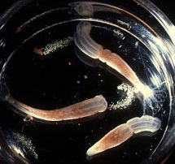
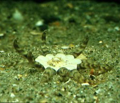

## Phylogeny 

-   « Ancestral Groups  
    -   [Nynantheae](Nynantheae)
    -   [Actiniaria](Actiniaria)
    -   [Zoantharia](Zoantharia)
    -   [Anthozoa](Anthozoa)
    -   [Cnidaria](Cnidaria)
    -   [Animals](Animals)
    -   [Eukaryotes](Eukaryotes)
    -   [Tree of Life](../../../../../../../Tree_of_Life.md)

-   ◊ Sibling Groups of  Nynantheae
    -   Athenaria
    -   [Boloceroidaria](Boloceroidaria)
    -   [Thenaria](Thenaria)

-   » Sub-Groups
    -   [Edwardsiidae](Edwardsiidae.md)
    -   [Halcampoididae](Halcampoididae)
    -   [Haloclavidae](Haloclavidae.md)
    -   [Andresiidae](Andresiidae)
    -   [Halcampidae](Halcampidae)
    -   [Limnactiniidae](Limnactiniidae)
    -   [Haliactiidae](Haliactiidae)
    -   [Octineonidae](Octineonidae)
    -   [Andwakiidae](Andwakiidae.md)

# Athenaria 

-   *[Edwardsiidae](Edwardsiidae.md "go to ToL page")*
-   *[Halcampoididae](Halcampoididae)*
-   *[Haloclavidae](Haloclavidae.md "go to ToL page")*
-   *[Andresiidae](Andresiidae)*
-   *[Halcampidae](Halcampidae)*
-   *[Limnactiniidae](Limnactiniidae)*
-   *[Haliactiidae](Haliactiidae)*
-   *[Octineonidae](Octineonidae)*
-   *[Andwakiidae](Andwakiidae.md "go to ToL page")*

Containing group: [Nynantheae](Nynantheae.md)

### Characteristics

Nyantheae \[sic\] without basilar muscles. Body as a rule very elongate,
more or less vermiform, often divisible into different regions. Aboral
end of the body usually rounded being a physa often used for digging,
which does sometimes adhere to small objects and then becomes more or
less flattened. As a rule no sphincter, but when present this may be
endodermal or mesogloeal. Tentacles and mesenteries usually few, rarely
more than 48, cyclically arranged. Mesenteries as a rule divisible into
macro- and microcnemes. Retractors of the macrocnemes usually strongly
restricted, reniform, or circumscribed. Parietal part of the
longitudinal mesenterial muscles commonly differentiated from the
retractors forming a distinct parietal muscle together with the
parietobasilar muscles. In the more differentiated genera acontia may
appear.

### References

Carlgren, O. 1949. A Survey of the Ptychodactiaria, Corallimorpharia and
Actiniaria. Kungl. Svenska Vetenskapsakadamiens Handlingar, series 4,
volume 1, number 1.

## Title Illustrations

Left:\
Nematostella vectensis (Edwardsiidae) with egg masses.\
Permission by Prof. C. Hand to take this picture in the Bodega Marine
Lab, University of California is gratefully acknowledged.

Right:\
Peachia hastata (Haloclavidae).\
France. Collection and donation of this specimen by Dr. R. Dekker (NIOZ,
Texel, Netherlands) is gratefully acknowledged.

Photographs copyright © 2000, Ron Ates.


  -------
  Copyright ::   © 2000 Ron Ates
  -------


  -------
  Copyright ::   © 2000 Ron Ates
  -------

## Confidential Links & Embeds: 

### #is_/same_as :: [Athenaria](/_Standards/bio/bio~Domain/Eukaryotes/Animals/Cnidaria/Anthozoa/Zoantharia/Actiniaria/Nynantheae/Athenaria.md) 

### #is_/same_as :: [Athenaria.public](/_public/bio/bio~Domain/Eukaryotes/Animals/Cnidaria/Anthozoa/Zoantharia/Actiniaria/Nynantheae/Athenaria.public.md) 

### #is_/same_as :: [Athenaria.internal](/_internal/bio/bio~Domain/Eukaryotes/Animals/Cnidaria/Anthozoa/Zoantharia/Actiniaria/Nynantheae/Athenaria.internal.md) 

### #is_/same_as :: [Athenaria.protect](/_protect/bio/bio~Domain/Eukaryotes/Animals/Cnidaria/Anthozoa/Zoantharia/Actiniaria/Nynantheae/Athenaria.protect.md) 

### #is_/same_as :: [Athenaria.private](/_private/bio/bio~Domain/Eukaryotes/Animals/Cnidaria/Anthozoa/Zoantharia/Actiniaria/Nynantheae/Athenaria.private.md) 

### #is_/same_as :: [Athenaria.personal](/_personal/bio/bio~Domain/Eukaryotes/Animals/Cnidaria/Anthozoa/Zoantharia/Actiniaria/Nynantheae/Athenaria.personal.md) 

### #is_/same_as :: [Athenaria.secret](/_secret/bio/bio~Domain/Eukaryotes/Animals/Cnidaria/Anthozoa/Zoantharia/Actiniaria/Nynantheae/Athenaria.secret.md)

