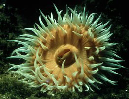

## Phylogeny 

-   « Ancestral Groups  
    -   [Thenaria](Thenaria)
    -   [Nynantheae](Nynantheae)
    -   [Actiniaria](Actiniaria)
    -   [Zoantharia](Zoantharia)
    -   [Anthozoa](Anthozoa)
    -   [Cnidaria](Cnidaria)
    -   [Animals](Animals)
    -   [Eukaryotes](Eukaryotes)
    -   [Tree of Life](../../../../../../../../Tree_of_Life.md)

-   ◊ Sibling Groups of  Thenaria
    -   [Endomyaria](Endomyaria)
    -   [Mesomyaria](Mesomyaria)
    -   Acontiaria

-   » Sub-Groups
    -   [Acontiophoridae](Acontiophoridae)
    -   [Bathyphelliidae](Bathyphelliidae)
    -   [Isophelliidae](Isophelliidae)
    -   [Hormathiidae](Hormathiidae)
    -   [Sagartiomorphidae](Sagartiomorphidae)
    -   [Sagartiidae](Sagartiidae)
    -   [Metridiidae](Metridiidae)
    -   [Aiptasiidae](Aiptasiidae)
    -   [Aiptasiomorphidae](Aiptasiomorphidae)
    -   [Diadumenidae](Diadumenidae)
    -   [Nemanthidae](Nemanthidae)

# Acontiaria 

-   *[Acontiophoridae](Acontiophoridae)*
-   *[Bathyphelliidae](Bathyphelliidae)*
-   *[Isophelliidae](Isophelliidae)*
-   *[Hormathiidae](Hormathiidae)*
-   *[Sagartiomorphidae](Sagartiomorphidae)*
-   *[Sagartiidae](Sagartiidae)*
-   *[Metridiidae](Metridiidae)*
-   *[Aiptasiidae](Aiptasiidae)*
-   *[Aiptasiomorphidae](Aiptasiomorphidae)*
-   *[Diadumenidae](Diadumenidae)*
-   *[Nemanthidae](Nemanthidae)*

Containing group: [Thenaria](Thenaria.md)

### Characteristics

Thenaria with acontia or acontia-like organs. Sphincter sometimes absent
or endodermal, more commonly mesogloeal.

### References

Carlgren, O. 1949. A Survey of the Ptychodactiaria, Corallimorpharia and
Actiniaria. Kungl. Svenska Vetenskapsakadamiens Handlingar, series 4,
volume 1, number 1.

## Title Illustrations

Left:\
Sagartia elegans (Sagartiidae). Scotland.

Right:\
Diadumene cincta (Diadumenidae). The Netherlands.

Photographs copyright © 2000, Ron Ates.


  -------
  Copyright ::   © 2000 Ron Ates
  -------


  -------
  Copyright ::   © 2000 Ron Ates
  -------
