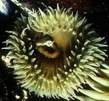

---
title: Endomyaria
---

## Phylogeny 

-   « Ancestral Groups  
    -   [Thenaria](Thenaria)
    -   [Nynantheae](Nynantheae)
    -   [Actiniaria](Actiniaria)
    -   [Zoantharia](Zoantharia)
    -   [Anthozoa](Anthozoa)
    -   [Cnidaria](Cnidaria)
    -   [Animals](Animals)
    -   [Eukaryotes](Eukaryotes)
    -   [Tree of Life](../../../../../../../../Tree_of_Life.md)

-   ◊ Sibling Groups of  Thenaria
    -   Endomyaria
    -   [Mesomyaria](Mesomyaria)
    -   [Acontiaria](Acontiaria)

-   » Sub-Groups
    -   [Aliciidae](Aliciidae)
    -   [Condylanthidae](Condylanthidae)
    -   [Actiniidae](Actiniidae)
    -   [Actinodendronidae](Actinodendronidae)
    -   [Thalassianthidae](Thalassianthidae)
    -   [Aurelianidae](Aurelianidae)
    -   [Minyadidae](Minyadidae)
    -   [Homostichanthidae](Homostichanthidae)
    -   [Stoichactiidae](Stoichactiidae)
    -   [Phymanthidae](Phymanthidae)

# Endomyaria 

-   *[Aliciidae](Aliciidae)*
-   *[Condylanthidae](Condylanthidae)*
-   *[Actiniidae](Actiniidae)*
-   *[Actinodendronidae](Actinodendronidae)*
-   *[Thalassianthidae](Thalassianthidae)*
-   *[Aurelianidae](Aurelianidae)*
-   *[Minyadidae](Minyadidae)*
-   *[Homostichanthidae](Homostichanthidae)*
-   *[Stoichactiidae](Stoichactiidae)*
-   *[Phymanthidae](Phymanthidae)*

Containing group: [Thenaria](Thenaria.md)

### Characteristics

Thenaria without sphincter or with an endodermal one, which occasionally
shows a strong tendency to be more or less mesogloeal. No acontia.

### References

Carlgren, O. 1949. A Survey of the Ptychodactiaria, Corallimorpharia and
Actiniaria. Kungl. Svenska Vetenskapsakadamiens Handlingar, series 4,
volume 1, number 1.

## Title Illustrations

Left:\
Cryptodendrum adhaesivum (Thalassianthidae). Egypt.

Right:\
Anthopleura xanthogrammica (Actiniidae).\
Picture taken in the intertidal near the Bodega Marine Lab, University
of California.

Photographs copyright © 2000, Ron Ates.


  -------
  Copyright ::   © 2000 Ron Ates
  -------


  -------
  Copyright ::   © 2000 Ron Ates
  -------

## Confidential Links & Embeds: 

### #is_/same_as :: [Endomyaria](/_Standards/bio/bio~Domain/Eukaryotes/Animals/Cnidaria/Anthozoa/Zoantharia/Actiniaria/Nynantheae/Thenaria/Endomyaria.md) 

### #is_/same_as :: [Endomyaria.public](/_public/bio/bio~Domain/Eukaryotes/Animals/Cnidaria/Anthozoa/Zoantharia/Actiniaria/Nynantheae/Thenaria/Endomyaria.public.md) 

### #is_/same_as :: [Endomyaria.internal](/_internal/bio/bio~Domain/Eukaryotes/Animals/Cnidaria/Anthozoa/Zoantharia/Actiniaria/Nynantheae/Thenaria/Endomyaria.internal.md) 

### #is_/same_as :: [Endomyaria.protect](/_protect/bio/bio~Domain/Eukaryotes/Animals/Cnidaria/Anthozoa/Zoantharia/Actiniaria/Nynantheae/Thenaria/Endomyaria.protect.md) 

### #is_/same_as :: [Endomyaria.private](/_private/bio/bio~Domain/Eukaryotes/Animals/Cnidaria/Anthozoa/Zoantharia/Actiniaria/Nynantheae/Thenaria/Endomyaria.private.md) 

### #is_/same_as :: [Endomyaria.personal](/_personal/bio/bio~Domain/Eukaryotes/Animals/Cnidaria/Anthozoa/Zoantharia/Actiniaria/Nynantheae/Thenaria/Endomyaria.personal.md) 

### #is_/same_as :: [Endomyaria.secret](/_secret/bio/bio~Domain/Eukaryotes/Animals/Cnidaria/Anthozoa/Zoantharia/Actiniaria/Nynantheae/Thenaria/Endomyaria.secret.md)

