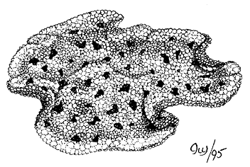

---
title: Placozoa
---

# Placozoa 

## #has_/text_of_/abstract 

> **Placozoa** ( PLAK-ə-ZOH-ə; lit. 'flat animals') is a 
> phylum of free-living (non-parasitic) marine invertebrates. 
> 
> They are blob-like animals composed of aggregations of cells. 
> 
> Moving in water by ciliary motion, eating food by engulfment, reproducing by fission or budding, 
> placozoans are described as "the simplest animals on Earth." 
> 
> Structural and molecular analyses have supported them as among the most basal animals, 
> thus, constituting a primitive metazoan phylum.
>
> The first known placozoan, Trichoplax adhaerens, was discovered in 1883 
> by the German zoologist Franz Eilhard Schulze (1840–1921). 
> 
> Karl Gottlieb Grell(1912–1994), erected a new phylum, Placozoa, for it in 1971. 
> 
> Remaining a monotypic phylum for over a century, new species began to be added since 2018. 
> 
> So far, three other extant species have been described, in two distinct classes: 
> - Uniplacotomia (Hoilungia hongkongensis in 2018 and Cladtertia collaboinventa in 2022) and 
> - Polyplacotomia (Polyplacotoma mediterranea, the most basal, in 2019). 
> 
> A single putative fossil species is known, the Middle Triassic Maculicorpus microbialis.
>
> [Wikipedia](https://en.wikipedia.org/wiki/Placozoa) 

## Phylogeny 

-   « Ancestral Groups  
    -   [Animals](Animals)
    -   [Eukaryotes](Eukaryotes)
    -   [Tree of Life](../../Tree_of_Life.md)

-   ◊ Sibling Groups of  Animals
    -   [Bilateria](Bilateria)
    -   [Myxozoa](Myxozoa)
    -   [Cnidaria](Cnidaria)
    -   [Ctenophora](Ctenophora)
    -   Placozoa
    -   [Sponge](Sponge.md)

-   » Sub-Groups 
	-   *Trichoplax adhaerens*
	-   *Treptoplax reptans*

## Title Illustrations

---------------------------------------------------------------------------

Scientific Name ::  Placozoa
Comments          Diagram of the external features of a placazoan.
Creator           Ivy Livingstone
Copyright ::         © 1995 [BIODIDAC](http://biodidac.bio.uottawa.ca/index.htm) 

## Confidential Links & Embeds: 

### #is_/same_as :: [Placozoa](/_Standards/bio/bio~Domain/Eukaryotes/Animals/Placozoa.md) 

### #is_/same_as :: [Placozoa.public](/_public/bio/bio~Domain/Eukaryotes/Animals/Placozoa.public.md) 

### #is_/same_as :: [Placozoa.internal](/_internal/bio/bio~Domain/Eukaryotes/Animals/Placozoa.internal.md) 

### #is_/same_as :: [Placozoa.protect](/_protect/bio/bio~Domain/Eukaryotes/Animals/Placozoa.protect.md) 

### #is_/same_as :: [Placozoa.private](/_private/bio/bio~Domain/Eukaryotes/Animals/Placozoa.private.md) 

### #is_/same_as :: [Placozoa.personal](/_personal/bio/bio~Domain/Eukaryotes/Animals/Placozoa.personal.md) 

### #is_/same_as :: [Placozoa.secret](/_secret/bio/bio~Domain/Eukaryotes/Animals/Placozoa.secret.md)

