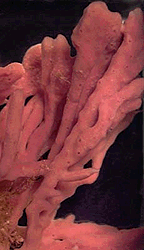
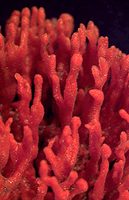

---
aliases:
- Sponge
- Sponges
- Porifera
title: Porifera
---

# [[Sponge]] 

Sponges 

  

## #has_/text_of_/abstract 

> Sponges or sea sponges are primarily marine invertebrates of the animal phylum **Porifera** 
> (meaning 'pore bearer'), a basal clade and a sister taxon of the diploblasts. 
> 
> They are sessile filter feeders that are bound to the seabed, 
> and are one of the most ancient members of macrobenthos, 
> with many historical species being important reef-building organisms.
>
> Sponges are multicellular organisms consisting of jelly-like mesohyl sandwiched between two thin layers of cells, and usually have tube-like bodies full of pores and channels that allow water to circulate through them. They have unspecialized cells that can transform into other types and that often migrate between the main cell layers and the mesohyl in the process. They do not have complex nervous, digestive or circulatory systems. Instead, most rely on maintaining a constant water flow through their bodies to obtain food and oxygen and to remove wastes, usually via flagella movements of the so-called "collar cells".
>
> 
>
> Sponges are believed to have been the first outgroup to branch off the evolutionary tree from the last common ancestor of all animals, with fossil evidence of primitive sponges such as Otavia from as early as the Tonian period (around 800 Mya). The branch of zoology that studies sponges is spongiology.
>
> [Wikipedia](https://en.wikipedia.org/wiki/Sponge) 

## Phylogeny 

-   « Ancestral Groups  
    -   [Animals](Animals)
    -   [Eukaryotes](Eukaryotes)
    -   [Tree of Life](../../Tree_of_Life.md)

-   ◊ Sibling Groups of  Animals
    -   [Bilateria](Bilateria)
    -   [Myxozoa](Myxozoa)
    -   [Cnidaria](Cnidaria)
    -   [Ctenophora](Ctenophora)
    -   [Placozoa](Placozoa)
    -   Porifera

-   » Sub-Groups 
	-   *Calcarea*
	    -   *Calcinea*
	    -   *Calcaronea*
	-   *Hexactinellida*
	    -   *Amphidiscophora*
	    -   *Hexasterophora*
	-   *Demospongiae*
	    -   *Homoscleromorpha*
	    -   *Tetractinomorpha*
	    -   *Ceractinomorpha*
	

## Title Illustrations

-------------------------------------------------------------------------------
 
Scientific Name ::  Haliclona
Creator           David Remsen
Copyright ::         © 1995 [Marine Biological Laboratory, Woods Hole](http://www.mbl.edu/) 

-------------------------------------------------------------------------------
 
Scientific Name ::  Microciona
Creator           David Remsen
Copyright ::         © 1995 [Marine Biological Laboratory, Woods Hole](http://www.mbl.edu/) 
-------------------------------------------------------------------------------

## Confidential Links & Embeds: 

### #is_/same_as :: [Sponge](/_Standards/bio/bio~Domain/Eukaryotes/Animals/Sponge.md) 

### #is_/same_as :: [Sponge.public](/_public/bio/bio~Domain/Eukaryotes/Animals/Sponge.public.md) 

### #is_/same_as :: [Sponge.internal](/_internal/bio/bio~Domain/Eukaryotes/Animals/Sponge.internal.md) 

### #is_/same_as :: [Sponge.protect](/_protect/bio/bio~Domain/Eukaryotes/Animals/Sponge.protect.md) 

### #is_/same_as :: [Sponge.private](/_private/bio/bio~Domain/Eukaryotes/Animals/Sponge.private.md) 

### #is_/same_as :: [Sponge.personal](/_personal/bio/bio~Domain/Eukaryotes/Animals/Sponge.personal.md) 

### #is_/same_as :: [Sponge.secret](/_secret/bio/bio~Domain/Eukaryotes/Animals/Sponge.secret.md)

