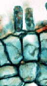
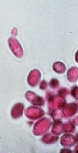
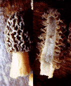
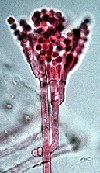
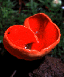

## Phylogeny 

-   « Ancestral Groups  
    -   [Fungi](Fungi)
    -   [Eukaryotes](Eukaryotes)
    -   [Tree of Life](../../Tree_of_Life.md)

-   ◊ Sibling Groups of  Fungi
    -   [Basidiomycota](Basidiomycota)
    -   Ascomycota
    -   [Glomeromycota](Glomeromycota)
    -   [Chytridiomycota](Chytridiomycota)
    -   [Zygomycota](Zygomycota)

-   » Sub-Groups
    -   [Pezizomycotina](Pezizomycotina.md)

# Ascomycota

## Sac Fungi 

[John W. Taylor, Joey Spatafora, and Mary Berbee]()

Containing group: [Fungi](Eukaryotes/Fungi.md)

### Information on the Internet

-   [MYCONET](http://www.umu.se/myconet/Myconet.html). An international
    mycological journal mainly intended for the development of natural
    classifications of fungi and for the publication of related
    information
    -   [Outline of Ascomycota -         2001](http://www.umu.se/myconet/M7.html). All accepted genera
        and taxa above the generic level in phylum Ascomycota.
-   [Freshwater Ascomycete     Database](http://www.life.uiuc.edu/plantbio/fungi/). Carol Shearer,
    University of Illinois at Urbana-Champaign.
-   [LIAS](http://www.lias.net/index.cfm). A Global Information System
    for Lichenized and Non-Lichenized Ascomycetes.
-   [Saccharomyces Genome     Database](http://genome-www.stanford.edu/Saccharomyces/).
    -   [Yeast WWW         Sites](http://genome-www.stanford.edu/Saccharomyces/yeast_info.html).
-   [PezWeb](http://mgd.nacse.org/hyperSQL/pezweb/mainx.html). A Web
    site dedicated to the study of the Pezizales.
-   [Identifying Morels and False     Morels](http://nt2.advant.com/kuocgi2/morels/index.html).
-   [truffle.org](http://www.truffle.org/). To promote research on
    truffle and ectomycorrhizae. At present the main emphasis of this
    project is to provide methods for the identification of truffles
    both at the morphological and molecular level. Istituto di Scienze
    Biochimiche, University of Parma.
-   [Truffles of the Great     Basin](http://www.herb.lsa.umich.edu/GBSurvey/Gb_home.htm). Robert
    Fogel, University of Michigan and Jack States, Northern Arizona
    University.
-   [The Truffle, Black Pearl of     Perigord](http://www.french-truffle.com/).
-   [Systematic Studies in Discomycetes:     Pezizales](http://www.herbaria.harvard.edu/discomycetes/). PEET
    Project. Harvard University.
-   [DERMBASE: Names of Dermateaceae     (Ascomycetes)](http://www.bgbm.fu-berlin.de/BGBM/RESEARCH/DATA/dermatea).
    Botanischer Garten und Botanisches Museum Berlin-Dahlem, Freie
    Universität Berlin.
-   [The Aspergillus Website](http://www.aspergillus.man.ac.uk/).
-   [Studies in the     Lasiosphaeriaceae](http://www.fmnh.org/research_collections/botany/botany_sites/ascomycete/peetwebpages/peettitle.htm).
    NSF-PEET Project. The Field Museum, Chicago.
-   [Neurospora Genome     Project](http://biology.unm.edu/biology/ngp/home.html). University
    of New Mexico.
-   [The Podospora anserina Web     Page](http://cgdc3.igmors.u-psud.fr/Podospora/index_english.htm).
-   [Hypomyces](http://nt.ars-grin.gov/taxadescriptions/hypomyces/).
    Descriptions, images, keys. Part of Monographic Studies of
    Hypocreales: Hypocrea and Hypomyces PEET Project. United States
    Department of Agriculture, Agricultural Research Service.
-   [Home of the     Xylariaceae](http://mycology.sinica.edu.tw/Xylariaceae/). Washington
    State University.

## Introduction

The Ascomycota, or sac fungi, is monophyletic and accounts for
approximately 75% of all described fungi. It includes most of the fungi
that combine with algae to form lichens, and the majority of fungi that
lack morphological evidence of sexual reproduction. Among the Ascomycota
are some famous fungi: *Saccharomyces cerevisiae*, the yeast of commerce
and foundation of the baking and brewing industries (not to mention
molecular developmental biology), *Penicillium chrysogenum*, producer of
penicillin, *Morchella esculentum*, the edible morel, and *Neurospora
crassa*, the \"one-gene-one-enzyme\" organism. There are also some
infamous Ascomycota, a few of the worst being: *Aspergillus flavus*,
producer of aflatoxin, the fungal contaminant of nuts and stored grain
that is both a toxin and the most potent known natural carcinogen,
*Candida albicans*, cause of thrush, diaper rash and vaginitis, and
*Cryphonectria parasitica*, responsible for the demise of 4 billion
chestnut trees in the eastern USA (Alexopoulos et al., 1996). Asexual
Ascomycota, such as *Penicillium* or *Candida* species, used to be
classified separately in the Deuteromycota because sexual characters
were necessary for Ascomycota classification. However, the comparison of
nucleic acid sequence, as well as nonsexual phenotypic characters, have
permitted the integration of asexual fungi into the Ascomycota (Taylor,
1995). The Deuteromycota is no longer recognized as a formal taxon in
fungal systematics.

### Characteristics

The shared derived character that defines the Ascomycota is the ascus.
It is within the ascus that nuclear fusion and meiosis take place. In
the ascus, one round of mitosis typically follows meiosis to leave eight
nuclei, and eventually eight ascospores. Ascospores are formed within
the ascus by an enveloping membrane system, which packages each nucleus
with its adjacent cytoplasm and provides the site for ascospore wall
formation. These membranes apparently are derived from the ascus plasma
membrane in the Pezizomycotina and the nuclear membrane in the
Saccharomycotina (Wu and Kimbrough, 1992; Raju, 1992).

In hyphal Ascomycota (left), the youngest, terminal hyphal segments
develop into 8-spored asci. In yeasts (right) a single cell simply
becomes the ascus, often with just 4 spores. Asci of a hyphal Ascomycota
(Pezizomycotina), *Podospora* , © R. Vilgalys 1996. Ascus of a yeast
(Saccharomycotina), *Saccharomyces*, © J. Taylor 1996.

At the time they are released from the ascus, the thick-walled haploid
ascospores are resistant to adverse environments. But, given the right
conditions, they will germinate to form a new haploid fungus.

The body of Ascomycota is shared by other fungi and consists of a
typical eukaryotic cell surrounded by a wall. The body can be a single
cell, as in yeasts, or a long tubular filament divided into cellular
segments, which is called a hypha (plural, hyphae). Both yeasts and
hyphae have cell walls made of varying proportions of chitin and beta
glucans (Wessels, 1994).

### Nutrition and Symbioses

Like other fungi, Ascomycota are heterotrophs and obtain nutrients from
dead or living organisms (Griffin, 1994; Carroll and Wicklow, 1992). If
water is present, as saprotrophs they can consume almost any
carbonaceous substrate, including jet fuel (*Amorphotheca resinae*) and
wall paint (*Aureobasidium pullulans*), and play their biggest role in
recycling dead plant material. As biotrophs, they may form symbioses
with algae (lichens), plant roots (mycorrhizae) or the leaves and stems
of plants (endophytes). Other Ascomycota (*Ceratocystis* and
*Ophiostoma*) form symbiotic associations with an array of arthropods,
where they can line beetle galleries and provide nutrition for the
developing larvae. In return, the beetles maintain a pure culture of the
fungus and transport it to newly established galleries. As parasites,
ascomycetes account for most of the animal and plant pathogens including
*Pneumocystis carinii*, responsible for pneumonia of humans with
compromised immune systems and *Ophiostoma ulmi*, the Dutch elm disease
fungus that is responsible for the demise of elm trees in North America
and Europe (Agrios, 1988).

### Biogeography

Ascomycota can be found on all continents and many genera and species
display a cosmopolitan distribution (*Candida albicans* or *Aspergillus
flavus*). Others are found on more than one continent (*Ophiostoma
ulmi*, or *Cryphonectria parasitica*), but many are known from only one
narrowly restricted location. For example, the White Piedmont Truffle
(*Tuber magnatum*) is known from only one province of Northern Italy.

### Reproduction

From a human perspective, the most unusual aspect of all fungi is that
they have more than one reproductive option. The textbook Ascomycota can
make spores sexually (ascospores or meiospores) and asexually (condia or
mitospores). Following meiosis, the ascospores take shape inside the
ascus when new cell walls surround each nucleus as can be seen in the
electron micrograph above (Wu and Kimbrough, 1992). Conidia contain
mitotic nuclei, and their cell wall is simply a modified hyphal or yeast
wall.

Ascus of a hyphal ascomycete (Pezizomycotina) as viewed by the electron
microscope, © R. Vilgalys 1996.

Ascospores may or may not be shot by turgor pressure from the ascus and
although wind is the primary dispersal agent once the spores have been
released from the ascus, Ascomycota also use splashing or running water
or animals to disperse their spores (Ingold, 1965). Conidial diversity
reaches its climax with the Ascomycota, with forms ranging from single
spores hardly different from hyphae(*Geotrichum candidum*) to elaborate
heads of ornamented condida (*Aspergillus niger*) and beyond (Cole and
Kendrick, 1981).

### Life Cycle

Ascomycota are either single-celled (yeasts) or filamentous (hyphal) or
both (dimorphic). Yeasts grow by budding or fission and hyphae grow
apically and branch laterally. Most yeasts and filamentous Ascomycota
are haploid, but some species, *Saccharomyces cerevisiae* for example,
can also be diploid. Mitospores may simply reproduce the parent, or may
also act as gametes to fertilize a compatible partner. Some Ascomycota
must outbreed (heterothallic), others can also self, and some can only
self (homothallic) (Alexopoulos et al. 1996).

Life cycle of Ascomycota, © J. Taylor 1996

Genetic regulation of sex expression and mating is well-understood in
some model Ascomycota such as yeast, where there are two sexes and
mating is coordinated by oligopeptide pheromones (Marsh, 1991; Glass and
Lorimer, 1991). In hyphal species, cytoplasmic fusion may not be
immediately followed by nuclear fusion, leading to a short dikaryotic
phase. The dikaryotic hyphae may be protected and nourished by
differentiated haploid hyphae which form a fruiting body (the ascoma;
plural ascomata). Ascomata may be closed (cleistothecium), open by a
narrow orifice (perithecium), or broadly open like a cup (apothecium).
Ascospores are released from the ascoma and germinate to form a new
haploid mycelium.

### Relationships of Ascomycota to other Fungi

The Ascomycota is sister group to the Basidiomycota. This relationship
is supported by the presence in members of both phyla of cross-walls
(septa) that divide the hypahe into segments, and pairs of unfused
nuclei in these segments after mating and before nuclear fusion
(dikaryons). Further support comes from the apparent homology between
structures that coordinate simultaneous mitosis of the two dikaryotic
nucli (Ascomycota croziers and Basidiomycota clamp-connections).

### Discussion of Phylogenetic Relationships

Molecular phylogenetic analyses of nuclear and mitochondrial ribosomal
RNA genes and protein coding genes support a monophyletic Ascomycota
(Lutzoni et al 2004, James et al 2006, Spatafora et al 2006). Early
diverging lineages of Ascomycota have been classified in
Taphrinomycotina (Eriksson 2004; =Archiascomycetes Nishida and Sugiyama
1994). Due to the lack of strong support for the monophly of
Taphrinomycotina (Nishida and Sugiyama 1994) and the paraphyletic
resolution of these taxa in some analyses (Lutzoni et al 2004),
Taphrinamycotina is not recognized in some classifications (Ericksson
2005).  More recent analyses, however, that included multiple protein
coding genes and RNA genes recovered a monophyletic Taphrinomycotina
with greater support (James et al 2006, Liu et al 2006, Spatafora et al
2006). 

The Taphrinomycotina includes yeast species (*Pneumocystis*,
*Schizosaccharomyces*), dimorphic taxa (*Taphrina* spp.) and a
filamentous sporocarp producing genus (*Neolecta*). The placement of
*Neolecta* among the basal lineages of the Ascomycota is surprising
because of the presence of an ascoma, a feature not found in the other
basal lineages or in any Saccharomycotina (Landvik et al. 1992).
However, there is no reason that the Saccharomycotina could not have
lost ascomata as hyphal growth became suppressed in favor of yeasts. The
Saccharomycotina form a well-supported monophyletic taxon, as do the
Pezizomycotina (Gargas et al. 1995, Lutzoni et al 2004, Spatafora et al
2006). Asexual fungi sharing morphological or molecular characters of
sexual Ascomycota are classified in the Ascomycota and its subtaxa;
examples include *Candida albicans* (Saccharomycotina, Saccharomycetes)
and *Pencillium chrysogenum* (Pezizomycotina, Eurotiomycetes).

By comparing nucleic acid sequences from 50 genes, the timing of
Ascomycota evolution has been estimated, although results produced a
wide geological time span depending on calibrations points used (Taylor
and Berbee 2006).  The Taphrinomycotina, Saccharomycotina and
Pezizomycotina were likely established in the early Devonian, a bit more
than 400 million years ago (mya).  Some estimates, however, suggest a
much earlier Ascomycota origin of ca. 1000 mya (Hedges et al 2001,
Taylor and Berbee 2006). Fossils of early Ascomycota are not easy to
recognize and the utility of some of them as exemplars of extant
lineages is problematical (e.g., *Paleopyrenomycites devonicus* as a
fossil Sordariomycetes). Thus, we still rely on generally accepted
fossil dates external to Fungi (e.g., dicot-monocot split) for
potentially more robust calibration points.\

### Subgroups of Ascomycota

The basal lineage or lineages of Ascomycota comprise four classes,
Neolectomycetes, Pneumocystidomycetes, Schizosaccharomycetes, and
Taphrinomycetes, which are classified in the subphylum, Taphrinomycotina
(=Archiascomycetes Nishida and Sugiyama). The monophyly of
Taphrinomycotina is questionable (Nishida and Sugiyama 1994, Eriksson
2005), but increased sampling of both taxa and genes has resulted in
increased support for the monophyly of the taxon (James et al 2006, Liu
et al 2006, Spatafora et al 2006).

The Saccharomycotina comprises the \'true yeasts\' and is home to the
most famous fungus, *Saccharomyces cerevisiae*, better known as the
baker\'s yeast. Although most members are primarily unicellular, the
basal taxa make abundant hyphae. The Saccharomycotina lack ascomata
(Barnett et al., 1990). Current classification of the Saccharomycotina
includes one class, Saccharomycetes, and one order, Saccharomycetales.

Pezizomycotina contain well over 90% of Ascomycota, and the species are
hyphal, with almost all of the sexually reproducing forms possessing
ascomata. The Pezizomycotina includes 11 well supported clades that are
recognized as classes. Most of the recent molecular phylogenetic effort
has been directed at this subphylum (reviewed in Lutzoni et al 2004,
Spatafora et al 2006).

### References

Agrios, G. N. 1988. Plant Pathology, third edition. Academic Press, San
Diego.

Alexopoulos, C. J., C. W. Mims, and M. Blackwell. 1996. Introductory
Mycology. John Wiley and Sons, New York. 868p.

Barnett, J. A., R. W. Payne, and D. Yarrow. 1990. Yeasts:
characteristics and identification. Cambridge University Press,
Cambridge.

Berbee, M. L., and J. W. Taylor. 1992a. Convergence in ascospore
discharge mechanism among Pyrenomycete fungi based on 18S ribosomal RNA
gene sequence. Mol. Phylog. Evol. 1:59-71.

Berbee, M. L., and J. W. Taylor. 1992b. Two ascomycete classes based on
fruiting-body characters and ribosomal DNA sequence. Mol. Biol. Evol.
9:278-284.

Berbee, M. L., and J. W. Taylor. 1993. Dating the evolutionary
radiations of the true fungi. Can. J. Bot. 71:1114-1127.

Bruns, T. D., R. Vilgalys, S. M. Barns, D. Gonzalez, D. S. Hibbett, D.
J. Lane, L. Simon, S. Stickel, T. M. Szaro, W. G. Weisburg, and M. L.
Sogin. 1992. Evolutionary relationships within the fungi: analyses of
nuclear small subunit rRNA sequences. Mol. Phylog. Evol. 1:231-241.

Carroll, G.C. and D. T. Wicklow, 1992. The Fungal Community: Its
Organization and Role in the Ecosystem. Marcel Dekker, Inc., New York.

Cole, G. T., and B. Kendrick. 1981. Biology of conidial fungi. Academic
Press, New York.

Gargas, A., P. T. DePriest, M. Grube, and A. Tehler. 1995. Multiple
origins of lichen symbioses in fungi suggested by SSU rDNA phylogeny.
Science 268:1492-1495.

Glass, N. L., and I. A. J. Lorimer. 1991. Ascomycete mating types. Pages
193-216. in More gene manipulations in fungi (J. W. Bennett and L. L.
Lasure, eds.). Academic Press, Orlando.

Griffin, D. H. 1994. Fungal Physiology. 2nd. Wiley-Liss, New York.

Heckman DS, Geiser DM, Eidell BR, Stauffer RL, Kardos NL, Hedges SB.
2001. Molecular evidence for the early colonization of land by fungi and
plants. Science 293:1129-1133.

Ingold, C. T. 1965. Spore Liberation. Clarendon Press, Oxford.

James, T.Y., Kauff, F., Schoch, C., Matheny, P.B., Hofstetter, V., Cox,
C.J., Celio, G., Gueidan, C., Fraker, E., Miadlikowska, J., Lumbsch,
H.T., Rauhut, A., Reeb, V., Arnold, A.E., Amtoft, A., Stajich, J.E.,
Hosaka, K., Sung, G.-H., Johnson, D., O'Rourke, B., Crockett, M.,
Binder, M., Curtis, J.M., Slot, J.C., Wang, Z., Wilson, A.W., Schußler,
A., Longcore, J.E., O'Donnell, K., Mozley-Standridge, S., Porter, D.,
Letcher, P.M., Powell, M.J., Taylor, J.W., White, M.M., Griffith, G.W.,
Davies, D.R., Humber, R.A., Morton, J.B., Sugiyama, J., Rossman, A.Y.,
Rogers, J.D., Pfister, D.H., Hewitt, D., Hansen, K., Hambleton, S.,
Shoemaker, R.A., Kohlmeyer, J., Volkmann-Kohlmeyer, B., Spotts, R.A.,
Serdani, M., Crous, P.W., Hughes, K.W., Matsuura, K., Langer, E.,
Langer, G., Untereiner, W.A., Lucking, R., Budel, B., Geiser, D.M.,
Aptroot, A., Diederich, P., Schmitt, I., Schultz, M., Yahr, R., Hibbett,
D.S., Lutzoni, F., McLaughlin, D.J., Spatafora, J.W. and Vilgalys, R.
2006. Reconstructing the early evolution of Fungi using a six-gene
phylogeny. Nature (in press).

Landvik, S., O. E. Eriksson, A. Gargas, and P. Gustafsson. 1993.
Relationships of the genus Neolecta (Neolectales ordo nov.,
Ascomycotina) inferred from 18s rDNA sequences. Syst. Ascomycetum
11:107-118.

Landvik, S., O. E. Eriksson, A. Gargas, and P. Gustafsson. 1993.
Relationships of the genus Neolecta (Neolectales ordo nov.,
Ascomycotina) inferred from 18s rDNA sequences. Syst. Ascomycetum
11:107-118.

Liu, Y. J., M. C. Hodson and B. D. Hall. 2006. Loss of the flagellum
happened only once in the fungal lineage: phylogenetic structure of
Kingdom Fungi inferred from RNA polymerase II subunit genes. BMC
Evolutionary Biology 2006, 6:74.

Lutzoni, F., F. Kauff, C. J. Cox, D. McLaughlin, G. Celio, B. Dentinger,
M. Padamsee, D. Hibbett, T. Y. James, E. Baloch, M. Grube, V. Reeb, V.
Hofstetter, C. Schoch, A. E. Arnold, J. Miadlikowska, J. Spatafora, D.
Johnson, S. Hambleton, M. Crockett, R. Shoemaker, G.-H. Sung, R.
Lücking, T. Lumbsch, K. O?Donnell, M. Binder, P. Diederich, D. Ertz, C.
Gueidan, K. Hansen, R. C. Harris, K. Hosaka, Y.-W. Lim, B. Matheny, H.
Nishida, D. Pfister, J. Rogers, A. Rossman, I. Schmitt, H. Sipman, J.
Stone, J. Sugiyama, R. Yahr, and R. Vilgalys. 2004. Assembling the
fungal tree of life: progress, classification, and evolution of
subcellular traits. American Journal of Botany 91: 1446-1480.

Marsh, L. 1991. Signal transduction during pheromone response in yeast.
Annu. Rev. Cell biol. 7:699-728.

Nishida, H., and J. Sugiyama. 1994. Archiascomycetes: Detection of a
major new linage within the Ascomycota. Mycoscience 35:361-366.

Raju, N. B. 1992. Genetic control of the sexual cycle in Neurospora.
Mycol. Res. 96:241-262,.

Spatafora, J. W. 1995a. Ascomal evolution among filamentous ascomycetes:
evidence from molecular data. Can. J. Bot. S811-S815.

Spatafora, J., and M. Blackwell. 1993. Molecular systematics of
unitunicate perithecial Ascomycetes. The Clavicipitales - Hypocreales
connection. Mycologia 85:912-922.

Spatafora, J.W., Johnson, D., Sung, G.-H., Hosaka, K., O'Rourke, B.,
Serdani, M., Spotts, R., Lutzoni, F., Hofstetter, V., Fraker, E.,
Gueidan, C., Miadlikowska, J., Reeb, V., Lumbsch, T., Lücking, R.,
Schmitt, I., Aptroot, A., Roux, C., Miller, A., Geiser, D., Hafellner,
J., Hestmark, G., Arnold, A.E., Büdel, B., Rauhut, A., Hewitt, D.,
Untereiner, W., Cole, M.S., Scheidegger, C., Schultz, M., Sipman., H.
and Schoch, C. 2006. A five-gene phylogenetic analysis of the
Pezizomycotina. Mycologia (in press).

Taylor, J. W. 1995. Making the Deuteromycota redundant: a practical
integration of mitosporic and meiosporic fungi. Can. J. Bot. 73
(suppl.):s754-s759.

Taylor, J. W., B. Bowman, M. L. Berbee, and T. J. White. 1993. Fungal
model organisms: phylogenetics of Saccharomyces, Aspergillus and
Neurospora. Syst. Biol. 42:440-457.

Taylor, J. W. and M. L. Berbee. 2006. Dating divergences in the Fungal
Tree of Life: Review and new analyses. Mycologia (in press).

Wessels, J. G. H. 1994. Developmental regulation of fungal cell wall
formation. Ann. Rev. Phytopathol. 32:413-437.

Wu, C. G., and J. W. Kimbrough. 1992. Ultrastructural studies of
ascosporogenesis in Ascobolus immersus. Mycologia 84:459-466.

edit internet links

## Title Illustrations

  ---------------------
  Scientific Name ::  Taphrina
  Comments          Asci of the peach leaf curl fungus atop a peach leaf
  Body Part         asci
  Copyright ::         © 1996 K. Wells
  ---------------------

  --------------------
  Scientific Name ::  Saccharomyces
  Comments          Budding cells of the baker\'s and brewer\'s yeast
  Copyright ::         © 1996 K. Wells
  --------------------

  -----------------------------------------------------------------------------
  Scientific Name ::  Morchella
  Comments          Two fruiting bodies (ascomata) of the edible morel with one sliced open
  Body Part         fruiting bodies (ascomata)
  Copyright ::         © 1996 [John W. Taylor](http://plantbio.berkeley.edu/%7Etaylor/) 
  -----------------------------------------------------------------------------

  -------------------------
  Scientific Name ::  Penicillium
  Comments          Mitospores (conidia) of Penicillium, one of the asexual Ascomycota
  Body Part         Mitospores (conidia)
  Copyright ::         © 1996 K. Wells
  -------------------------

## Confidential Links & Embeds: 

### #is_/same_as :: [Ascomycota](/_Standards/bio/bio~Domain/Eukaryotes/Fungi/Ascomycota.md) 

### #is_/same_as :: [Ascomycota.public](/_public/bio/bio~Domain/Eukaryotes/Fungi/Ascomycota.public.md) 

### #is_/same_as :: [Ascomycota.internal](/_internal/bio/bio~Domain/Eukaryotes/Fungi/Ascomycota.internal.md) 

### #is_/same_as :: [Ascomycota.protect](/_protect/bio/bio~Domain/Eukaryotes/Fungi/Ascomycota.protect.md) 

### #is_/same_as :: [Ascomycota.private](/_private/bio/bio~Domain/Eukaryotes/Fungi/Ascomycota.private.md) 

### #is_/same_as :: [Ascomycota.personal](/_personal/bio/bio~Domain/Eukaryotes/Fungi/Ascomycota.personal.md) 

### #is_/same_as :: [Ascomycota.secret](/_secret/bio/bio~Domain/Eukaryotes/Fungi/Ascomycota.secret.md)

