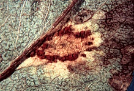

## Phylogeny 

-   « Ancestral Groups  
    -   [Helicobasidiales](Helicobasidiales)
    -   [Urediniomycotina](Urediniomycotina)
    -   [Basidiomycota](Basidiomycota)
    -   [Fungi](Fungi)
    -   [Eukaryotes](Eukaryotes)
    -   [Tree of Life](../../../../../Tree_of_Life.md)

-   ◊ Sibling Groups of  Helicobasidiales
    -   [Tuberculina sbrozzii](Tuberculina_sbrozzii)
    -   [Helicobasidium         purpureum](Helicobasidium_purpureum)
    -   [Tuberculina maxima](Tuberculina_maxima)
    -   Helicobasidium longisporum
    -   [Helicobasidium mompa](Helicobasidium_mompa)

-   » Sub-Groups 

# *Helicobasidium longisporum* [Wakef.]

## syn.: Helicobasidium compactum [Boedijn] 

Containing group: [Helicobasidiales](Helicobasidiales.md)

## Title Illustrations



  -----------------------------------------------------------------------------
  Scientific Name ::     Helicobasidium longisporum on roots and basal parts of stems of Aster sp. cult.
  Location ::           Germany, Baden-Württemberg, Stuttgart
  Comments             on roots and basal parts of stems of Aster sp. cult.
  Specimen Condition   Live Specimen
  Identified By        M. Lutz
  Life Cycle Stage ::     Sterile stage (Thanatophytum) of the phytoparasitic teleomorph
  Collection           2000
  Copyright ::            © 2000 [Matthias Lutz](mailto:matthias.lutz@uni-tuebingen.de) 
  -----------------------------------------------------------------------------


  -----------------------------------------------------------------------------
  Scientific Name ::     Helicobasidium longisporum Wakef. on roots and basal parts of stem of Pyrus communis L.
  Location ::           Germany, Baden-Württemberg, Stuttgart
  Specimen Condition   Live Specimen
  Identified By        M. Lutz
  Life Cycle Stage ::     Fructification of the phytoparasitic teleomorph
  Collection           2000
  Collector            M. Lutz
  Copyright ::            © 2000 [Matthias Lutz](mailto:matthias.lutz@uni-tuebingen.de) 
  -----------------------------------------------------------------------------


  -----------------------------------------------------------------------------
  Scientific Name ::     Tuberculina persicina (Ditmar) Sacc. on Gymnosporangium sabinae (Dicks.) G. Winter/Pyrus communis L.
  Location ::           Germany, Nordrhein-Westfalen, Aachen
  Specimen Condition   Dead Specimen
  Identified By        M. Lutz
  Life Cycle Stage ::     Mycoparasitic anamorph of Helicobasidium longisporum Wakef. forming conidia
  Collection           2004
  Collector            M. Mennicken
  Copyright ::            © 2004 [Matthias Lutz](mailto:matthias.lutz@uni-tuebingen.de) 
  -----------------------------------------------------------------------------

## Confidential Links & Embeds: 

### #is_/same_as :: [Helicobasidium_longisporum](/_Standards/bio/bio~Domain/Eukaryotes/Fungi/Basidiomycota/Pucciniomycotina/Helicobasidiales/Helicobasidium_longisporum.md) 

### #is_/same_as :: [Helicobasidium_longisporum.public](/_public/bio/bio~Domain/Eukaryotes/Fungi/Basidiomycota/Pucciniomycotina/Helicobasidiales/Helicobasidium_longisporum.public.md) 

### #is_/same_as :: [Helicobasidium_longisporum.internal](/_internal/bio/bio~Domain/Eukaryotes/Fungi/Basidiomycota/Pucciniomycotina/Helicobasidiales/Helicobasidium_longisporum.internal.md) 

### #is_/same_as :: [Helicobasidium_longisporum.protect](/_protect/bio/bio~Domain/Eukaryotes/Fungi/Basidiomycota/Pucciniomycotina/Helicobasidiales/Helicobasidium_longisporum.protect.md) 

### #is_/same_as :: [Helicobasidium_longisporum.private](/_private/bio/bio~Domain/Eukaryotes/Fungi/Basidiomycota/Pucciniomycotina/Helicobasidiales/Helicobasidium_longisporum.private.md) 

### #is_/same_as :: [Helicobasidium_longisporum.personal](/_personal/bio/bio~Domain/Eukaryotes/Fungi/Basidiomycota/Pucciniomycotina/Helicobasidiales/Helicobasidium_longisporum.personal.md) 

### #is_/same_as :: [Helicobasidium_longisporum.secret](/_secret/bio/bio~Domain/Eukaryotes/Fungi/Basidiomycota/Pucciniomycotina/Helicobasidiales/Helicobasidium_longisporum.secret.md)

