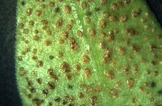

## Phylogeny 

-   « Ancestral Groups  
    -   [Helicobasidiales](Helicobasidiales)
    -   [Urediniomycotina](Urediniomycotina)
    -   [Basidiomycota](Basidiomycota)
    -   [Fungi](Fungi)
    -   [Eukaryotes](Eukaryotes)
    -   [Tree of Life](../../../../../Tree_of_Life.md)

-   ◊ Sibling Groups of  Helicobasidiales
    -   Tuberculina sbrozzii
    -   [Helicobasidium         purpureum](Helicobasidium_purpureum)
    -   [Tuberculina maxima](Tuberculina_maxima)
    -   [Helicobasidium         longisporum](Helicobasidium_longisporum)
    -   [Helicobasidium mompa](Helicobasidium_mompa)

-   » Sub-Groups 

# *Tuberculina sbrozzii* [Cavara & Sacc.] 

Containing group: [Helicobasidiales](Helicobasidiales.md)

## Title Illustrations



  -----------------------------------------------------------------------------
  Scientific Name ::     Tuberculina sbrozzii Cavara & Sacc. on Puccinia vincae (DC.) Berk./Vinca major L.
  Location ::           Germany, Baden-Württemberg, Tübingen
  Specimen Condition   Live Specimen
  Identified By        M. Lutz
  Life Cycle Stage ::     Mycoparasitic anamorph
  Collection           2004
  Copyright ::            © 2004 [Matthias Lutz](mailto:matthias.lutz@uni-tuebingen.de) 
  -----------------------------------------------------------------------------


  -----------------------------------------------------------------------------
  Scientific Name ::     Tuberculina sbrozzii Cavara & Sacc. on Puccinia vincae (DC.) Berk./Vinca major L.
  Location ::           Germany, Baden-Württemberg, Tübingen
  Specimen Condition   Live Specimen
  Identified By        M. Lutz
  Life Cycle Stage ::     Mycoparasitic anamorph
  Collection           2002
  Copyright ::            © 2002 [Matthias Lutz](mailto:matthias.lutz@uni-tuebingen.de) 
  -----------------------------------------------------------------------------


  -----------------------------------------------------------------------------
  Scientific Name ::     Tuberculina sbrozzii Cavara & Sacc. on Puccinia vincae (DC.) Berk./Vinca major L.
  Location ::           Germany, Baden-Württemberg, Tübingen
  Specimen Condition   Live Specimen
  Identified By        M. Lutz
  Life Cycle Stage ::     Mycoparasitic anamorph
  Collection           2002
  Copyright ::            © 2002 [Matthias Lutz](mailto:matthias.lutz@uni-tuebingen.de) 
  -----------------------------------------------------------------------------

## Confidential Links & Embeds: 

### [Tuberculina_sbrozzii](/_Standards/bio/bio~Domain/Eukaryotes/Fungi/Basidiomycota/Pucciniomycotina/Helicobasidiales/Tuberculina_sbrozzii.md) 

### [Tuberculina_sbrozzii.public](/_public/bio/bio~Domain/Eukaryotes/Fungi/Basidiomycota/Pucciniomycotina/Helicobasidiales/Tuberculina_sbrozzii.public.md) 

### [Tuberculina_sbrozzii.internal](/_internal/bio/bio~Domain/Eukaryotes/Fungi/Basidiomycota/Pucciniomycotina/Helicobasidiales/Tuberculina_sbrozzii.internal.md) 

### [Tuberculina_sbrozzii.protect](/_protect/bio/bio~Domain/Eukaryotes/Fungi/Basidiomycota/Pucciniomycotina/Helicobasidiales/Tuberculina_sbrozzii.protect.md) 

### [Tuberculina_sbrozzii.private](/_private/bio/bio~Domain/Eukaryotes/Fungi/Basidiomycota/Pucciniomycotina/Helicobasidiales/Tuberculina_sbrozzii.private.md) 

### [Tuberculina_sbrozzii.personal](/_personal/bio/bio~Domain/Eukaryotes/Fungi/Basidiomycota/Pucciniomycotina/Helicobasidiales/Tuberculina_sbrozzii.personal.md) 

### [Tuberculina_sbrozzii.secret](/_secret/bio/bio~Domain/Eukaryotes/Fungi/Basidiomycota/Pucciniomycotina/Helicobasidiales/Tuberculina_sbrozzii.secret.md)

