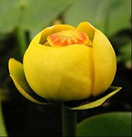

-   « Ancestral Groups 
    -   [Angiosperms](Angiosperms.md)
    -   [Spermatopsida](Spermatopsida.md)
    -   [Embryophytes](Embryophytes.md)
    -   [Green plants](Green_plants)
    -   [Eukaryotes](Eukaryotes)
    -   [Tree of Life](../../../../../Tree_of_Life.md)

-   ◊ Sibling Groups of  Angiosperms
    -   [Amborella trichopoda](Amborella_trichopoda.md)
    -   [magnoliids](magnoliids.md)
    -   [Chloranthaceae](Chloranthaceae.md)
    -   [Ceratophyllaceae](Ceratophyllaceae.md)
    -   [Monocotyledons](Monocotyledons.md)
    -   [eudicots](Eukaryotes/Green_plants/Embryophytes/Spermatopsida/Angiosperms/eudicots.md)
    -   [Austrobaileyales](Austrobaileyales.md)
    -   Nymphaeaceae

-   »

# Nymphaeaceae

## Water lilies and their relatives 

Relationships after Les et al. (1999)

Containing group: [Angiosperms](Angiosperms.md)

### Information on the Internet

-   [Center for Aquatic and Invasive     Plants](http://aquat1.ifas.ufl.edu/welcome.html). University of
    Florida
-   [International Waterlily and Water Gardening     Society](http://www.iwgs.org/)
-   [AquaPlant](http://www.aquaplant.org/). A search engine that indexes
    a number of other aquatic plant sites.
-   [Aquatic Gardeners Association](http://www.aquatic-gardeners.org/)
-   [Victoria Adventure     Home](http://www.victoria-adventure.org/index.html). Water
    gardening.

### References

Friis, E. M., K. R. Pedersen, and P. R. Crane. 2001. Fossil evidence of
water lilies (Nymphaeales) in the Early Cretaceous. Nature 410:357-360.

Gandolfo, M. A., K. C. Nixon, and W. L. Crepet. 2004. Cretaceous flowers
of Nymphaeaceae and implications for complex insect entrapment
pollination mechanisms in early Angiosperms. Proceedings of the National
Academy of Sciences (USA) 101(21):8056-8060.

Ito, M. 1987. Phylogenetic systematics of the Nymphaeales. Botanical
Magazine (Tokyo) 100:17-35.

Les, D., D. K. Garvin and C. F. Wimpee. 1991. Molecular evolutionary
history of ancient aquatic angiosperms. Proceedings of the National
Academy of Sciences (USA) 88:10119-10123.

Les, D. H., E. L. Schneider, D. J. Padgett, P. S. Soltis, D. E. Soltis,
and M. Zanis. 1999. Phylogeny, classification and floral evolution of
water lilies (Nymphaeaceae; Nymphaeales): A synthesis of non-molecular,
rbcL, matK, and rDNA data. Systematic Botany 24:28-46.

Moseley, M. F. Jr, E. L. Schneider, and P. S. Williamson. 1993.
Phylogenetic interpretations from selected floral vasculature characters
in the Nymphaeaceae sensu lato. Aquatic Botany 44:325--342.

Qiu, Y. L., J. H. Lee, F. Bernasconi-Quadroni, D. E. Soltis, P. S.
Soltis, M. Zanis, E. A. Zimmer, Z. D. Chen, V. Savolainen, and M. W.
Chase. 2000. Phylogeny of basal angiosperms: Analyses of five genes from
three genomes. International Journal of Plant Sciences 161:S3-S27.

Schneider, E. L., S. Carlquist, K. Beamer, and A. Kohn. 1995. Vessels in
Nymphaeaceae: Nuphar, Nymphaea, and Ondinea. International Journal of
Plant Sciences 156:857-862.

Yamada, T., R. Imaichi, and M. Kato. 2001. Developmental morphology of
ovules and seeds of Nymphaeales. American Journal of Botany 88:963-974.

##### Title Illustrations



  ------------------------------------------------------------------------
  Scientific Name ::   Victoria cruziana
  Comments           The Santa Cruz water lily, native to northern Argentina, Paraguay and Bolivia. The photographed specimens were cultivated at the Botanical Garden Basel, Switzerland.
  Acknowledgements   Photograph courtesy [Botanical Image Database](http://www.unibas.ch/botimage/)
  Copyright ::          © 2001 University of Basel, Basel, Switzerland 
  ------------------------------------------------------------------------


  ---------------------
  Scientific Name ::     Nuphar japonica
  Specimen Condition   Live Specimen
  Identified By        Sangtae Kim
  Body Part            Flower
  Copyright ::            © 2005 [Sangtae Kim](mailto:sangtae@botany.ufl.edu)
  ---------------------


  ---------------------------------------------------------------------
  Scientific Name ::  Nymphaea thermarum
  Location ::        endemic to Rwanda
  Copyright ::         © [Kurt Stüber](http://www.biolib.de/) 
  ---------------------------------------------------------------------
