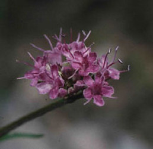

-   « Ancestral Groups 
    -   [Dipsacales](Dipsacales.md)
    -   [Asterids](Asterids.md)
    -   [Core Eudicots](Core_Eudicots)
    -   [eudicots](Eukaryotes/Green_plants/Embryophytes/Spermatopsida/Angiosperms/eudicots.md)
    -   [Angiosperms](Angiosperms.md)
    -   [Spermatopsida](Spermatopsida.md)
    -   [Embryophytes](Embryophytes.md)
    -   [Green plants](Green_plants)
    -   [Eukaryotes](Eukaryotes)
    -   [Tree of Life](../../../../../../../../../Tree_of_Life.md)

-   ◊ Sibling Groups of  Dipsacales
    -   [Adoxaceae](Adoxaceae.md)
    -   [Morinaceae](Morinaceae.md)
    -   Valerianaceae

-   »

# Valerianaceae 

[Charles D. Bell](#AboutThisPage)

Containing group: [Dipsacales](Dipsacales.md)

### Introduction

Originally described by Linnaeus (1753); Linnaeus (1754), Valerianaceae
is traditionally subdivided into three tribes (Graebner, 1906); 1)
Patrinieae, 2) Triplostegieae, and 3) Valerianeae. Many authors (see
Weberling (1970), Cronquist (1988), Backlund (1996a), Brummitt (1992),
and Mabberley (1997)) recognize 14 genera; two in the tribe Patrinieae
(*Patrinia* and *Nardostachys*), a single genus (*Triplostegia*) in the
tribe Triplostegieae, and 11 genera assigned to five subtribes in the
Valerianeae. Six genera besides *Valeriana* have been recognized in
South America (*Aretiastrum*, *Astrephia*, *Belonanthus*, *Phuodendron*,
*Phyllactis*, and *Stangea*). Recent treatments of the South American
taxa have argued for placing these species in Valeriana, reducing the
number of recognized genera within Valerianaceae to eight (Eriksen, 1989
a; Borsini, 1944; Larsen, 1986).

### Characteristics

Valerianaceae has long been thought to represent a natural group of ca.
350 species distributed throughout much of the world, with the exception
of Australia and New Zealand. The group is characterized by a)
sympetalous, asymmetric flowers, b) inferior, three-carpelate ovaries,
c) one fertile carpel with a single anatropous ovule, d) an achene fruit
type, and e) lack of endosperm in the ripe seed (with the exception of
*Triplostegia*). The presence of iridoids of the Valepotriate type in
many of the species, including *Triplostegia* (Backlund and Moritz,
1998), is also characteristic the group. Although the group appears to
have a center of origin in Asia, the majority of the species occur in
the Andes of South America.

Within Valerianaceae there is a degree of differentiation/specialization
in flower and fruit morphology. The most noticeable difference in floral
morphologies across Valerianaceae is in the number of stamens, which
varies from four to one \[five stamens have also been reported in
*Patrinia* (Eriksen, 1989 a)\]. The trend in the group is toward the
reduction in the number of stamens. Donoghue et al. (in press b)
inferred from a large chloroplast data set, combined with ITS sequences,
that there was an initial reduction in stamen number from the ancestral
condition of four to three, then two additional, independent reductions
in number to two (in *Fedia*) and to a single stamen (in species of
*Centranthus*; see Donoghue et al., 2003). The calyx of species of
Valerianaceae is either persistent (leafy, as in *Nardostachys*; reduced
to small teeth, as in *Fedia* and *Valerianella*; or pappus-like, as in
*Centranthus* and species of *Valeriana*) or completely lacking. Eriksen
(1989 a) hypothesized that the complete reduction of the calyx has
occurred independently several times within Valerianaceae (e.g., within
the Latin American species of *Valeriana*). Likewise, the degree of
reduction of the two abaxial sterile locules is quite heterogeneous
among species of Valerianaceae; from highly reduced to extremely
inflated (as seen in some species of Valerianella and Valeriana). These
modifications, of both the calyx and the sterile locules, are most
likely correlated with means of dispersal.

### Relationships of Valerianaceae to other Dipsacales

The relationship of Valerianaceae within Dipsacales has been
investigated quite extensively using morphological data (Judd et al.,
1994; Backlund, 1996b). These phylogenetic analyses place Valerianaceae
as sister to Dipsacaceae. Both of these herbaceous groups are united by
having distinctive pollen morphology and chlorophyllous embryos, a trait
unique within Dipsacales (Backlund, 1996b). The link between
Valerianaceae and Dipsacaceae is further supported by simple vessel
perforations, modification of calyx lobes, and reduction in the amount
of endosperm (Judd et al., 1994; Backlund, 1996b; Manchester and
Donoghue, 1995). Various molecular data sets, including sequence data
from the chloroplast genes *rbcL* (Donoghue et al., 1992) and *ndhF*
(Pyck et al., 1999; Pyck et al., 2002), restriction site data (Downie
and Palmer, 1992), as well as combined morphological and molecular data
(Backlund, 1996b) have now been analyzed. These molecular phylogenetic
studies also support the close relationship between Valerianaceae and
Dipsacaceae, with this Valerianaceae- Dipsacaceae clade being sister to
the Morinaceae, another herbaceous lineage \[the Valerina clade sensu
Donoghue et al. (2001)\]. These data do not tend to support the grouping
of *Triplostegia* with Valerianaceae, but instead place it in a basal
position in the clade consisting of species of Dipsacaceae.

### Discussion of Phylogenetic Relationships

More recently, phylogenetic analyses based on chloroplast DNA (*trnL-F*
intergenic spacer (IGS), *trnL* intron, *ndhF*, *matK*) (Zhang et al.,
2003; Bell et al., 2001) have provided additional insights into the
relationships within Valerianaceae. All these analyses (with the
exception of *matK*) place *Patrinia* at the base of Valerianaceae (with
very strong bootstrap support, from both maximum parsimony and maximum
likelihood analyses), followed by *Nardostachys*. The chloroplast data
also support a clade consisting of *Valeriana*, *Centranthus*, and
*Plectritis* that is sister to a clade containing *Fedia* and
*Valerianella*. These data also consistently find *Triplostegia* to be
more closely related to species of Dipsacaceae than to Valerianaceae.
Pyck et al. (2002) investigated the phylogeny of the tribe Patrinieae
(Graebner, 1906), which consists of *Patrinia* and *Nardostachys*, using
*ndhF* sequence data. The author\'s findings were consistent with other
molecular data sets (Donoghue et al., 2001b; Bell et al., 2001). There
data suggested that the Patrinieae is not monophyletic and that
*Patrinia* is sister to the rest of Valerianaceae (with the exception of
*Triplostegia*, which was not included in their study), followed by
*Nardostachys*.

An additional study looked at sequence data from the atpB-rbcL
intergenic spacer region (Raymundez et al., 2002). These authors found
results that were highly consistent with all the other studies. They did
not, however, sequence any species of Nardostachys, Plectritis,
Triplostegia, or species of Dipsacaceae. This study did, however, find
support for the grouping of Fedia and Valerianella as a clade. In
addition, their data supported a clade consisting of species of
Valeriana and Centranthus.

### References

Backlund, A. A. (1996): Phylogeny of the Dipsacales. Ph.D. thesis,
Uppsala University, Sweden.

Backlund, A. A. & Donoghue, M. J. (1996): Morphology and phylogeny of
the order Dipsacales. In Phylogeny of the Dipsacales, A. A. Backlund,
Doctoral Dissertation. Uppsala: Department of Systematic Botany, Uppsala
University, Sweden.

Backlund, A. & Moritz, T. (1998): Phylogenetic implications of an
expanded valepotriate distribution in the Valerianaceae. Biochem. Syst.
and Ecol. 26:309-335.

Bell, C. D. (2004a): Preliminary phylogeny of Valerianaceae (Dipsacales)
inferred from nuclear and chloroplast DNA sequence data. Mol. Phylogen.
Evol. 31:340-350.

Bell, C. D. (2004b): Phylogeny and biogeography of Valerina
(Dipsacales). Ph.D. thesis, Yale University, USA.

Bell, C. D. & Donoghue M. J. (2003): Phylogeny and biogeography of

Morinaceae (Dipsacales) based on nuclear and chloroplast DNA sequences.
Org. Divers. Evol. 3: 227-237.

Bell, C. D. & Donoghue M. J. (in press): Dating the Dipsacales:
comparing models, genes, and evolutionary implications. Am. J. Bot.

Bell, C. D., Edwards, E. J., Kim, S-T., & Donoghue, M. J. (2001):
Dipsacales phylogeny based on chloroplast DNA sequences. Harv. Pap. Bot.
6:481-499.

Borsini, O. E. (1944): Genera and species plantarum argentinarum,
chapter Valerianaceae, pp. 275-372. Descole, Buenos Aires. Argentina.

Cronquist, A. (1988): The Evolution and Classification of Flowering
Plants. New York Botanical Gardens, Bronx, NY, USA.

Donoghue, M.J., Bell, C. D. & Winkworth, R. C. (2003): The evolution of
reproductive characters in Dipsacales. Int. J. Plant Sci. 164: S453-464.

Donoghue, M. J., Eriksson, T., Reeves, P. A. & Olmstead, R. G. (2001b):
Phylogeny and phylogenetic taxonomy of Dipsacales, with special
reference to Sinadoxa and Tetradoxa (Adoxaceae). Harv. Pap. Bot.
6:459-479.

Donoghue, M. J., Olmstead, R. G, Smith, J. F. & Palmer, J. D. (1992):
Phylogenetic relationships of Dipsacales based on rbcL sequences. Ann.
Missouri Bot. Gard. 79:333-345.

Eriksen, B. (1989): Note on the generic and infrageneric delimitation in
the Valerianaceae. Nord. J. Bot. 9:179-187.

Graebner, P. (1906): Die Gattungen der naturlichen Familie der
Valerianaceae. Bot. Jahrb. Syst. 37:464-480.

Hildago, O. Garnatje, T., Susana, A. & Mathez, J. (2004): Phylogeny of
Valerianaceae based on matK and ITS markers, with reference to matK
individual polymorphisms. Ann. Bot. 93: 283-293.

Larsen, B. B. (1986): A taxonomic revision of Phyllactis and Valeriana
sect Bracteata (Valerianaceae). Nord. J. Bot. 6:427-446.

Meyer, F. G. (1951): Valeriana in North America and the West Indies
(Valerianaceae). Ann. Missouri Bot. Gard. 38:377-503.

Ozaki, K. (1980): Late Miocene Tatsumitoge flora of Tottori Prefecture,
southwest Honshu, Japan. Science Reports of the Yokohama National
University Sec. 2 2:40-42.

Pyck, N., Roels, P & Smets, E. (1999): Tribal relationships in
Caprifoliaceae: evidence from a cladistic analysis using ndhF sequences.
Syst. Geogr. Pl. 69:145-159.

Pyck, N. & Smets, E. (2000): A search for the position of the seven-son
flower (Heptacodium, Dipsacales): combining molecular and morphological
evidence. Plant Syst. Evol. 225:185-199.

Pyck, N., van Lysebetten, A., Stessens, J. & Smets, E. (2002): The
phylogeny of Patrinieae sensu Graebner (Valerianaceae) revisited:
additional evidence from ndhF sequence data. Plant Syst. Evol.
233:29-46.

Raymundez, M. B., Mathez, J., Xena de Enrech, N. & Duduisson, J.-Y.
(2002): Coding of insertion-deletion events of the chloroplast intergene
atpB-rbcL for the phylogeney of the Valerianeae tribe (Valerianaceae).
C. R. Biologies pp. 131-139.

Weberling, F. (1970): in: Hegig, Illustrierte Flora von Mitteleuropa,
Familie Valerianaceae, pp. 97-176. Carl Hansen, Munchen, Germany.

Zhang, W.-H., Chen, Z.-D. , Li, J.-H., Chen, Y.-C. & Tang, H-B. (2003):
Phylogeny of the Dipsacales s.l. based on chloroplast trnL and ndhF
sequences. Mol. Phylogen. Evol. 26:176-189.

##### Title Illustrations



  ----------------------------------------------------------------------------
  Scientific Name ::  Patrinia triloba
  Comments          Flowers
  Copyright ::         © 2004 [Charles D. Bell](http://www.phylodiversity.net/cbell/) 
  ----------------------------------------------------------------------------


  ---------------------------------------------------------------------------
  Scientific Name ::     Nardostachys jatamansi
  Specimen Condition   Live Specimen
  Identified By        C. Bell
  Copyright ::            © [Michael Donoghue](mailto:michael.donoghue@yale.edu) 
  ---------------------------------------------------------------------------
