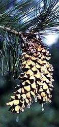

-   « Ancestral Groups 
    -   [Pinus](Eukaryotes/Green_plants/Embryophytes/Spermatopsida/Conifers/Pinaceae/Pinus.md)
    -   [Pinaceae](Pinaceae.md)
    -   [Conifers](Conifers.md)
    -   [Spermatopsida](Spermatopsida.md)
    -   [Embryophytes](Embryophytes.md)
    -   [Green plants](Green_plants)
    -   [Eukaryotes](Eukaryotes)
    -   [Tree of Life](../../../../../../../Tree_of_Life.md)

-   ◊ Sibling Groups of  Pinus
    -   [subgenus Pinus](subgenus_Pinus)
    -   subgenus Strobus

-   » Sub-Groups
    -   [subsection Cembroides](subsection_Cembroides)

# subgenus Strobus 

Containing group: [Pinus](Eukaryotes/Green_plants/Embryophytes/Spermatopsida/Conifers/Pinaceae/Pinus.md)

### References

Gernandt, D. S., A. Liston, and D. Piñero. 2001. Variation in the nrDNA
ITS of Pinus subsection Cembroides: implications for molecular
systematic studies of pine species complexes. Molec. Phyl. Evol.
21:449-467.

Gernandt, D. S., A. Liston, and D. Piñero. 2003. Phylogenetics of Pinus
subsections Cembroides and Nelsoniae inferred from cpDNA sequences.
Syst. Bot. 28:657-673.

Gernandt, D. S., G. Geada López, S. Ortiz García, and A. Liston.
Phylogeny and classification of Pinus. Taxon, in press.

Liston, A., D. S. Gernandt, T. F. Vining, C. T. Campbell, and D. Piñero.
2003. Molecular phylogeny of Pinaceae and Pinus. Pp. 107-114 in Mill,
R.R. (ed.), Proceedings of the 4th Conifer Congress. Acta Hort 615.

##### Title Illustrations



  ---------------------------------------------------------------------------
  Scientific Name ::  Pinus monticola
  Body Part         ovulate cone
  Copyright ::         © [Aaron Liston](http://www.bcc.orst.edu/bpp/faculty/liston/) 
  ---------------------------------------------------------------------------
