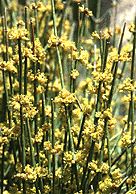

-   « Ancestral Groups 
    -   [Gnetales](Gnetales.md)
    -   [Spermatopsida](Spermatopsida.md)
    -   [Embryophytes](Embryophytes.md)
    -   [Green plants](Green_plants)
    -   [Eukaryotes](Eukaryotes)
    -   [Tree of Life](../../../../../Tree_of_Life.md)

-   ◊ Sibling Groups of  Gnetales
    -   Ephedra
    -   [Gnetum](Gnetum.md)

-   »

# Ephedra 

-   *Ephedra alata*
-   *Ephedra altissima*
-   *Ephedra americana*
-   *Ephedra antisyphilitica*
-   *Ephedra aphylla*
-   *Ephedra aspera*
-   *Ephedra boelckei*
-   *Ephedra breana*
-   *Ephedra californica*
-   *Ephedra chilensis*
-   *Ephedra compacta*
-   *Ephedra coryi*
-   *Ephedra cutleri*
-   *Ephedra distachya*
-   *Ephedra equisetina*
-   *Ephedra fasciculata*
-   *Ephedra fedtschenkoae*
-   *Ephedra foeminea*
-   *Ephedra foliata*
-   *Ephedra fragilis*
-   *Ephedra frustillata*
-   *Ephedra funerea*
-   *Ephedra gerardiana*
-   *Ephedra gracilis*
-   *Ephedra holoptera*
-   *Ephedra intermedia*
-   *Ephedra lepidosperma*
-   *Ephedra likiangensis*
-   *Ephedra lomatolepis*
-   *Ephedra major*
-   *Ephedra minuta*
-   *Ephedra monosperma*
-   *Ephedra multiflora*
-   *Ephedra nevadensis*
-   *Ephedra ochreata*
-   *Ephedra oxyphylla*
-   *Ephedra pachyclada*
-   *Ephedra pedunculata*
-   *Ephedra przewalski*
-   *Ephedra rupestris*
-   *Ephedra sarcocapa*
-   *Ephedra saxatilis*
-   *Ephedra sinica*
-   *Ephedra strobilacea*
-   *Ephedra torreyana*
-   *Ephedra triandra*
-   *Ephedra trifurca*
-   *Ephedra trifurcata*
-   *Ephedra tweediana*
-   *Ephedra viridis*

Containing group: [Gnetales](Gnetales.md)

### Notes

Image copyright © 1995 David R. Maddison

Image copyright © 1995 David R. Maddison

### References

Caveney, S., D. A. Charlet, H. Freitag, M. Maier-Stolte, and A. N.
Starratt. 2001. New observations on the secondary chemistry of world
Ephedra (Ephedraceae). American Journal of Botany 88:1199-1208.

Freitag, H. and M. Maier-Stolte. 1989. The Ephedra-species of P.
Forsskal: identity and typification. Taxon 38:545-556.

Friedman, W. E. 1990. Double fertilization in Ephedra, a nonflowering
seed plant: Its bearing on the origin of angiosperms. Science
247:951-954.

Friedman, W. E. 1990. Sexual reproduction in Ephedra nevadensis
(Ephedraceae): Further evidence of double fertilization in a
nonflowering seed plant. Am. J. Bot. 77:1582-1598.

Huang, J., D. E. Giannasi and R. A. Price. 2005. Phylogenetic
relationships in Ephedra (Ephedraceae) inferred from chloroplast and
nuclear DNA sequences. Molecular Phylogenetics and Evolution
35(1):48-59.

Huang, J. and R. A. Price. 2003. Estimation of the age of extant Ephedra
using chloroplast rbcL sequence data. Molecular Biology and Evolution
20(3):435-440.

Hunziker, J. H. 1995. The karyotypes of Ephedra ochreata, E. rupestris
and E. viridis. Darwiniana 33:369-370.

Land, W. J. G. 1907. Fertilization and embryogeny in Ephedra trifurca.
Bot. Gaz. 44:273-292.

Price, R. A. 1996. Systematics of the Gnetales: a review of
morphological and molecular evidence. International Journal of Plant
Sciences157(6, Suppl.): S40-S49.

Rydin, C., K. R. Pedersen, and E. M. Friis. 2004. On the evolutionary
history of Ephedra: Cretaceous fossils and extant molecules.

Yang, Y., B.-Y. Geng, D. L. Dilcher, Z.-D. Chen, and T. A. Lott. 2005.
Morphology and affinities of an Early Cretaceous Ephedra (Ephedraceae)
from China. American Journal of Botany 92:231-241.

##### Title Illustrations



  ---------------------------------------------------------------------------
  Scientific Name ::     Ephedra
  Specimen Condition   Live Specimen
  Copyright ::            © 1995 [David R. Maddison](http://david.bembidion.org/) 
  ---------------------------------------------------------------------------
