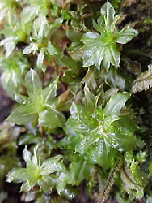
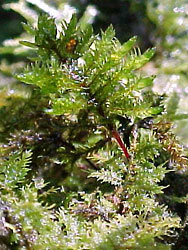
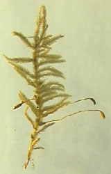
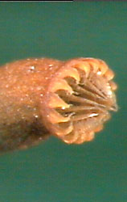
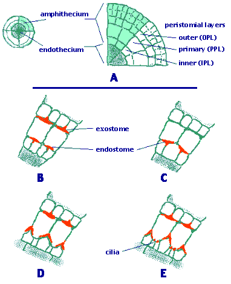
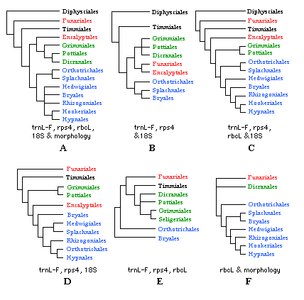

---
aliases:
- Bryopsida
title: Bryopsida
---

# [[Bryopsida]]

Mosses with arthrodontous peristome. 

     

## #has_/text_of_/abstract 

> The **Bryopsida** constitute the largest class of mosses, containing 95% of all moss species. 
> It consists of approximately 11,500 species, common throughout the whole world.
>
> The group is distinguished by having spore capsules with teeth that are arthrodontous; 
> the teeth are separate from each other and jointed at the base 
> where they attach to the opening of the capsule. 
> 
> Consequently, mosses in the Class Bryopsida are 
> commonly known as the “joint-toothed” or “arthrodontous” mosses. 
> 
> These teeth are exposed when the covering operculum falls off.  In other groups of mosses, 
> the capsule is either nematodontous with an attached operculum, 
> or else splits open without operculum or teeth.
>
> [Wikipedia](https://en.wikipedia.org/wiki/Bryopsida) 

## Phylogeny 

-   « Ancestral Groups  
    -   [Moss](../Moss.md)
    -   [Land_Plant](../../Land_Plant.md)
    -   [Green plants](../../../Plants.md)
    -   [Eukaryotes](Eukaryotes)
    -   [Tree of Life](../../../../Tree_of_Life.md)

-   ◊ Sibling Groups of  Bryophyta
    -   Bryopsida

-   » Sub-Groups 

## Introduction

[Efrain De Luna, Angela E. Newton, and Brent D. Mishler]() 

More than 95% of moss species belong to the Bryopsida. 
Diversity in this group has been classified into 90 to 110 families and 11 to 16 orders.
The Dicranales and Hypnales are the most diverse groups with 13 and 44 families, respectively.

The most important characteristic of the Bryopsida is the architecture of the ring of teeth (peristome) 
surrounding the mouth of the sporophyte capsule (Figure 1). 

Bryopsida are the only mosses that have an arthrodontous peristome, 
i. e., a peristome in which the teeth are structured by articulated cell wall remnants (see [[#Characteristics]]). 

**Figure 1**. Closeup of the peristome of the capsule of Sematophyllum
(Hypnales). This arthrodontous peristome is composed of a double ring of
teeth. The external teeth (exostome) are shorter and thicker than the
segments of the internal row (endostome). Note that each tooth in the
exostome is alternated with a segment of the endostome.\
Image copyright © 2000, Efrain De Luna.

Despite all orders sharing a basic arthrodontous peristome, the
Bryopsida comprises a diverse set of species of various gametophytic
morphologies. Branching systems combine pinnate (monopodial) and
stepwise extension of new branches (sympodial architectures) with apical
(acrocarpous) or lateral (cladocarpous and pleurocarpous) sporophyte
locations. Leaf cells are variously differentiated forming specialized
groups at allar, basal, medial, upper and apical leaf zones. Leaves in
some taxa are multilayered stratose, at least in the apex and margins.
The sporangia also show a wide range of variation in shape and size of
the capsule, operculum, and peristome organization. The outer surface of
teeth can be variously ornamented with papillae, striations, or both.

### Characteristics

All of the features of the gametophyte (protonema, gametophore,
gametangia) and sporophyte (seta, sporangium and peristome) described
for the Bryophyta are applicable to the Bryopsida. Here, the basic
patterns of variation in the peristome requires special examination,
since it provides most of the characters for the classification at the
ordinal level in the Bryopsida.

Each tooth of the arthrodontous peristome type is composed of periclinal
(tangential) cell wall remnants between two of the three concentric
peristomial cell layers: the outer, primary, and inner peristomial
layers (OPL, PPL, and IPL; Figure 2A). Often, a double ring of teeth is
present surrounding the capsule mouth (Figure 1). The external ring of
teeth is formed by the tangential walls between the OPL and PPL; it is
collectively known as the **exostome**. The internal row consists of the
cell wall remnants located between the cell rings of the PPL and IPL,
therefore the row of segments is known as **endostome**.

Depending on the number of cell columns articulated to form the length
of a tooth, two primary types of arthrodontous peristomes are known:
diplolepidous and haplolepidous.

In **diplolepidous** peristomes two columns of adjacent OPL cells
participate in the formation of an exostome tooth (Figure 2B, D, E). A
medial vertical line marking the two cells can be observed along the
outer surface of each tooth. This type of peristome can be observed in
taxa of the Funariales, Bryales and Hypnales, among others. In
**haplolepidous** peristomes the exostome is missing, but the endostome
is well developed and strongly thickened. The outer surface of an
endostome segment is made up of just one column of cells from the PPL
(Figure 2C). The haplolepidous peristome is characteristic of the
Grimmiales, Seligeriales, Archidiales, Pottiales, and Dicranales.

**Figure 2**. The different peristome types of Bryopsida.\
**A.** Cross section of an embryonic sporophyte capsule.\
**B.** Diplolepidous opposite peristome (Funaria type).\
**C.** Haplolepidous peristome (Dicranum type).\
**D.** Diplolepidous alternate (Orthotrichum type).\
**E.** Diplolepidous alternate (Bryum type).\
Drawings copyright © 2000 Efrain de Luna.

Two basic peristome \"types\" have long been recognized in the
diplolepidous mosses: diplolepidous-opposite, and
diplolepidous-alternate. In diplolepidous peristomes usually both the
exostome and the endostome are present, but in several families the
endostome is lacking or reduced. When the two concentric rows are
present, each external tooth can be directly opposite or alternated to
the internal segments of the endostome.

In the **diplolepidous-opposite** or \"Funaria type\", the anticlinal
walls of the IPL and PPL are almost perfectly aligned (co-radial), so
the endostome segments and the exostome teeth are opposite each other
(Figure 2B). This peristome organization in found in the Funariales.

In the **diplolepidous-alternate** or \"Bryum type\", anticlinal cell
divisions in the IPL are asymmetric, producing narrow cells adjacent to
large cells. Later in development, the IPL ring shifts displacing the
position of radial IPL cell walls relative to those in the PPL cells.
This results in the placement of the endostome segments alternating with
the exostome teeth (Figure 2D, E). The diplolepidous alternate peristome
is common in the Bryales, Rhizogoniales, Hookeriales, and Hypnales.

### Discussion of Phylogenetic Relationships

The Diphysciales, Funariales, and Timmiales are the most basal lineages
within Bryopsida, but these groups have a number of unique features that
make comparisons difficult (Netwon et al 2000). The remaining orders are
grouped in two large clades: the Dicraniidae consisting of the
haplolepidous peristomate orders, and the Bryidae including the
diplolepidous-alternate taxa (Figure 3A). The most derived clade within
the Bryidae includes orders with ciliate endostomes: Bryales,
Rhizogoniales, Hookeriales and Hypnales (Cox et al. 2000, De Luna et al.
1999). The Hedwigiales are interpreted as an instance of peristome loss,
and it remains uncertain if they belong in the ciliate clade.

**Figure 3**. Phylogenetic relationships within the Bryopsida.\
Orders in the Dicraniidae in green, orders in the Bryidae in blue.\
**A.** Tree from Newton et al. (2000, p. 195). **B.** Tree from Goffinet
& Cox (2000, p. 218). **C.** Tree from Cox et al. (2000, p. 235). **D.**
Tree from Cox & Hedderson (1999, p. 126, 132). **E.** Tree from La Farge
et al. (2000, p. 265). **F.** Tree from De Luna et al (1999, p. 642) and
De Luna et al. (2000, p. 251).

As best estimates of higher-level moss phylogeny, recent cladograms of
the Bryopsida still contain uncertain relationships for the Funariales,
Encalyptales, Bryales, and Hedwigiales.

The Funariales are very likely sister to the rest of arthrodontous
mosses (except Diphysiales). This position is consistent in Newton et
al. (2000, Figure 3A) and Cox et al. (2000, Figure 3C). However, another
analysis places the Funariales as sister to the Encalyptales, and this
clade is in turn sister to Dicraniidae (Goffinet & Cox 2000, Figure 3B).
The apparent relationship of the Funariales to the Dicraniidae (as
interpreted by La Farge et al. 2000, Figure 3E) is most likely because
members of the Bryales were used to root the phylogeny. This topology
becomes mostly concordant with the other five hypotheses of
relationships in Figure 3 if it is rooted with the Funariales.

The relationships of the Encalyptales are still uncertain. This group
has been resolved as sister to the Dicraniidae (Newton et al. 2000,
Figure 3A), sister to the Bryidae (Cox & Hedderson 1999, Figure 3D), or
sister to the Dicraniidae + Bryidae clade (Cox et al. 2000, Figure 3C).

Also the circumscription and relationships of Bryales and Hedwigiales
still need further study. Polyphyletic status of the Bryales in several
studies make it unclear how families such as the Bartramiaceae,
Bryaceae, Mniaceae, and Hedwigiaceae are related to each other.

### References

Cox, C. J. and T. A. J. Hedderson. 1999. Phylogenetic relationships
among the ciliate arthrodontous mosses: evidence from chloroplast and
nuclear DNA sequences. Pl. Syst. Evol. 215:119-139.

Cox, C. J., B. Goffinet, A. E. Newton, A. J. Shaw and T. A. J.
Hedderson. 2000. Phylogenetic relationships among the
diplolepideous-alternate mosses (Bryidae) inferred from nuclear and
chloroplast DNA sequences. The Bryologist 103:224-241.

De Luna, E., A. E. Newton, A. Withey, D. Gonzalez and B. D. Mishler.
1999. The transition to pleurocarpy: A phylogenetic analysis of the main
Diplolepidous lineages based on rbcL sequences and morphology. The
Bryologist 102:634-650.

De Luna, E., W. R. Buck, H. Akiyama, T. Arikawa, H. Tsubota, D.
Gonzalez, A. E. Newton and A. J. Shaw. 2000. Ordinal phylogeny within
the Hypnobryalean pleurocarpous mosses inferred from cladistic analyses
of three chloroplast DNA sequence data sets: trnL-F, rps4, and rbcL. The
Bryologist 103:242-256.

Goffinet, B. and C. J. Cox. 2000. Phylogenetic relationships among
basal-most arthrodontous mosses with special emphasis on the
evolutionary significance of the Funariineae. The Bryologist
103:212-223.

La Farge, C., B. D. Mishler, J. A. Wheeler, D. P. Wall, K. Johanes, S.
Schaffer and A. J. Shaw. 2000. Phylogenetic relationships within the
haplolepideous mosses. The Bryologist 103:257-276.

Newton, A. E. and E. De Luna. 1999. A survey of morphological characters
for phylogenetic study of the transition to pleurocarpy. The Bryologist
102:651-682.

Newton, A. E., C. J. Cox, J. G. Duckett, J. A. Wheeler, B. Goffinet, T.
A. Hedderson and B. D. Mishler. 2000. Evolution of the major moss
lineages: Phylogenetic analyses based on multiple gene sequences and
morphology. The Bryologist 103:187-211.

## Title Illustrations

--------------------------------------------------------------------------------
  
Scientific Name ::     Bryum, Bryales
Location ::           cloud forest near Xalapa, Veracruz, Mexico
Comments             a moss growing on soil
Specimen Condition   Live Specimen
Copyright ::            © 2000 [Efrain De Luna](http://www.ecologia.edu.mx/academicos/deluna.htm) 

--------------------------------------------------------------------------------
 

Scientific Name ::     Pterobryon, Hypnales
Location ::           cloud forest near Xalapa, Veracruz, Mexico
Comments             an epiphyte moss
Specimen Condition   Live Specimen
Copyright ::            © 2000 [Efrain De Luna](http://www.ecologia.edu.mx/academicos/deluna.htm) 

--------------------------------------------------------------------------------
 
Scientific Name ::     Hypnum, Hypnales
Location ::           cloud forest near Xalapa, Veracruz, Mexico
Comments             a moss growing on soil
Specimen Condition   Live Specimen
Copyright ::            © 2000 [Efrain De Luna](http://www.ecologia.edu.mx/academicos/deluna.htm) 

## Confidential Links & Embeds: 

### #is_/same_as :: [Bryopsida](/_Standards/bio/bio~Domain/Eukaryotes/Plants/Land_Plant/Moss/Bryopsida.md) 

### #is_/same_as :: [Bryopsida.public](/_public/bio/bio~Domain/Eukaryotes/Plants/Land_Plant/Moss/Bryopsida.public.md) 

### #is_/same_as :: [Bryopsida.internal](/_internal/bio/bio~Domain/Eukaryotes/Plants/Land_Plant/Moss/Bryopsida.internal.md) 

### #is_/same_as :: [Bryopsida.protect](/_protect/bio/bio~Domain/Eukaryotes/Plants/Land_Plant/Moss/Bryopsida.protect.md) 

### #is_/same_as :: [Bryopsida.private](/_private/bio/bio~Domain/Eukaryotes/Plants/Land_Plant/Moss/Bryopsida.private.md) 

### #is_/same_as :: [Bryopsida.personal](/_personal/bio/bio~Domain/Eukaryotes/Plants/Land_Plant/Moss/Bryopsida.personal.md) 

### #is_/same_as :: [Bryopsida.secret](/_secret/bio/bio~Domain/Eukaryotes/Plants/Land_Plant/Moss/Bryopsida.secret.md)

