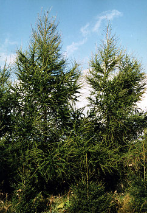
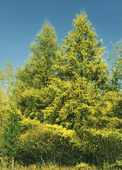

# [[Larch]] 

   

## Phylogeny 

-   « Ancestral Groups  
    -   [Pine](../Pine.md)
    -   [Conifers](../../Conifers.md)
    -   [Seed_Plant](../../../Seed_Plant.md)
    -   [Land_Plant](../../../../Land_Plant.md)
    -   [Green plants](../../../../../Plants.md)
    -   [Eukaryotes](Eukaryotes)
    -   [Tree of Life](../../../../../../Tree_of_Life.md)

-   ◊ Sibling Groups of  Pinaceae
    -   [Pinus](Pinus.md)
    -   [Pseudotsuga](Pseudotsuga.md)
    -   Larix

-   » Sub-Groups 

## Title Illustrations

--------------------

Scientific Name ::     Larix decidua
Location ::           Michigan, USA
Comments             European larch
Acknowledgements     Photograph courtesy InsectImages.org (#1218012)
Specimen Condition   Live Specimen
Source Collection    [InsectImages.org](http://www.insectimages.org/)
Copyright ::            © Bill Cook, Michigan State University

--------------------

Scientific Name ::     Larix laricina
Location ::           Michigan, USA
Comments             tamarack
Acknowledgements     Photograph courtesy InsectImages.org (#1218018)
Specimen Condition   Live Specimen
Source Collection    [InsectImages.org](http://www.insectimages.org/)
Copyright ::            © Bill Cook, Michigan State University

