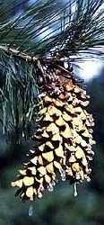

# [[Strobus(subgenus)]] 

## Phylogeny 

-   « Ancestral Groups  
    -   [Pinus](../Pinus.md)
    -   [Pine](../../Pine.md)
    -   [Conifers](../../../Conifers.md)
    -   [Seed_Plant](../../../../Seed_Plant.md)
    -   [Land_Plant](../../../../../Land_Plant.md)
    -   [Green plants](../../../../../../Plants.md)
    -   [Eukaryotes](Eukaryotes)
    -   [Tree of Life](../../../../../../../Tree_of_Life.md)

-   ◊ Sibling Groups of  Pinus
    -   [subgenus Pinus](subgenus_Pinus)
    -   subgenus Strobus

-   » Sub-Groups
    -   [subsection Cembroides](subsection_Cembroides)

## Title Illustrations

.jpg)

  ---------------------------------------------------------------------------
  Scientific Name ::  Pinus monticola
  Body Part         ovulate cone
  Copyright ::         © [Aaron Liston](http://www.bcc.orst.edu/bpp/faculty/liston/) 
  ---------------------------------------------------------------------------

## Confidential Links & Embeds: 

### #is_/same_as :: [Strobus](/_Standards/bio/bio~Domain/Eukaryotes/Plants/Land_Plant/Seed_Plant/Conifers/Pine/Pinus/Strobus.md) 

### #is_/same_as :: [Strobus.public](/_public/bio/bio~Domain/Eukaryotes/Plants/Land_Plant/Seed_Plant/Conifers/Pine/Pinus/Strobus.public.md) 

### #is_/same_as :: [Strobus.internal](/_internal/bio/bio~Domain/Eukaryotes/Plants/Land_Plant/Seed_Plant/Conifers/Pine/Pinus/Strobus.internal.md) 

### #is_/same_as :: [Strobus.protect](/_protect/bio/bio~Domain/Eukaryotes/Plants/Land_Plant/Seed_Plant/Conifers/Pine/Pinus/Strobus.protect.md) 

### #is_/same_as :: [Strobus.private](/_private/bio/bio~Domain/Eukaryotes/Plants/Land_Plant/Seed_Plant/Conifers/Pine/Pinus/Strobus.private.md) 

### #is_/same_as :: [Strobus.personal](/_personal/bio/bio~Domain/Eukaryotes/Plants/Land_Plant/Seed_Plant/Conifers/Pine/Pinus/Strobus.personal.md) 

### #is_/same_as :: [Strobus.secret](/_secret/bio/bio~Domain/Eukaryotes/Plants/Land_Plant/Seed_Plant/Conifers/Pine/Pinus/Strobus.secret.md)

