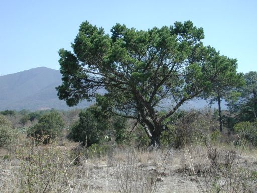

# subsection Cembroides 

 

## Phylogeny 

-   « Ancestral Groups  
    -   [subgenus Strobus](subgenus_Strobus)
    -   [Pinus](../../Pinus.md)
    -   [Pine](../../../Pine.md)
    -   [Conifers](../../../../Conifers.md)
    -   [Seed_Plant](../../../../../Seed_Plant.md)
    -   [Land_Plant](../../../../../../Land_Plant.md)
    -   [Green plants](../../../../../../../Plants.md)
    -   [Eukaryotes](Eukaryotes)
    -   [Tree of Life](../../../../../../../../Tree_of_Life.md)

-   ◊ Sibling Groups of  subgenus Strobus
    -   subsection Cembroides

-   » Sub-Groups
    -   [Pinus cembroides](Pinus_cembroides)
    -   [Pinus johannis](Pinus_johannis)
    -   [Pinus remota](Pinus_remota)

## Introduction

Most of the North American pinyon pines are species of *Pinus*
subsection *Cembroides*. This group of pines are distributed from the
western United States to south-central Mexico. The species are
recognizable for adaptations for bird dispersal, notably enlarged,
functionally wingless seeds with a hardened integument. Other pine
subsections (*Nelsoniae*, *Strobus*, and *Pinaster*) also have wingless
seeds, so this character is not diagnostic for the group. Furthermore,
the rare Mexican endemic, *P. rzedowskii* is also in subsection
*Cembroides*, although it has small, winged, wind-dispersed seeds as in
most other pines.

### References

Farjon, A. & Styles, B. T. 1997. Pinus (Pinaceae). Flora Neotropica
Monograph 75. The New York Botanical Garden, New York.

Gernandt, D. S., A. Liston, and D. Piñero. 2001. Variation in the nrDNA
ITS of Pinus subsection Cembroides: implications for molecular
systematic studies of pine species complexes. Molec. Phyl. Evol.
21:449-467.

Gernandt, D. S., A. Liston and D. Piñero. 2003. Phylogenetics of Pinus
subsections Cembroides and Nelsoniae inferred from cpDNA sequences.
Syst. Bot. 28:657-673.

Liston, A., D. S. Gernandt, T. F. Vining, C. S. Campbell and D. Piñero.
2003. Molecular phylogeny of Pinaceae and Pinus. Pp. 107-114 in Mill, R.
R. (ed.), Proceedings of the International Conifer Conference. Acta
Hort. No. 615, International Society for Horticultural Science, Brugge.

Malusa, J. 1992. Phylogeny and biogeography of the pinyon pines (Pinus
subsect. Cembroides). Syst. Bot. 17:42-66.

## Title Illustrations

-------------------------------------------------------------------------------------------
 
Scientific Name ::     Pinus cembroides subspecies orizabensis
Location ::           Puebla-Veracruz border, Mexico
Specimen Condition   Live Specimen
Body Part            tree
Copyright ::            © 2004 [David S. Gernandt](http://www.reduaeh.mx/investigacion/biologia/investigadores/gernandt_latteri.htm) 

## Confidential Links & Embeds: 

### #is_/same_as :: [Cembroides](/_Standards/bio/bio~Domain/Eukaryotes/Plants/Land_Plant/Seed_Plant/Conifers/Pine/Pinus/Strobus/Cembroides.md) 

### #is_/same_as :: [Cembroides.public](/_public/bio/bio~Domain/Eukaryotes/Plants/Land_Plant/Seed_Plant/Conifers/Pine/Pinus/Strobus/Cembroides.public.md) 

### #is_/same_as :: [Cembroides.internal](/_internal/bio/bio~Domain/Eukaryotes/Plants/Land_Plant/Seed_Plant/Conifers/Pine/Pinus/Strobus/Cembroides.internal.md) 

### #is_/same_as :: [Cembroides.protect](/_protect/bio/bio~Domain/Eukaryotes/Plants/Land_Plant/Seed_Plant/Conifers/Pine/Pinus/Strobus/Cembroides.protect.md) 

### #is_/same_as :: [Cembroides.private](/_private/bio/bio~Domain/Eukaryotes/Plants/Land_Plant/Seed_Plant/Conifers/Pine/Pinus/Strobus/Cembroides.private.md) 

### #is_/same_as :: [Cembroides.personal](/_personal/bio/bio~Domain/Eukaryotes/Plants/Land_Plant/Seed_Plant/Conifers/Pine/Pinus/Strobus/Cembroides.personal.md) 

### #is_/same_as :: [Cembroides.secret](/_secret/bio/bio~Domain/Eukaryotes/Plants/Land_Plant/Seed_Plant/Conifers/Pine/Pinus/Strobus/Cembroides.secret.md)

