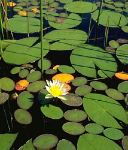
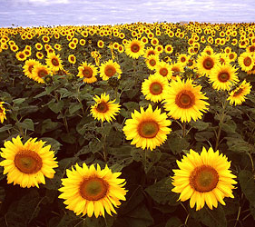
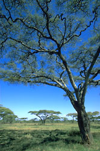
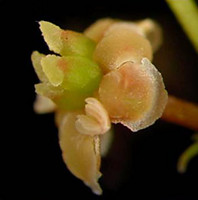
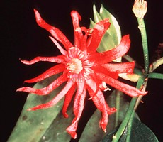
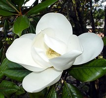

---
aliases:
- Angiosperm
- Angiosperms
- "Flowering Plant"
- "Flowering Plants"
- Magnoliophyta
title: Angiosperms
---

# Angiosperms

Flowering Plants 

     

## #has_/text_of_/abstract 

> Flowering plants are plants that bear flowers and fruits, and form the clade Angiospermae. 
> The term 'angiosperm' is derived from the Greek words ἀγγεῖον / angeion ('container, vessel') 
> and σπέρμα / sperma ('seed'), meaning that the seeds are enclosed within a fruit. 
> The group was formerly called Magnoliophyta.
>
> **Angiosperms** are by far the most diverse group of land plants with 64 orders, 416 families, 
> approximately 13,000 known genera and 300,000 known species. 
> 
> They include all forbs (flowering plants without a woody stem), grasses and grass-like plants, 
> a vast majority of broad-leaved trees, shrubs and vines, and most aquatic plants. 
> 
> Angiosperms are distinguished from the other major seed plant clade, the gymnosperms, 
> by having flowers, xylem consisting of vessel elements instead of tracheids, 
> endosperm within their seeds, and fruits that completely envelop the seeds. 
> 
> The ancestors of flowering plants diverged from the common ancestor of all living gymnosperms 
> before the end of the Carboniferous, over 300 million years ago. 
> In the Cretaceous, angiosperms diversified explosively, 
> becoming the dominant group of plants across the planet.
>
> Agriculture is almost entirely dependent on angiosperms, 
> and a small number of flowering plant families supply nearly all plant-based food and livestock feed. 
> Rice, maize and wheat provide half of the world's staple calorie intake, 
> and all three plants are cereals from the Poaceae family (colloquially known as grasses). 
> 
> Other families provide important industrial plant products such as wood, paper and cotton, 
> and supply numerous ingredients for beverages, sugar production, traditional medicine 
> and modern pharmaceuticals. 
> 
> Flowering plants are also commonly grown for decorative purposes, 
> with certain flowers playing significant cultural roles in many societies.
>
> Out of the "Big Five" extinction events in Earth's history, only the Cretaceous–Paleogene extinction event 
> had occurred while angiosperms dominated plant life on the planet. 
> 
> Today, the Holocene extinction affects all kingdoms of complex life on Earth, 
> and conservation measures are necessary to protect plants in their habitats in the wild (in situ), 
> or failing that, ex situ in seed banks or artificial habitats like botanic gardens. 
> 
> Otherwise, around 40% of plant species may become extinct due to human actions 
> such as habitat destruction, introduction of invasive species, unsustainable logging, land clearing 
> and overharvesting of medicinal or ornamental plants. 
> 
> Further, climate change is starting to impact plants 
> and is likely to cause many species to become extinct by 2100.
>
> [Wikipedia](https://en.wikipedia.org/wiki/Flowering%20plant) 

## Phylogeny 

-   « Ancestral Groups  
    -   [Seed_Plant](../Seed_Plant.md)
    -   [Land_Plant](../../Land_Plant.md)
    -   [Green plants](../../../Plants.md)
    -   [Eukaryotes](Eukaryotes)
    -   [Tree of Life](../../../../Tree_of_Life.md)

-   ◊ Sibling Groups of  Spermatopsida
    -   [Conifers](Conifers.md)
    -   [Gnetales](Gnetales.md)
    -   Angiosperms

-   » Sub-Groups

    -   [Amborella trichopoda](Flowering_Plant/Amborella.md)
    -   [Magnoliids](Flowering_Plant/Magnoliids.md)
    -   [Chloranthaceae](Flowering_Plant/Chloranthaceae.md)
    -   [Ceratophyllaceae](Flowering_Plant/Ceratophyllaceae.md)
    -   [Monocot](Flowering_Plant/Monocot.md)
    -   [Eudicots](Flowering_Plant/Eudicots.md)
    -   [Austrobaileyales](Flowering_Plant/Austrobaileyales.md)
    -   [Nymphaeaceae](Flowering_Plant/Nymphaeaceae.md)

## Introduction

[Pam Soltis, Doug Soltis, and Christine Edwards]()

The angiosperms, or flowering plants, are one of the major groups of extant seed plants 
and arguably the most diverse major extant plant group on the planet, 
with at least 260,000 living species classified in 453 families (Judd et al., 2002; APG II, 2003; Soltis et al., 2005).

They occupy every habitat on Earth 
- except extreme environments such as the highest mountaintops, 
- the regions immediately surrounding the poles,
- and the deepest oceans. 

They live as epiphytes (i.e., living on other plants), 
as floating and rooted aquatics in both freshwater and marine habitats, 
and as terrestrial plants that vary tremendously in size, longevity, and overall form. 

They can be small herbs, parasitic plants, shrubs, vines, lianas, or giant trees. 
There is a huge amount of diversity in chemistry (often as a defense against herbivores),
reproductive morphology, and genome size and organization 
that is unparalleled in other members of the Plant Kingdom. 

Furthermore, angiosperms are crucial for human existence; 
the vast majority of the world\'s crops are angiosperms, as are most natural clothing fibers.
Angiosperms are also sources for other important resources such as medicine and timber.

### Characteristics

Despite their diversity, angiosperms are clearly united by a suite of synapomorphies 
(i.e., shared, derived features) including 
1) ovules that are enclosed within a carpel, 
   that is, a structure that is made up of an ovary, which encloses the ovules, 
   and the stigma, a structure where pollen germination takes place, 
2) double fertilization, which leads to the formation of an endosperm 
   (a nutritive tissue within the seed that feeds the developing plant embryo), 
3) stamens with two pairs of pollen sacs, 
4) features of gametophyte structure and development, and 
5) phloem tissue composed of sieve tubes and companion cells (see Doyle and Donoghue, 1986; Judd et al. 2002; P. Soltis et al., 2004; and D. Soltis et al., 2005, for further discussion). 

All available evidence strongly rejects hypotheses of more than one evolutionary origin of extant
angiosperms.

### Discussion of Phylogenetic Relationships

#### *Amborella* and the root of the angiosperm evolutionary tree

Most analyses of the past five years concur in placing the monotypic
*Amborella* as the sister to all other extant angiosperms, although some
analyses suggest *Amborella* plus water lilies may occupy this pivotal
position (see below). *Amborella trichopoda*, endemic to cloud forests
of New Caledonia, was described in the mid-nineteenth century (Baillon,
1869) and has since been classified with various groups of basal
angiosperms, most often with Laurales (e.g., Cronquist, 1981), a group
of magnoliids (see below). However, *Amborella* lacks those features
considered to be synapomorphies for Laurales (Doyle and Endress, 2000;
see Laurales later) and clearly differs from most Laurales in having
spirally arranged floral organs (except perhaps the carpels; M. Buzgo et
al., University of Florida, unpublished data), rather than the whorled
arrangement typical of most Laurales (see studies of floral morphology
and development by Endress and Igersheim, 2000a; Posluszny and
Tomlinson, 2003; Buzgo et al., 2004). *Amborella* has carpels that are
closed only by secretion, rather than by fused tissue as in most
angiosperms (Endress and Igersheim, 2000b)--a feature that may represent
a plesiomorphy (i.e., ancestral feature) for the angiosperms. Features
that unify all extant angiosperms except *Amborella* include vessels
(Judd et al., 2002; but see Feild et al., 2000; Doyle and Endress, 2001)
and pollen grains with a reticulate tectum (Doyle and Endress, 2001).
Synapomorphies for all extant angiosperms except *Amborella* and
Nymphaeaceae (sensu APG II, 2003) include ethereal oil cells--common
throughout basal angiosperms--and columellate pollen grains with a
perforate tectum (Doyle and Endress, 2001).

Photo of *Amborella trichopoda* (Amborellaceae; photo © Sangtae Kim).

The placement of *Amborella* as sister to all other angiosperms is
supported by nearly all multigene analyses of basal angiosperms,
including evidence from all three plant genomes (e.g., P. Soltis et al.,
1999; Qiu et al., 1999; Mathews and Donoghue, 1999, 2000; Parkinson et
al., 1999; Graham and Olmstead, 2000; Graham et al., 2000; D. Soltis et
al., 2000; Magallon and Sanderson, 2002; Zanis et al., 2002; see also
Nickerson and Drouin, 2004). A few studies have found alternative
rootings, using either different genes or different methods of analysis.
For example, *Amborella* + Nymphaeaceae (e.g. Barkman et al., 2000; P.
Soltis et al., 2000; Kim et al., 2004a) or Nymphaeaceae alone (e.g.,
Parkinson et al., 1999; Graham and Olmstead, 2000, with partial sampling
of Nymphaeaceae; Mathews and Donoghue, 2000) have occasionally been
reported as sister to all other angiosperms. However, statistical
analyses of these alternative rootings using a data set of up to 11
genes generally favor the tree with *Amborella* as sister to the rest,
although the *Amborella* + Nymphaeaceae tree could not always be
rejected (Zanis et al., 2002).

Another alternative, which conflicts with all molecular analyses of
angiosperms with dense taxon sampling, is based on a selection of 61
genes from the totally sequenced plastid genomes of 13 plant species
(Goremykin et al., 2003). This data set placed the monocots (represented
by only three grasses--rice, maize, and wheat) as the sister to all
other extant angiosperms, while *Amborella* was sister to *Calycanthus*
of Laurales, a position consistent with the original description of
*Amborella*, but clearly at odds with other aspects of morphology (see
Laurales section). Goremykin et al. (2003) attributed their results to
the increased character sampling (30,017 nucleotides in their aligned
matrix) in their study relative to other analyses that included fewer
genes but many more taxa. However, further analyses of a data set of
three genes and nearly equivalent taxon sampling as used by Goremykin et
al. indicated that the \"monocots-basal\" topology is an artifact of
limited taxon sampling (D. Soltis and Soltis, 2004; Soltis et al.,
2004). The recent work of Stefanovic et al. (2005) further indicates
that the results of Goremykin et al. reflect poor taxon sampling.
Stefanovic et al. added the nearly complete plastid sequence of *Acorus*
to the Goremykin et al. data set, and this simple addition resulted in
the \"*Amborella*-basal\" topology.

#### **The basal angiosperms**

The basal angiosperms represent a grade that includes the following
groups: Amborellaceae (discussed above), Nymphaeaceae (sensu APG II,
2003), Austrobaileyales, Ceratophyllaceae, Chloranthaceae, magnoliids,
and monocots (although not all investigators choose to consider monocots
basal angiosperms). The evolutionary relationships of these groups are
discussed below.

Photos of *Nuphar japonica* sp. (Nymphaeaceae; photo © Sangtae Kim),
*Austrobaileya* sp. (Austrobaileyales; photo © Peter Endress) and
*Illicium floridanum* (Schisandraceae sensu APG II (2003); photo © Doug
Soltis).

***Nymphaeaceae.*** The phylogenetic position of Nymphaeaceae as one of
the two basalmost (or oldest diverging) lineages of extant angiosperms
is strongly supported by nearly all molecular analyses. This clade of
eight aquatic genera has a worldwide distribution, consistent with the
ancient age of this lineage based on the fossil record. However, despite
the ancient origins of this group, molecular analyses indicate that most
extant genera of Nympheaceae have relatively recent origins (Yoo et al.
2005).

***Austrobaileyales.*** The positions of Amborellaceae and Nymphaeaceae
as successive sisters to the rest of the angiosperms are followed, in
turn, by Austrobaileyales. Austrobaileyales are a small clade that
comprises Austrobaileyaceae (*Austrobaileya*) and Trimeniaceae
(*Trimenia*) from Australasia plus a broadly defined Schisandraceae
(sensu APG II, 2003, i.e., *Schisandra*, *Kadsura*, and *Illicium*; Qiu
et al., 1999; Renner, 1999; Savolainen et al., 2000a, b; P. Soltis et
al., 1999; D. Soltis et al., 2000). Although the traditional Illiciaceae
and Schisandraceae have typically been considered to be closely related,
a relationship between these taxa and *Austrobaileya* and *Trimenia* had
not been suspected. No morphological characteristics have been
identified that unify this group, despite the strong molecular support
for its monophyly.

#### **Relationships among Ceratophyllaceae, monocots, Chloranthaceae, magnoliids, and eudicots**

Resolution and support for relationships among Ceratophyllaceae,
monocots, Chloranthaceae, magnoliids, and eudicots are poor.
Individually, each lineage is well supported, and both the fossil record
and molecular-based trees identify these lineages as ancient. However,
relationships among them remain unclear. It is clear, however, that
angiosperms do not fall into two major groups that correspond to
monocots (Liliopsida) and dicots (Magnoliopsida) of most traditional
classification systems such as Cronquist (1981), Takhtajan (1997), and
their predecessors. Although monocots clearly form a strongly supported
group, dicots in the traditional sense do not: most are found in the
eudicot clade, but the remaining nonmonocot basal branches (i.e.,
Amborellaceae, Nymphaeaceae, Austrobaileyales, Ceratophyllaceae,
Chloranthaceae, magnoliids) were also \"traditional\" dicots. It was
long suspected that the \"dicots\" as traditionally recognized
represents multiple evolutionary lineages, and the nonmonophyly of
dicots based on molecular data precludes their recognition in current
classifications (e.g., APG II, 2003). Thus, the concept of \"dicot\"
should be abandoned in favor of eudicots.

Photos of *Ceratophyllum demersum* (Ceratophyllaceae; photo © Peter
Endress), *Sarcandra chloranthoides* (Chloranthaceae; photo © Peter
Endress) and *Magnolia grandiflora* (Magnoliaceae; photo © Sangtae Kim)

***Monocots.*** While dicots are not a valid group, the monocots indeed
are a distinct group within the angiosperms. Ray (1703) first identified
the monocots as a group, based largely on their possession of a single
cotyledon. Nonmolecular phylogenetic studies of monocots (Doyle and
Donoghue, 1992; Donoghue and Doyle, 1989; Loconte and Stevenson, 1991)
support this grouping; these studies have identified 13 putative
synapomorphies for the monocots, including, among others, a single
cotyledon, parallel-veined leaves, sieve cell plastids with several
cuneate protein crystals, scattered vascular bundles in the stem, and an
adventitious root system. An often-overlooked synapomorphy for monocots
is their sympodial growth; although there are other angiosperms with
sympodial growth, monocots are nearly exclusively so. These
synapomorphies are covered in detail by Chase (2004; see also Judd et
al., 2002; D. Soltis et al., 2005). In some analyses the monocots appear
as the sister to Ceratophyllaceae, with the clade of monocots +
Ceratophyllaceae sister to Chloranthaceae + magnoliids + eudicots (e.g.,
Zanis et al., 2002; Davies et al., 2004). However, relationships of
monocots are unclear and further work is needed to assess the validity
of their relationships.

***Ceratophyllaceae.*** Ceratophyllaceae (*Ceratophyllum*) had the
distinction of appearing as the sister to all other angiosperms in the
first large molecular phylogenetic analysis based on *rbcL* (Chase et
al., 1993). The aquatic habit and simple flowers seemed at odds with
most hypotheses about the earliest angiosperms, although *Ceratophyllum*
has a long fossil record, going back at least 125 mya (Dilcher, 1989).
Subsequent analyses demonstrated that this placement was unique to the
*rbcL* data set. Our current understanding of the relationship of
*Ceratophyllum* to other angiosperms, based on evidence from many other
genes, is still not clear although it may be related to the monocots
(see Monocots above).

***Chloranthaceae.*** Chloranthaceae, with their small, simple flowers,
have an extensive fossil record, dating back 125 my (e.g., Couper, 1958;
Walker and Walker, 1984; Friis et al., 2000; Doyle et al., 2004; Eklund
et al., 2004). However, although the origins of the family are ancient,
most extant genera are relatively young in age (Zhang and Renner, 2003).
Chloranthaceae are clearly an isolated lineage separate from the
magnoliid clade (Fig. 2), but their phylogenetic position remains
uncertain. In some analyses (e.g., Zanis et al., 2002; Davies et al.,
2004), they are sister to a clade of magnoliids + eudicots, albeit with
weak support.

***Magnoliids.*** The magnoliid clade comprises most of those lineages
typically referred to as \"primitive angiosperms\" in earlier works
(e.g., Cronquist, 1981, 1988; Stebbins, 1974; Takhtajan, 1997). Although
the component families of the magnoliid clade were loosely associated in
previous classifications, for example, as Cronquist\'s (1981) subclass
Magnoliidae, relationships among the families were not clear. In
addition, Magnoliidae contained groups that are not part of the
magnoliid clade as recognized by phylogenetic analyses. Reconstructing
relationships within this clade is challenging, given the age of the
group (some putative members, such as *Archaeanthus*, Dilcher and Crane,
1984, date to the early Cretaceous) and presumably high levels of
extinction. Although the major lineages of the magnoliid clade were
identified as well-supported clades in earlier studies (e.g., P. Soltis
et al., 1999), composition and interrelationships of the magnoliid clade
did not become clear until data sets of at least five genes for a broad
sample of taxa were assembled to address these problems (e.g., Qiu et
al., 1999, 2000; Zanis et al., 2002). Some phylogenetic analyses weakly
support a grouping of magnoliids as sister to the eudicots, although
more data are necessary to clarify this relationship.

***Eudicots.*** Eudicots, a clade strongly supported by molecular data,
comprise the bulk of angiosperm species (approximately 75%; Drinnan et
al., 1994). This large clade is supported by a single morphological
synapomorphy--triaperturate pollen. This pollen type is unique to the
eudicots, and while not all eudicots have triaperturate pollen due to
subsequent changes in pollen structure, triaperturate pollen is clearly
distinct from the uniaperturate pollen of basal angiosperms, monocots,
and all other seed plants, allowing easy assignment of fossil pollen to
the eudicots. The fossil pollen record indicates that the eudicots
appeared 125 mya, shortly after the origin of the angiosperms
themselves. The extensive fossil pollen collections worldwide, coupled
with solid dates, make it unlikely that the eudicots arose much before
this time point.

### The Fossil Record

The oldest unambiguous angiosperm fossil extends back at least to the
early Cretaceous, conservatively around 132 million years ago (mya) (see
Crane et al., 2004). Floral size, structure, and organization in early
angiosperms varied tremendously, ranging from small (i.e., \<1 cm in
diameter) flowers of fossil Chloranthaceae and many other lineages
(reviewed in Friis et al., 2000), to the large, Magnolia-like flowers of
*Archaeanthus* (Dilcher and Crane, 1984). However, some early fossils,
such as *Archaefructus* (Sun et al. 2002), appear to have no close
extant relatives. The floral diversity in the fossil record is
consistent with an early radiation of angiosperms and a diversification
in floral form (e.g., Friis et al., 2000).

### Age Estimates for the Angiosperms

Initial attempts to estimate the age of the angiosperms and the timing
of important divergences based on molecular data span a wide time range
(ranging from \~125 to \> 400 mya) and many disagree with dates
determined from the fossil record (see Sanderson and Doyle, 2001; P.
Soltis et al. 2002; Sanderson et al., 2004; Bell et al., 2005). However,
more recent efforts to date the origin of the angiosperms using
molecular data and improved dating methods have converged on estimates
between 180-140 mya, predating the dates inferred from the fossil record
by between 45 to 5 million years (Sanderson et al., 2004; Bell et al.,
2005). Estimated ages for specific angiosperm clades using molecular
estimates are also generally older than inferences from the fossil
record (e.g., Wikström et al., 2001, compared with Magallon et al.,
1999), but these discrepancies are generally small. Work in the future
will likely focus on further reconciliation of age estimates inferred
from fossils and molecular data. For example, given the numerous diverse
fossils reported from as early as 115-125 mya, perhaps the earliest
angiosperms were older than the estimate from the fossil record of 132
mya. Conversely, molecular methods tend to overestimate ages
(Rodríguez-Trelles et al., 2002), so refinement of dating approaches is
needed to compensate for this bias.

## Title Illustrations

------------------------------------------------------------------------------
 
Scientific Name ::  Nymphaea
Location ::        Okavango Delta, Botswana
Comments          Nymphaea water lilies (Nymphaeales) in a lagoon
Copyright ::         © 1990 [Greg and Marybeth Dimijian](http://www.dimijianimages.com/) 

----------------------------------------------------------------------------------------------
 
Scientific Name ::  Helianthus annuus
Location ::        Fargo, North Dakota
Comments          Cultivated sunflowers (Euangiosperms, Asteraceae)
Creator           Photograph by Bruce Fritz
Copyright ::         © [USDA Agricultural Research Service USDA Agricultural Research Service](http://www.ars.usda.gov/is/graphics/photos/) 

----------------------------------------------------------------------------
 
Scientific Name ::  Acacia tortilis
Location ::        southern Serengeti near Ndutu, Tanzania
Comments          (Euangiosperms, Fabaceae)
Copyright ::         © [Greg and Marybeth Dimijian](http://www.dimijianimages.com/) 

## Confidential Links & Embeds: 

### #is_/same_as :: [Flowering_Plant](/_Standards/bio/bio~Domain/Eukaryotes/Plants/Land_Plant/Seed_Plant/Flowering_Plant.md) 

### #is_/same_as :: [Flowering_Plant.public](/_public/bio/bio~Domain/Eukaryotes/Plants/Land_Plant/Seed_Plant/Flowering_Plant.public.md) 

### #is_/same_as :: [Flowering_Plant.internal](/_internal/bio/bio~Domain/Eukaryotes/Plants/Land_Plant/Seed_Plant/Flowering_Plant.internal.md) 

### #is_/same_as :: [Flowering_Plant.protect](/_protect/bio/bio~Domain/Eukaryotes/Plants/Land_Plant/Seed_Plant/Flowering_Plant.protect.md) 

### #is_/same_as :: [Flowering_Plant.private](/_private/bio/bio~Domain/Eukaryotes/Plants/Land_Plant/Seed_Plant/Flowering_Plant.private.md) 

### #is_/same_as :: [Flowering_Plant.personal](/_personal/bio/bio~Domain/Eukaryotes/Plants/Land_Plant/Seed_Plant/Flowering_Plant.personal.md) 

### #is_/same_as :: [Flowering_Plant.secret](/_secret/bio/bio~Domain/Eukaryotes/Plants/Land_Plant/Seed_Plant/Flowering_Plant.secret.md)

