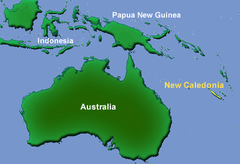

# [[Amborella]] 

Amborella trichopoda is a small, evergreen, doecious shrub 
that occurs only in the moist, shaded understory of montane forests 
on the South Pacific island of New Caledonia.

## #has_/text_of_/abstract 

> **Amborella** is a monotypic genus of understory shrubs or small trees 
> endemic to the main island, Grande Terre, of New Caledonia in the southwest Pacific Ocean. 
> 
> The genus is the only member of the family Amborellaceae and the order Amborellales 
> and contains a single species, Amborella trichopoda. 
> 
> Amborella is of great interest to plant systematists 
> because molecular phylogenetic analyses consistently place it as 
> the sister group to all other flowering plants, 
> meaning it was the earliest group to evolve separately from all other flowering plants.
>
> [Wikipedia](https://en.wikipedia.org/wiki/Amborella) 

## Phylogeny 

-   « Ancestral Groups  
    -   [Flowering_Plant](../Flowering_Plant.md)
    -   [Seed_Plant](../../Seed_Plant.md)
    -   [Land_Plant](../../../Land_Plant.md)
    -   [Green plants](../../../../Plants.md)
    -   [Eukaryotes](Eukaryotes)
    -   [Tree of Life](../../../../../Tree_of_Life.md)

-   ◊ Sibling Groups of  Angiosperms
    -   Amborella trichopoda
    -   [Magnoliids](Magnoliids.md)
    -   [Chloranthaceae](Chloranthaceae.md)
    -   [Ceratophyllaceae](Ceratophyllaceae.md)
    -   [Monocot](Monocot.md)
    -   [Eudicots](Eudicots.md)
    -   [Austrobaileyales](Austrobaileyales.md)
    -   [Nymphaeaceae](Nymphaeaceae.md)

-   » Sub-Groups 

