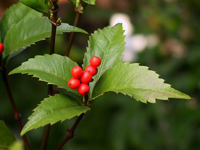

# [[Chloranthaceae]] 

  

## #has_/text_of_/abstract 

> **Chloranthaceae** ( klor-ann-THAY-see-ee) is a family of flowering plants (angiosperms), 
> the only family in the order Chloranthales. 
> 
> It is not closely related to any other family of flowering plants, 
> and is among the early-diverging lineages in the angiosperms. 
> 
> They are woody or weakly woody plants occurring in Southeast Asia, the Pacific, 
> Madagascar, Central and South America, and the West Indies. 
> 
> The family consists of four extant genera, totalling about 77 known species 
> according to Christenhusz and Byng in 2016. 
> 
> Some species are used in traditional medicine.  The type genus is Chloranthus. 
> The fossil record of the family, mostly represented by pollen such as Clavatipollenites, 
> extends back to the dawn of the history of flowering plants in the Early Cretaceous, 
> and has been found on all continents.
>
> [Wikipedia](https://en.wikipedia.org/wiki/Chloranthaceae)

## Phylogeny 

-   « Ancestral Groups  
    -   [Flowering_Plant](../Flowering_Plant.md)
    -   [Seed_Plant](../../Seed_Plant.md)
    -   [Land_Plant](../../../Land_Plant.md)
    -   [Green plants](../../../../Plants.md)
    -   [Eukaryotes](Eukaryotes)
    -   [Tree of Life](../../../../../Tree_of_Life.md)

-   ◊ Sibling Groups of  Angiosperms
    -   [Amborella trichopoda](Amborella.md)
    -   [Magnoliids](Magnoliids.md)
    -   Chloranthaceae
    -   [Ceratophyllaceae](Ceratophyllaceae.md)
    -   [Monocot](Monocot.md)
    -   [Eudicots](Eudicots.md)
    -   [Austrobaileyales](Austrobaileyales.md)
    -   [Nymphaeaceae](Nymphaeaceae.md)

-   » Sub-Groups 

## Title Illustrations

--------------------------------------------------------

Scientific Name ::     Sarcandra glabra
Specimen Condition   Live Specimen
Body Part            fruits
Source               [Sarcandra glabra](http://flickr.com/photos/jam343/2103091/)
Source Collection    [Flickr](http://flickr.com/)
Image Use ::    [Attribution 2.0 Creative Commons License](http://creativecommons.org/licenses/by/2.0/).
Copyright ::            © 2004 [Juni A.](http://flickr.com/people/jam343/)

-------------------------------------------------------------------------

[Chloranthus japonicus](Chloranthaceae/Sarcandra_glabra.jpg) 
Scientific Name ::    Chloranthus japonicus
Location ::          Vityaz inlet, Gamov Peninsula, Khasansky distr., Primorsky Territory (Russian Federation)
Source Collection   [CalPhotos](http://calphotos.berkeley.edu/)
Copyright ::           © 2001 [Nick Kurzenko](mailto:kurzenko@ibss.dvo.ru) 

## Confidential Links & Embeds: 

### #is_/same_as :: [Chloranthaceae](/_Standards/bio/bio~Domain/Eukaryotes/Plants/Land_Plant/Seed_Plant/Flowering_Plant/Chloranthaceae.md) 

### #is_/same_as :: [Chloranthaceae.public](/_public/bio/bio~Domain/Eukaryotes/Plants/Land_Plant/Seed_Plant/Flowering_Plant/Chloranthaceae.public.md) 

### #is_/same_as :: [Chloranthaceae.internal](/_internal/bio/bio~Domain/Eukaryotes/Plants/Land_Plant/Seed_Plant/Flowering_Plant/Chloranthaceae.internal.md) 

### #is_/same_as :: [Chloranthaceae.protect](/_protect/bio/bio~Domain/Eukaryotes/Plants/Land_Plant/Seed_Plant/Flowering_Plant/Chloranthaceae.protect.md) 

### #is_/same_as :: [Chloranthaceae.private](/_private/bio/bio~Domain/Eukaryotes/Plants/Land_Plant/Seed_Plant/Flowering_Plant/Chloranthaceae.private.md) 

### #is_/same_as :: [Chloranthaceae.personal](/_personal/bio/bio~Domain/Eukaryotes/Plants/Land_Plant/Seed_Plant/Flowering_Plant/Chloranthaceae.personal.md) 

### #is_/same_as :: [Chloranthaceae.secret](/_secret/bio/bio~Domain/Eukaryotes/Plants/Land_Plant/Seed_Plant/Flowering_Plant/Chloranthaceae.secret.md)

