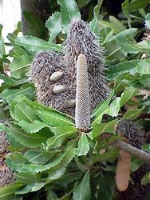
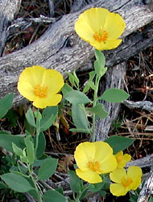
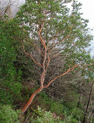

# [[Eudicots]]

     

## #has_/text_of_/abstract 

> The **Eudicots** or eudicotyledons are flowering plants 
> that have two seed leaves (cotyledons) upon germination. 
> 
> The term derives from dicotyledon (etymologically, eu = true; di = two; cotyledon = seed leaf). 
> Historically, authors have used the terms tricolpates or non-magnoliid dicots. 
> 
> The current botanical terms were introduced in 1991, 
> by evolutionary botanist James A. Doyle and paleobotanist Carol L. Hotton, 
> to emphasize the later evolutionary divergence of tricolpate dicots 
> from earlier, less specialized, dicots.
>
> Scores of familiar plants are eudicots, including many commonly cultivated and edible plants, 
> numerous trees, tropicals and ornamentals. 
> 
> Among the most well-known eudicot genera are those of the 
> - sunflower (Helianthus), 
> - dandelion (Taraxacum), 
> - forget-me-not (Myosotis), 
> - cabbage (Brassica), 
> - apple (Malus), 
> - buttercup (Ranunculus), 
> - maple (Acer) and 
> - macadamia (Macadamia). 
> 
> Most leafy, mid-latitude trees are also classified as eudicots, 
> with notable exceptions being the magnolias and American tulip tree (Liriodendron)—
> which belong to the magnoliids—and Ginkgo biloba, which is not an angiosperm.
>
> [Wikipedia](https://en.wikipedia.org/wiki/Eudicots) 

## Phylogeny 

-   « Ancestral Groups  
    -   [Flowering_Plant](../Flowering_Plant.md)
    -   [Seed_Plant](../../Seed_Plant.md)
    -   [Land_Plant](../../../Land_Plant.md)
    -   [Green plants](../../../../Plants.md)
    -   [Eukaryotes](Eukaryotes)
    -   [Tree of Life](../../../../../Tree_of_Life.md)

-   ◊ Sibling Groups of  Angiosperms
    -   [Amborella trichopoda](Amborella.md)
    -   [Magnoliids](Magnoliids.md)
    -   [Chloranthaceae](Chloranthaceae.md)
    -   [Ceratophyllaceae](Ceratophyllaceae.md)
    -   [Monocot](Monocot.md)
    -   eudicots
    -   [Austrobaileyales](Austrobaileyales.md)
    -   [Nymphaeaceae](Nymphaeaceae.md)

-   » Sub-Groups
    -   [Buxaceae](Eudicots/Buxaceae.md)
    -   [Ranunculales](Eudicots/Ranunculales.md)
    -   [Proteales](Eudicots/Proteales.md)
    -   [Core Eudicots](Core_Eudicots)

## Title Illustrations

---------------------------------------------------------------------
 
Scientific Name ::  Banksia serrata
Comments          Proteales, Proteaceae
Copyright ::         © [Kurt Stüber](http://www.biolib.de/) 

---------------------

Scientific Name ::     Dendromecon rigida
Location ::           Placer County, California, US
Comments             Tree Poppy, Ranunculales, Papaveraceae
Specimen Condition   Live Specimen
Source Collection    [CalPhotos](http://calphotos.berkeley.edu/)
Copyright ::            © 2001 [Russell Towle](mailto:rtowle@neworld.net)

------------------------------------------------------------------------
 
Scientific Name ::   Arbutus andrachne
Location ::         Samos, Greece.
Comments           Core Eudicots, Ericaceae
Acknowledgements   courtesy [Botanical Image Database](http://www.unibas.ch/botimage/)
Copyright ::          © 2001 University of Basel, Basel, Switzerland 

