## Phylogeny 

-   « Ancestral Groups  
    -   [Eudicots](../Eudicots.md)
    -   [Flowering_Plant](../../Flowering_Plant.md)
    -   [Seed_Plant](../../../Seed_Plant.md)
    -   [Land_Plant](../../../../Land_Plant.md)
    -   [Green plants](../../../../../Plants.md)
    -   [Eukaryotes](Eukaryotes)
    -   [Tree of Life](../../../../../../Tree_of_Life.md)

-   ◊ Sibling Groups of  eudicots
    -   [Buxaceae](Buxaceae.md)
    -   [Ranunculales](Ranunculales.md)
    -   [Proteales](Proteales.md)
    -   Core Eudicots

-   » Sub-Groups
    -   [Santalales](Core_Eudicots/Santalales.md)
    -   [Saxifragales](Core_Eudicots/Saxifragales.md)
    -   [Berberidopsidales](Core_Eudicots/Berberidopsidales.md)
    -   [Rosids](Core_Eudicots/Rosids.md)
    -   [Caryophyllales](Core_Eudicots/Caryophyllales.md)
    -   [Asterids](Core_Eudicots/Asterids.md)

# [[Core_Eudicots]]

Core Tricolpates 

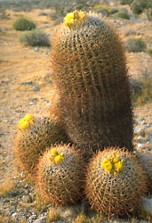  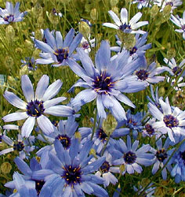  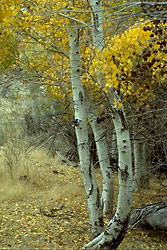 

## Introduction

[Doug Soltis, Pam Soltis, and Christine Edwards](http://www.tolweb.org/)

The core eudicots are an extremely large, diverse assemblage of
flowering plants, with an enormous range of variation in habit,
morphology, chemistry, geographic distributions, and other attributes.
Based on analyses of morphology, classical systematists did not
previously recognize the core eudicot group. Instead, the
circumscription of the core eudicots as a clade was based on the very
strong support obtained in analyses of DNA data sets (e.g., Hoot et al.,
1999; Savolainen et al., 2000a; P. Soltis et al., 1999; D. Soltis et
al., 2000).

### Characteristics

Although the core eudicot group was not originally identified based on
morphological evidence, subsequent research has identified several key
events that correspond fairly closely to the origin of the core
eudicots, including the evolution of flowers organized in a predictable
manner with a stable number of parts (e.g., flowers with parts in fives
or multiples of five, a clear differentiation of sepals and petals,
twice the number of stamens as petals, and a gynoecium of three to five
typically fused (at least partially) carpels; Judd et al. 2002),
production of ellagic and gallic acids, and perhaps the duplication of
several floral organ identity genes including homologs of the
*Arabidopsis* genes, *Apetala3* (Kramer et al., 1998) and *Apetala1*
(Litt and Irish, 2003; reviewed in D. Soltis et al., 2005).

### Discussion of Phylogenetic Relationships

The strongly supported core eudicot clade comprises seven generally
strongly supported subgroups (D. Soltis et al., 2000, 2003; APG II,
2003): 1) Gunnerales (Myrothamnaceae and Gunneraceae; 2)
\"Berberidopsidales\" (an order that was not recognized by APG II and
comprising Berberidopsidaceae and Aextoxicaceae); 3) Saxifragales; 4)
Santalales; 5) rosids; 6) Dilleniaceae/Caryophyllales; and 7) asterids.
Recent studies identified Gunnerales as the sister to all other core
eudicots (D. Soltis et al., 2003; Hilu et al., 2003); however,
relationships among the remaining lineages are largely unresolved. The
circumscription and general phylogenetic relationships of each of these
major groups are discussed below. For further discussion of these
phylogenetic relationships, see D. Soltis et al. (2005) and subsequent
Tree of Life web pages.

#### Gunnerales

Gunnerales comprise two small families, Gunneraceae (*Gunnera* with
approximately 40 species) and Myrothamnaceae (*Myrothamnus* with two
species), or Gunneraceae s.l. sensu APG II (2003). This clade was
identified based on high molecular support for this relationship; it had
not previously been suggested on the basis of morphology because the two
genera differ substantially morphologically. Gunneraceae have a dimerous
perianth (e.g., the calyx and corolla each with two parts, or a multiple
of two parts; Drinnan et al., 1994), as do many of the basal eudicot
lineages; dimery is found in Buxaceae, Trochodendraceae, and Proteaceae
(but perhaps not the *Platanus* lineage) and is common and perhaps
ancestral in Ranunculales (van Tieghem, 1897; Drinnan et al., 1994;
Douglas and Tucker, 1996). The placement of Gunnerales as sister to the
rest of the core eudicots implies that the pentamerous perianth typical
of most core eudicots was derived from dimerous ancestors (Ronse
DeCraene et al., 2003; D. Soltis et al., 2003).

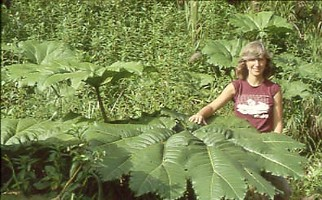

Two views of *Gunnera* sp. (Gunneraceae) including a view of an entire
plant and the leaf of one plant (photos © Douglas Soltis).

#### \"Berberidopsidales\"

Like Gunnerales, \"Berberidopsidales\" comprise two small and
morphologically disparate families: Berberidopsidaceae (*Berberidopsis*
and *Streptothamnus*; the latter is sometimes included in
*Berberidopsis*) and Aextoxicaceae (*Aextoxicon*, one species). Although
this clade has not been recognized at the ordinal level by APG (hence
the quotation marks), it is strongly supported by molecular data and is
isolated from all other clades. Furthermore, both families have
encyclocytic stomata, a rare character and an apparent synapomorphy for
this clade (D. Soltis et al., 2005). Hence, future revision of the APG
classification will likely recognize Berberidopsidales (see Soltis et
al., 2005). With four genes, Berberidopsidaceae plus Aextoxicaceae
(\"Berberidopsidales\") received weak support (54%) as sister to the
remaining core eudicots following Gunnerales. Thus, at this point the
placement of Berberidopsidales should be considered uncertain.

#### Saxifragales

Saxifragales are a morphologically eclectic clade of annual and
perennial herbs, succulents, aquatics (rarely), shrubs, vines, and large
trees. The composition of Saxifragales based on molecular analyses was
not suggested in any traditional treatment (Morgan and Soltis, 1993;
Fishbein et al., 2001); indeed, members of this clade were classified in
three of Cronquist\'s (1981) six subclasses of dicots (see also
Takhtajan, 1997). Possible synapomorphies for this clade include a
partially fused gynoecium with two carpels, a hypanthium, and glandular
leaf teeth (Judd et al., 2002); also, aspects of leaf venation and wood
anatomy are similar in the woody members of the clade. The best known of
the 13 families in this clade are Saxifragaceae, Crassulaceae,
Grossulariaceae, Paeoniaceae, and Hamamelidaceae. Molecular studies
continue to reveal new, unexpected members of this clade, such as
*Aphanopetalum* (Fishbein et al., 2001) and Peridiscaceae (Davis and
Chase, 2004), a family placed in Malpighiales in APG II (2003).\
\
The monophyly of Saxifragales is strongly supported, but the position of
this clade relative to other core eudicots remains uncertain. Some
analyses have placed it as sister to the rosids, although with weak
support (e.g., D. Soltis et al., 2000). The simple, pentamerous flowers
of many Saxifragaceae have long been thought to indicate a relationship
with Rosaceae and other rosids, but whether these floral features are
synapomorphies for Saxifragales + rosids or symplesiomorphies (i.e.,
shared ancestral features) is unclear. Additional research is needed to
resolve the relationship of Saxifragales within the core eudicots (see
D. Soltis et al., 2005).

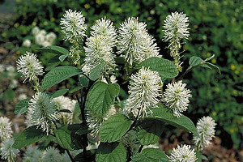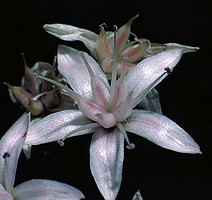

Representatives of the Saxifragales, including *Boykinia major*
(Saxifragaceae; photo © Douglas Soltis), *Fothergilla gardenii*
(Hamamelidaceae; photo © Walter Judd), and *Crassula argentea*
(Crassulaceae; photo © Scott Zona).

#### Santalales

The seven families of Santalales are a strongly supported clade of core
eudicots and are united by both molecular characters and morphological
features associated with the parasitic habit found in most members.
However, relationships of Santalales to other core eudicots are not
clear, although they often appear related to the asterids and
Caryophyllales + Dilleniaceae in at least some shortest trees (D. Soltis
et al., 2000). Furthermore, evolutionary relationships within Santalales
have not yet been fully resolved, which may be explained in part by
apparently rapid rates of molecular evolution in all three plant genomes
(e.g., Nickrent and Starr, 1994; Nickrent et al., 1998). However, DNA
evidence has revealed that several of the currently recognized families
probably do not represent single evolutionary lineages (Nickret and
Malecot, 2001; APG II, 2003; D. Soltis et al., 2005).

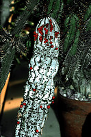

Representatives of the Santalales, including a *Dendropthora
opuntioides* with fruits (Santalaceae; photo © Walter Judd), a branch of
*Phorodendron leucarpum* (Viscaceae; photo © Paul Corogin), and the
visible red fruits of *Viscum minimum*, which is growing as a parasite
on *Euphorbia polygona* (Viscaceae; photo © Scott Zona).

#### Caryophyllales + Dilleniaceae

The core of Caryophyllales sensu APG II (2003) was considered a closely
related group of families as long ago as the mid-nineteenth century
(e.g., Braun, 1864; Eichler, 1876) and was formally recognized as the
Centrospermae by Harms (1934) based on morphological and embryological
characters. Chemical data (presence of betalains) altered the concept of
core Caryophyllales (Clement and Mabry 1996). Cladistic analyses of
morphological and chemical data defined the group and provided
hypotheses of relationships among the families (Rodman et al., 1993;
reviewed in D. Soltis et al., 2005). Recent molecular studies have
identified a larger clade (Caryophyllales sensu APG II) that includes
the Caryophyllidae of Cronquist (1981; i.e., Caryophyllales,
Polygonales, and Plumbaginales) plus a number of families previously
considered distantly related to Caryophyllales, including the
carnivorous sundews and Venus flytrap (Droseraceae) and Old World
pitcher plants (Nepenthaceae). Within Caryophyllales sensu lato, there
are two large clades, core and non-core Caryophyllales (Cuénoud et al.,
2002), that correspond to Caryophyllales and Polygonales sensu Judd et
al. (2002). Naming the larger clade \"Caryophyllales\" has resulted in
some confusion, and not all investigators follow the APG system. For
example, Judd et al. (2002) continue to use Caryophyllales in the narrow
sense and refer to the larger clade as the caryophyllids. This system
has advantages and perhaps should be adopted in future versions of the
APG system (D. Soltis et al., 2005).

Relationships of Caryophyllales to other core eudicots are not clear,
although Dilleniaceae are sister to Caryophyllales in most analyses,
although generally with low support (e.g., Chase and Albert, 1998; D.
Soltis et al., 2000). Furthermore, some evolutionary trees have
indicated a possible relationship of Caryophyllales with the asterids
and Santalales.

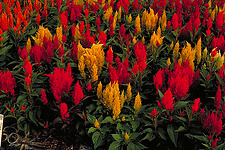

Representatives of the Caryophyllales, including the flower of the
cactus, *Hylocereus undatus* (Cactaceae; photo © Walter Judd), a branch
of *Cocoloba uvifera* with fruits (Polygonaceae; photo © Walter Judd),
and the ornamental, *Celosia argentia*, in flower (Amaranthaceae; photo
© Walter Judd).

#### Rosids + Vitaceae

The rosid clade as defined by molecular data is broader than the
traditional subclass Rosidae (Cronquist, 1981; Takhtajan, 1980, 1997)
and encompasses many families formerly classified in the polyphyletic
subclasses Magnoliidae, Dilleniidae, and Hamamelidae. The rosids
comprise 140 families and close to one-third of all angiosperm species
(D. Soltis et al., 2005). Clear synapomorphies for the rosids have not
been identified, although most rosids share several morphological and
anatomical features, such as nuclear endosperm development, reticulate
pollen exine, generally simple perforations of vessel end-walls,
alternate intervessel pitting, mucilaginous leaf epidermis, and two or
more whorls of stamens, plus ellagic acid (Hufford, 1992; Nandi et al.,
1998; reviewed in D. Soltis et al., 2005).

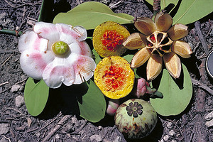

Representatives of the rosid clade, including the flowers of *Sorbus
aucuparia* (Rosaceae: Rosales: eurosid I; photo © Walter Judd), the
flower of the passion flower, *Passiflora coerulea* var. *cinncinata*
(Passifloraceae: Malpighiales: eurosids I; photo © Sangtae Kim), and the
flowers and fruits of *Clusia rosea* (Clusiaceae: Malpighiales: eurosids
I; photo © Walter Judd).

Relationships within the rosid clade are not clearly resolved. Vitaceae
may be sister to all other rosids, but this relationship is not strongly
supported (Savolainen et al., 2000a, b; reviewed in D. Soltis et al.,
2000). Saxifragales may be sister to the Vitaceae + rosids clade, but
this relationship is also not strongly supported (D. Soltis et al.,
2000, 2005). Two large subclades of rosids, eurosids I (fabids) and II
(malvids), have been identified through molecular analyses (e.g., Chase
et al., 1993; Savolainen et al., 2000a, b; D. Soltis et al., 2000). The
eurosid I clade comprises Celastrales, Cucurbitales, Fabales, Fagales,
Zygophyllales, Malpighiales, Oxalidales, and Rosales. Of these,
Cucurbitales, Fabales, Fagales, and Rosales form the \"nitrogen-fixing
clade,\" a clade that contains all angiosperms known to have symbiotic
relationships with nodulating nitrogen-fixing bacteria (see D. Soltis et
al., 1995, 1997, 2000). The smaller eurosid II clade is composed of
Brassicales, Malvales, Sapindales, and Tapisciaceae. In addition to the
large eurosid I and II clades, additional smaller clades have been
recognized (Crossosomatales, Myrtales, Geraniales, and Picramniaceae),
but their relationships to each other and to eurosids I and II are not
clear. Furthermore, relationships within eurosids I and II are not fully
resolved, and much additional work is needed to reconstruct
relationships within the rosid clade. In fact, the rosids represent the
largest remaining problematic group of angiosperms. For a more detailed
discussion of the rosids, see D. Soltis et al. (2005).

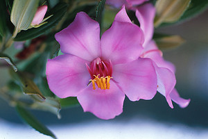

More representatives of the rosid clade, including the flowers of
*Euphorbia pulcherrima* (Euphorbiaceae: Malpighiales: eurosids I; photo
© Walter Judd), the flowers of the legume, *Albizzia julibrisin*
(Fabaceae: Fabales: eurosids I; photo © Walter Judd), and the flower of
*Meriania brevipedunculata* (Melastomataceae: Myrtales; photo © Walter
Judd).

#### Asterids

Like rosids, asterids are a large clade, encompassing nearly one-third
of all angiosperm species (80,000 species) classified in 114 families
(Albach et al., 2001a; D. Soltis et al., 2005). However, unlike the
rosids, a group of families corresponding closely to the asterid clade
has been recognized on morphological grounds for over 200 years (de
Jussieu, 1789; Reichenbach, 1828; Warming, 1879), and several
morphological and chemical features appear to unite all or most
asterids. Most notable are iridoid chemical compounds (e.g., Jensen,
1992), corollas with fused petals, unitegmic and tenuinucellate ovules,
and cellular endosperm development; however, it is still unclear which
of these features are actually synapomorphies for asterids (cf. Albach
et al., 2001b; Judd et al., 2002). The asterid clade is broader than the
Asteridae of recent classifications (e.g., Cronquist, 1981; Takhtajan,
1980, 1997) and includes also members of the polyphyletic subclasses
Hamamelidae, Dilleniidae, and Rosidae (Olmstead et al., 1992, 1993,
2000; Chase et al., 1993; D. Soltis et al., 1997, 2000; P. Soltis et
al., 1999; Savolainen et al., 2000a, b).

Many relationships within asterids were resolved by angiosperm-wide
molecular phylogenetic analyses, but asterids have since been analyzed
in greater detail with more extensive taxon sampling and data from four
(Albach et al., 2001a) and six (B. Bremer et al., 2002) loci. These
studies confirmed earlier results indicating four major clades within
asterids: Cornales and Ericales are subsequent sisters to all other
asterids (euasterids), which comprise two large sister clades:
euasterids I (lamiids) + euasterids II (campanulids). The Cornales and
Ericales were not considered closely related to the Asteridae in
previous classifications, and the families were typically placed instead
in Rosidae and Dilleniidae, respectively. Euasterids are mostly united
by flowers with epipetalous stamens that equal the number of corolla
lobes and a gynoecium of two fused carpels.

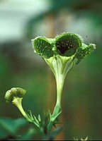

Representatives of the asterid clade, including the flower of *Triodanis
perfoliata* (Campanulaceae: Asterales: euasterids II; photo © Paul
Corogin), the stem and flower of *Conradina brevifolia* (Lamiaceae:
Lamiales; euasterids I; photo © Paul Corogin), and the flowers of
*Ceropegia sandersonii* (Apocynaceae: Gentianales: euasterids I; photo ©
Matyas Buzgo)

Within the euasterids, the euasterid I (or lamiid, B. Bremer et al.,
2002) and euasterid II (or campanulid, B. Bremer et al., 2002) clades
are sisters and can be distinguished both morphologically and
molecularly (Albach et al., 2001a; K. Bremer et al., 2001; B. Bremer et
al., 2002). Most members of lamiids have opposite leaves, entire leaf
margins, hypogynous flowers, \"early sympetaly\" with a ring-shaped
primordium, fusion of stamen filaments to the corolla tube, and capsular
fruits (K. Bremer et al., 2001). The lamiids comprise Garryales,
Gentianales, Solanales, and Lamiales, plus Boraginaceae, Vahliaceae, and
Oncothecaceae + Icacinaceae (APG II, 2003). Most campanuliids have
alternate leaves, serrate-dentate leaf margins, epigynous flowers,
\"late sympetaly\" with distinct petal primordia, free stamen filaments,
and indehiscent fruits (K. Bremer et al., 2001). It is unclear which of
the characters that distinguish euasterids I and II are truly
synapomorphies for these clades and which are symplesiomorphies; both
reversals and parallelisms have contributed to complex patterns of
morphological evolution in the asterids (Albach et al., 2001b; K. Bremer
et al., 2001). The campanuliids are composed of Dipsacales,
Aquifoliales, Apiales, and Asterales, plus Bruniaceae + Columelliaceae,
a small clade of Tribelaceae, Polyosmaceae, Escalloniaceae, and
Eremosynaceae, and possibly Paracryphiaceae. The campanulids include
families previously classified in Asteridae and Rosidae (Cronquist,
1981, 1988). The asterids are covered in more detail in Judd et al.
(2002), Judd and Olmsead (2004), P. Soltis et al. (2004), P. Soltis and
Soltis (2004) and D. Soltis et al. (2005).

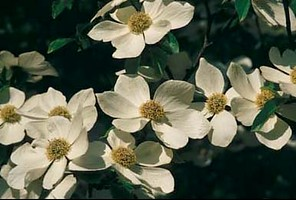

More representatives of the asterid clade, including the flower of
*Berlandiera subacaulis* (Asteraceae: Asterales: euasterids II; photo ©
Paul Corogin), the flowers of *Buchnera subacaulis* (Apocynaceae:
Lamiales: euasterids I; photo © Paul Corogin), and the flowers of
*Cornus nuttallii* (Cornaceae: Cornales; photo © Matyas Buzgo).

## Title Illustrations

------------------------------------------------------------------------------
  Scientific Name ::     Echinocactus acanthodes
Location ::           Palm Springs, Chino Canyon (Riverside County, California, USA)
Comments             Caryophyllales, Cactaceae
Creator              Photograph by Marguerite Gregory
Specimen Condition   Live Specimen
Source Collection    [CalPhotos](http://calphotos.berkeley.edu/)
Copyright ::            © 1999 [California Academy of Sciences](http://www.calacademy.org/) 

------------------------------------------------------------------------
  
Scientific Name ::   Catananche caerulea
Comments           Asterids, Asteraceae. Cultivated at the Botanical Garden Basel, Switzerland.
Acknowledgements   courtesy [Botanical Image Database](http://www.unibas.ch/botimage/)
Copyright ::          © 2001 University of Basel, Basel, Switzerland 

------------------------------------------------------------------------------
 
Scientific Name ::    Populus tremuloides
Comments            Rosids, Salicaceae
Creator             Photograph by Jo-Ann Ordano
Source Collection   [CalPhotos](http://calphotos.berkeley.edu/)
Copyright ::           © 2000 [California Academy of Sciences](http://www.calacademy.org/) 

