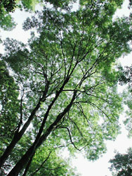

## Phylogeny 

-   « Ancestral Groups  
    -   [Core Eudicots](Core_Eudicots)
    -   [Core_Eudicots](../Core_Eudicots.md)
    -   [Flowering_Plant](../../../Flowering_Plant.md)
    -   [Seed_Plant](../../../../Seed_Plant.md)
    -   [Land_Plant](../../../../../Land_Plant.md)
    -   [Green plants](../../../../../../Plants.md)
    -   [Eukaryotes](Eukaryotes)
    -   [Tree of Life](../../../../../../../Tree_of_Life.md)

-   ◊ Sibling Groups of  Core Eudicots
    -   [Santalales](Santalales.md)
    -   [Saxifragales](Saxifragales.md)
    -   [Berberidopsidales](Berberidopsidales.md)
    -   [Rosids](Rosids.md)
    -   [Caryophyllales](Caryophyllales.md)
    -   Asterids

-   » Sub-Groups
    -   [Cornales](Asterids/Cornales.md)
    -   [Ericales](Asterids/Cornales/Ericales.md)
    -   [Solanales](Asterids/Solanales.md)
    -   [Lamiales](Asterids/Lamiales.md)
    -   [Gentianales](Asterids/Gentianales.md)
    -   [Garryales](Asterids/Garryales.md)
    -   [Asterales](Asterids/Asterales.md)
    -   [Apiales](Asterids/Apiales.md)
    -   [Dipsacales](Asterids/Dipsacales.md)
    -   [Aquifoliales](Asterids/Aquifoliales.md)

# Asterids 

Relationships after Albach et al. (2001), Olmstead et al. (2000),
Savolainen (2000), and Hilu et al. (2003).

Containing group: [Core Eudicots](../Core_Eudicots.md)

### References

Albach, D. C., P. S. Soltis, and D. E. Soltis. 2001. Patterns of
embryological and biochemical evolution in the asterids. Systematic
Botany 26:242-262.

Albach, D. C., P. S. Soltis, D. E. Soltis, and R. G. Olmstead. 2001.
Phylogenetic analysis of asterids based on sequences of four genes.
Annals of the Missouri Botanical Garden 88:163-212.

Backlund, A. and B. Bremer. 1997. Phylogeny of Asteridae s. str. based
on rbcL sequences, with particular reference to Dipsacales. Plant
Systematics and Evolution 207:225--254.

Bremer, K., A. Backlund, B. Sennblad, U. Swenson, K. Andreasen, M.
Hjertson, J. Lundberg, M. Backlund, and B. Bremer. 2001. A phylogenetic
analysis of 100+ genera and 50+ families of euasterids based on
morphological and molecular data with notes on possible higher level
morphological synapomorphies. Plant Systematics and Evolution
229:137-169.

Bremer, B., K. Bremer, N. Heidari, P. Erixon, R. G. Olmstead, A. A.
Anderberg, M. K?llersj?, and E. Barkhordarian. 2002. Phylogenetics of
asterids based on 3 coding and 3 non-coding chloroplast DNA markers and
the utility of non-coding DNA at higher taxonomic levels. Molecular
Phylogenetics and Evolution 24:274-301.

Bremer, K., E. Friis, and B. Bremer. 2004. Molecular phylogenetic dating
of asterid flowering plants shows early Cretaceous diversification.
Systematic Biology 53(3):496-505.

Kenneth M. Cameron, K. M. 2002. On the Phylogenetic Position of the New
Caledonian Endemic Families Paracryphiaceae, Oncothecaceae, and
Strasburgeriaceae: A Comparison of Molecules and Morphology. The
Botanical Review 68(4):428?443.

Hibsch-Jetter, C., D. E. Soltis, and T. D. McFarlane. 1997. Phylogenetic
analysis of Eremosyne pectinata (Saxifragaceae s.l.) based on rbcL
sequence data. Plant Systematics and Evolution 204:225-232.

Hilu, K. W., T. Borsch, K. M?ller, D. E. Soltis, P. S. Soltis, V.
Savolainen, M. W. Chase, M. P. Powell, L. A. Alice, R. Evans, H.
Sauquet, C. Neinhuis, T. A. B. Slotta, J. G. Rohwer, C. S. Campbell, and
L. W. Chatrou. 2003. Angiosperm phylogeny based on matK sequence
information. American Journal of Botany 90(12):1758-1776.

Judd, W. S. and R. G. Olmstead. 2004. A survey of tricolpate (eudicot)
phylogenetic relationships. American Journal of Botany 91:1627-1644.

K?rehed J. 2001. Multiple origin of the tropical forest tree family
Icacinaceae. American Journal of Botany 88:2259-2259.

Olmstead, R. G., K.-J. Kim, R. K. Jansen, and S. J. Wagstaff. 2000. The
phylogeny of the Asteridae sensu lato based on chloroplast ndhF gene
sequences. Molecular Phylogenetics and Evolution 16:96-112.

Savolainen, V., M. F. Fay, D. C. Albach, A. Backlund, M. van der Bank,
K. M. Cameron, S. A. Johnson, M. D. Lled?, J.-C. Pintaud, M. Powell, M.
C. Sheahan, D. E. Soltis, P. S. Soltis, P. Weston, W. M. Whitten, K. J.
Wurdack, and M. W. Chase. 2000. Phylogeny of the eudicots: a nearly
complete familial analysis based on rbcl gene sequences. Kew Bulletin
55:257-309.

Soltis, D. E., P. S. Soltis, M. W. Chase, M. E. Mort, D. C. Albach, M.
Zanis, V. Savolainen, W. H. Hahn, S. B. Hoot, M. F. Fay, M. Axtell, S.
M. Swensen, L. M. Prince, W. J. Kress, K. C. Nixon, and J. S. Farris.
2000. Angiosperm phylogeny inferred from 18S rDNA, rbcL, and atpB
sequences. Botanical Journal of the Linnean Society 133:381-461.

##### Title Illustrations



  ------------------------------------------------------------------------
  Scientific Name ::   Fraxinus excelsior
  Location ::         Allschwil, Basel, Switzerland.
  Comments           European ash (Lamiales, Oleaceae)
  Acknowledgements   courtesy [Botanical Image Database](http://www.unibas.ch/botimage/)
  Copyright ::          © 2001 University of Basel, Basel, Switzerland 
  ------------------------------------------------------------------------


  ---------------------------------------------------------------------
  Scientific Name ::  Erica cinera
  Comments          Bell heather (Ericales, Ericaceae)
  Copyright ::         © [Kurt Stüber](http://www.biolib.de/) 
  ---------------------------------------------------------------------


  -------------------------------------------------------------------------
  Scientific Name ::     Lactuca
  Location ::           Vladivostok city, Primorsky Territory (Russian Federation)
  Comments             Asterales, Asteraceae
  Specimen Condition   Live Specimen
  Source Collection    [CalPhotos](http://calphotos.berkeley.edu/)
  Copyright ::            © 1999 [Nick Kurzenko](mailto:kurzenko@ibss.dvo.ru) 
  -------------------------------------------------------------------------
