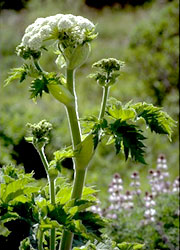

## Phylogeny 

-   « Ancestral Groups  
    -   [Asterids](../Asterids.md)
    -   [Core Eudicots](Core_Eudicots)
    -   [Eudicots](../../../Eudicots.md)
    -   [Flowering_Plant](../../../../Flowering_Plant.md)
    -   [Seed_Plant](../../../../../Seed_Plant.md)
    -   [Land_Plant](../../../../../../Land_Plant.md)
    -   [Green plants](../../../../../../../Plants.md)
    -   [Eukaryotes](Eukaryotes)
    -   [Tree of Life](../../../../../../../../Tree_of_Life.md)

-   ◊ Sibling Groups of  Asterids
    -   [Cornales](Cornales.md)
    -   [Ericales](Cornales/Ericales.md)
    -   [Solanales](Solanales.md)
    -   [Lamiales](Lamiales.md)
    -   [Gentianales](Gentianales.md)
    -   [Garryales](Garryales.md)
    -   [Asterales](Asterales.md)
    -   Apiales
    -   [Dipsacales](Dipsacales.md)
    -   [Aquifoliales](Aquifoliales.md)

-   » Sub-Groups
    -   [Griselinia](Apiales/Griselinia.md)

# Apiales 

Containing group: [Asterids](../Asterids.md)

### Information on the Internet

-   [Apiales Internet Resource     Centre](http://www.rbge.org.uk/data/URC/arc.htm)
-   [Systematics, evolution, and biogeography of Apiales (Araliaceae +     Apiaceae)](http://www.people.vcu.edu/%7Egmplunke/). Greg
    Plunkett Lab, Virginia Commonwealth University.

### References

Albach, D. C., P. S. Soltis, D. E. Soltis, and R. G. Olmstead. 2001.
Phylogenetic analysis of asterids based on sequences of four genes.
Annals of the Missouri Botanical Garden 88:163-212.

Backlund, A. and B. Bremer. 1997. Phylogeny of Asteridae s. str. based
on rbcL sequences, with particular reference to Dipsacales. Plant
Systematics and Evolution 207:225-254.

Bremer, K., A. Backlund, B. Sennblad, U. Swenson, K. Andreasen, M.
Hjertson, J. Lundberg, M. Backlund, and B. Bremer. 2001. A phylogenetic
analysis of 100+ genera and 50+ families of euasterids based on
morphological and molecular data with notes on possible higher level
morphological synapomorphies. Plant Systematics and Evolution
229:137-169.

Bremer, B., K. Bremer, N. Heidari, P. Erixon, R. G. Olmstead, A. A.
Anderberg, M. Källersjö, and E. Barkhordarian. 2002. Phylogenetics of
asterids based on 3 coding and 3 non-coding chloroplast DNA markers and
the utility of non-coding DNA at higher taxonomic levels. Molecular
Phylogenetics and Evolution 24:274-301.

Chandler, G. T. and G. M. Plunkett. 2004. Evolution in Apiales: nuclear
and chloroplast markers together in (almost) perfect harmony.

Botanical Journal of the Linnean Society 144(2):123-147.

Kårehed, J. 2003. The family Pennantiaceae and its relationships to
Apiales. Botanical Journal of the Linnean Society 141(1): 1-24.

Liu, M. (R.), G. M. Plunkett, P. P. Lowry, II, B.-E. Van Wyk, and P. M.
Tilney. 2006. The taxonomic value of fruit wing types in the order
Apiales. American Journal of Botany 93:1357-1368.

Lowry, P. P., II, G. M. Plunkett, and A. A. Oskolski. 2001. Early
lineages in Apiales: Insights from morphology, wood anatomy and
molecular data. Edinburgh Journal of Botany 58:207-220.

Olmstead, R. G., K.-J. Kim, R. K. Jansen, and S. J. Wagstaff. 2000. The
phylogeny of the Asteridae sensu lato based on chloroplast ndhF gene
sequences. Molecular Phylogenetics and Evolution 16:96-112.

Oskolski. A. A. 2001. Phylogenetic relationships within Apiales:
Evidence from wood anatomy. Edinburgh Journal of Botany 58:201-206.

Plunkett, G. M. 2001. Relationship of the order Apiales to subclass
Asteridae: a re-evaluation of morphological characters based on insights
from molecular data. Edinburgh Journal of Botany 58:183-200.

Plunkett, G. M. and P. P. Lowry II. 2001. Relationships among \"ancient
Araliads\" and their significance for the systematics of Apiales.
Molecular Phylogenetics and Evolution 19:259-276.

Plunkett, G. M., D. E. Soltis, and P. S. Soltis. 1996. Higher level
relationships involving Apiales (Apiaceae and Araliaceae) based on
phylogenetic analysis of rbcL sequences. American Journal of Botany
83:499-515.

Savolainen, V., M. F. Fay, D. C. Albach, A. Backlund, M. van der Bank,
K. M. Cameron, S. A. Johnson, M. D. Lledó, J.-C. Pintaud, M. Powell, M.
C. Sheahan, D. E. Soltis, P. S. Soltis, P. Weston, W. M. Whitten, K. J.
Wurdack, and M. W. Chase. 2000. Phylogeny of the eudicots: a nearly
complete familial analysis based on rbcl gene sequences. Kew Bulletin
55:257-309.

Soltis, D. E., P. S. Soltis, M. W. Chase, M. E. Mort, D. C. Albach, M.
Zanis, V. Savolainen, W. H. Hahn, S. B. Hoot, M. F. Fay, M. Axtell, S.
M. Swensen, L. M. Prince, W. J. Kress, K. C. Nixon, and J. S. Farris.
2000. Angiosperm phylogeny inferred from 18S rDNA, rbcL, and atpB
sequences. Botanical Journal of the Linnean Society 133:381-461.

##### Title Illustrations



  -------------------------------------------------------------------------
  Scientific Name ::     Kalopanax septemlobus
  Location ::           Vladivostok suburb, Primorsky Territory (Russian Federation)
  Comments             Castor aralia (Araliaceae)
  Specimen Condition   Live Specimen
  Source Collection    [CalPhotos](http://calphotos.berkeley.edu/)
  Copyright ::            © 1999 [Nick Kurzenko](mailto:kurzenko@ibss.dvo.ru) 
  -------------------------------------------------------------------------


  ------------------------------------------------------------------------------
  Scientific Name ::     Pittosporum crassifolium
  Location ::           Golden Gate Park (San Francisco County, California, USA)
  Comments             Stiffleaf cheesewood (Pittosporaceae)
  Creator              Photograph by J.W. Thompson
  Specimen Condition   Live Specimen
  Source Collection    [CalPhotos](http://calphotos.berkeley.edu/)
  Copyright ::            © 1999 [California Academy of Sciences](http://www.calacademy.org/) 
  ------------------------------------------------------------------------------


  ------------------------------------------------------------------------------
  Scientific Name ::     Heracleum lanatum (Apiaceae)
  Location ::           Point Reyes National Seashore (Marin County, California, USA)
  Creator              Photograph by Jo-Ann Ordano
  Specimen Condition   Live Specimen
  Source Collection    [CalPhotos](http://calphotos.berkeley.edu/)
  Copyright ::            © 2000 [California Academy of Sciences](http://www.calacademy.org/) 
  ------------------------------------------------------------------------------
