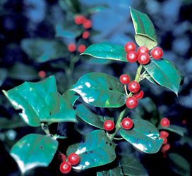

-   [Flowering_Plant](../../../../../Flowering_Plant.md)
-   [Seed_Plant](../../../../../../Seed_Plant.md)
-   [Land_Plant](../../../../../../../Land_Plant.md)
-   [Green plants](../../../../../../../../Plants.md)
-   [Eukaryotes](Eukaryotes)
-   [Tree of Life](../../../../../../../../../Tree_of_Life.md)

-   ◊ Sibling Groups of  Asterids
-   [Cornales](../Cornales.md)
-   [Ericales](../Cornales/Ericales.md)
-   [Solanales](../Solanales.md)
-   [Lamiales](../Lamiales.md)
-   [Gentianales](../Gentianales.md)
-   [Garryales](../Garryales.md)
-   [Asterales](../Asterales.md)
-   [Apiales](../Apiales.md)
-   [Dipsacales](../Dipsacales.md)
-   Aquifoliales

-   » Sub-Groups 

# Aquifoliales 

Containing group: [Asterids](../../Asterids.md)

### References

Albach, D. C., P. S. Soltis, D. E. Soltis, and R. G. Olmstead. 2001.
Phylogenetic analysis of asterids based on sequences of four genes.
Annals of the Missouri Botanical Garden 88:163-212.

 

Backlund, A. and B. Bremer. 1997. Phylogeny of Asteridae s. str. based
on rbcL sequences, with particular reference to Dipsacales. Plant
Systematics and Evolution 207:225-254.

 

Bremer, K., A. Backlund, B. Sennblad, U. Swenson, K. Andreasen, M.
Hjertson, J. Lundberg, M. Backlund, and B. Bremer. 2001. A phylogenetic
analysis of 100+ genera and 50+ families of euasterids based on
morphological and molecular data with notes on possible higher level
morphological synapomorphies. Plant Systematics and Evolution
229:137-169.

 

Bremer, B., K. Bremer, N. Heidari, P. Erixon, R. G. Olmstead, A. A.
Anderberg, M. Källersjö, and E. Barkhordarian. 2002. Phylogenetics of
asterids based on 3 coding and 3 non-coding chloroplast DNA markers and
the utility of non-coding DNA at higher taxonomic levels. Molecular
Phylogenetics and Evolution 24:274-301.

 

Olmstead, R. G., K.-J. Kim, R. K. Jansen, and S. J. Wagstaff. 2000. The
phylogeny of the Asteridae sensu lato based on chloroplast ndhF gene
sequences. Molecular Phylogenetics and Evolution 16:96-112.

 

Savolainen, V., M. F. Fay, D. C. Albach, A. Backlund, M. van der Bank,
K. M. Cameron, S. A. Johnson, M. D. Lledó, J.-C. Pintaud, M. Powell, M.
C. Sheahan, D. E. Soltis, P. S. Soltis, P. Weston, W. M. Whitten, K. J.
Wurdack, and M. W. Chase. 2000. Phylogeny of the eudicots: a nearly
complete familial analysis based on rbcl gene sequences. Kew Bulletin
55:257-309.

 

Soltis, D. E., P. S. Soltis, M. W. Chase, M. E. Mort, D. C. Albach, M.
Zanis, V. Savolainen, W. H. Hahn, S. B. Hoot, M. F. Fay, M. Axtell, S.
M. Swensen, L. M. Prince, W. J. Kress, K. C. Nixon, and J. S. Farris.
2000. Angiosperm phylogeny inferred from 18S rDNA, rbcL, and atpB
sequences. Botanical Journal of the Linnean Society 133:381-461.

## Title Illustrations

Holly, Ilex aquifolium (Aquifoliaceae). Davis (Yolo County, California,
US).\
Photograph courtesy [CalPhotos](http://elib.cs.berkeley.edu/photos/),
copyright © 1986 [Joseph M. DiTomaso](mailto:ditomaso@vegmail.ucdavis.edu).


  -------------------------
  Scientific Name ::     Ilex aquifolium
  Location ::           Davis (Yolo County, California, USA)
  Comments             Holly (Aquifoliaceae)
  Specimen Condition   Live Specimen
  Source Collection    [CalPhotos](http://calphotos.berkeley.edu/)
  Copyright ::            © 1986 [Joseph M. DiTomaso](mailto:ditomaso@vegmail.ucdavis.edu)
  -------------------------
