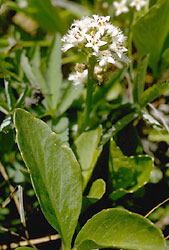
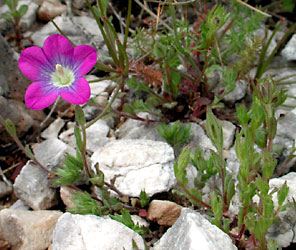
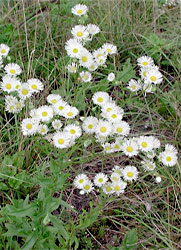

## Phylogeny 

-   « Ancestral Groups  
    -   [Asterids](../Asterids.md)
    -   [Core Eudicots](Core_Eudicots)
    -   [Eudicots](../../../Eudicots.md)
    -   [Flowering_Plant](../../../../Flowering_Plant.md)
    -   [Seed_Plant](../../../../../Seed_Plant.md)
    -   [Land_Plant](../../../../../../Land_Plant.md)
    -   [Green plants](../../../../../../../Plants.md)
    -   [Eukaryotes](Eukaryotes)
    -   [Tree of Life](../../../../../../../../Tree_of_Life.md)

-   ◊ Sibling Groups of  Asterids
    -   [Cornales](Cornales.md)
    -   [Ericales](Cornales/Ericales.md)
    -   [Solanales](Solanales.md)
    -   [Lamiales](Lamiales.md)
    -   [Gentianales](Gentianales.md)
    -   [Garryales](Garryales.md)
    -   Asterales
    -   [Apiales](Apiales.md)
    -   [Dipsacales](Dipsacales.md)
    -   [Aquifoliales](Aquifoliales.md)

-   » Sub-Groups
    -   [Asteraceae](Asteraceae)

# [[Asterales]] 

 
 
 

## #has_/text_of_/abstract 

> **Asterales** (  ASS-tər-RAY-leez) is an order of dicotyledonous flowering plants 
> that includes the large family Asteraceae (or Compositae) 
> known for composite flowers made of florets, and ten families related to the Asteraceae. 
> 
> While asterids in general are characterized by fused petals, 
> composite flowers consisting of many florets create the false appearance of separate petals (as found in the rosids).
>
> The order is cosmopolitan (plants found throughout most of the world including desert and frigid zones), 
> and includes mostly herbaceous species, 
> although a small number of trees 
> (such as the Lobelia deckenii, the giant lobelia, and Dendrosenecio, giant groundsels) and shrubs are also present.
>
> Asterales are organisms that seem to have evolved from one common ancestor. 
> Asterales share characteristics on morphological and biochemical levels. 
> 
> Synapomorphies (a character that is shared by two or more groups through evolutionary development) 
> include the presence in the plants of oligosaccharide inulin, 
> a nutrient storage molecule used instead of starch; and unique stamen morphology. 
> 
> The stamens are usually found around the style, either aggregated densely or fused into a tube, 
> probably an adaptation in association with the plunger (brush; or secondary) pollination 
> that is common among the families of the order, wherein pollen is collected and stored on the length of the pistil.
>
> [Wikipedia](https://en.wikipedia.org/wiki/Asterales)

## Title Illustrations

------------------------------------------------------------------------------

Scientific Name ::    Menyanthes trifoliata
Comments            Menyanthaceae
Creator             Photograph by Gladys Lucille Smith
Source Collection   [CalPhotos](http://calphotos.berkeley.edu/)
Copyright ::           © 1999 [California Academy of Sciences](http://www.calacademy.org/) 

------------------------------------------------------------------------

Scientific Name ::   Legousia pentagonia
Location ::         Samos, Greece
Comments           Campanulaceae
Acknowledgements   courtesy [Botanical Image Database](http://www.unibas.ch/botimage/)
Copyright ::          © 2001 University of Basel, Basel, Switzerland 

------------------------------------------------------------------------

Scientific Name ::   Erigeron annuus
Location ::         Sevelen SG, Switzerland
Comments           Asteraceae
Acknowledgements   courtesy [Botanical Image Database](http://www.unibas.ch/botimage/)
Copyright ::          © 2001 University of Basel, Basel, Switzerland 

## Confidential Links & Embeds: 

### #is_/same_as :: [Asterales](/_Standards/bio/bio~Domain/Eukaryotes/Plants/Land_Plant/Seed_Plant/Flowering_Plant/Eudicots/Core_Eudicots/Asterids/Asterales.md) 

### #is_/same_as :: [Asterales.public](/_public/bio/bio~Domain/Eukaryotes/Plants/Land_Plant/Seed_Plant/Flowering_Plant/Eudicots/Core_Eudicots/Asterids/Asterales.public.md) 

### #is_/same_as :: [Asterales.internal](/_internal/bio/bio~Domain/Eukaryotes/Plants/Land_Plant/Seed_Plant/Flowering_Plant/Eudicots/Core_Eudicots/Asterids/Asterales.internal.md) 

### #is_/same_as :: [Asterales.protect](/_protect/bio/bio~Domain/Eukaryotes/Plants/Land_Plant/Seed_Plant/Flowering_Plant/Eudicots/Core_Eudicots/Asterids/Asterales.protect.md) 

### #is_/same_as :: [Asterales.private](/_private/bio/bio~Domain/Eukaryotes/Plants/Land_Plant/Seed_Plant/Flowering_Plant/Eudicots/Core_Eudicots/Asterids/Asterales.private.md) 

### #is_/same_as :: [Asterales.personal](/_personal/bio/bio~Domain/Eukaryotes/Plants/Land_Plant/Seed_Plant/Flowering_Plant/Eudicots/Core_Eudicots/Asterids/Asterales.personal.md) 

### #is_/same_as :: [Asterales.secret](/_secret/bio/bio~Domain/Eukaryotes/Plants/Land_Plant/Seed_Plant/Flowering_Plant/Eudicots/Core_Eudicots/Asterids/Asterales.secret.md)

