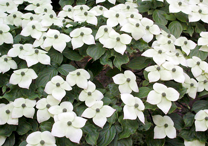

## Phylogeny 

-   « Ancestral Groups  
    -   [Asterids](../Asterids.md)
    -   [Core Eudicots](Core_Eudicots)
    -   [Eudicots](../../../Eudicots.md)
    -   [Flowering_Plant](../../../../Flowering_Plant.md)
    -   [Seed_Plant](../../../../../Seed_Plant.md)
    -   [Land_Plant](../../../../../../Land_Plant.md)
    -   [Green plants](../../../../../../../Plants.md)
    -   [Eukaryotes](Eukaryotes)
    -   [Tree of Life](../../../../../../../../Tree_of_Life.md)

-   ◊ Sibling Groups of  Asterids
    -   Cornales
    -   [Ericales](Cornales/Ericales.md)
    -   [Solanales](Solanales.md)
    -   [Lamiales](Lamiales.md)
    -   [Gentianales](Gentianales.md)
    -   [Garryales](Garryales.md)
    -   [Asterales](Asterales.md)
    -   [Apiales](Apiales.md)
    -   [Dipsacales](Dipsacales.md)
    -   [Aquifoliales](Aquifoliales.md)

-   » Sub-Groups 

# Cornales 

Relationships after Fan & Xiang (2003).

Containing group: [Asterids](../Asterids.md)

### References

Albach, D. C., P. S. Soltis, D. E. Soltis, and R. G. Olmstead. 2001.
Phylogenetic analysis of asterids based on sequences of four genes.
Annals of the Missouri Botanical Garden 88:163-212.

Backlund, A. and B. Bremer, B. 1997. Phylogeny of Asteridae s. str.
based on rbcL sequences, with particular reference to Dipsacales. Plant
Systematics and Evolution 207:225-254.

Fan, C. and Q.-Y. Xiang. 2003. Phylogenetic analyses of Cornales based
on 26S rRNA and combined 26S rDNA-MATK-RBCL sequence data. American
Journal of Botany 90:1357-1372.

Hempel, A. C., P. A. Reeves, R. G. Olmstead, and R. K. Jansen. 1995.
Implications of rbcL sequence data for higher order relationships of the
Loasaceae and the anomalous aquatic plant Hydrostachys
(Hydrostachyaceae). Plant Systematics and Evolution 194:25-37.

Olmstead, R. G., K.-J. Kim, R. K. Jansen, and S. J. Wagstaff. 2000. The
phylogeny of the Asteridae sensu lato based on chloroplast ndhF gene
sequences. Molecular Phylogenetics and Evolution 16:96-112.

Savolainen, V., M. F. Fay, D. C. Albach, A. Backlund, M. van der Bank,
K. M. Cameron, S. A. Johnson, M. D. Lledó, J.-C. Pintaud, M. Powell, M.
C. Sheahan, D. E. Soltis, P. S. Soltis, P. Weston, W. M. Whitten, K. J.
Wurdack, and M. W. Chase. 2000. Phylogeny of the eudicots: a nearly
complete familial analysis based on rbcl gene sequences. Kew Bulletin
55:257-309.

Soltis, D. E., P. S. Soltis, M. W. Chase, M. E. Mort, D. C. Albach, M.
Zanis, V. Savolainen, W. H. Hahn, S. B. Hoot, M. F. Fay, M. Axtell, S.
M. Swensen, L. M. Prince, W. J. Kress, K. C. Nixon, and J. S. Farris.
2000. Angiosperm phylogeny inferred from 18S rDNA, rbcL, and atpB
sequences. Botanical Journal of the Linnean Society 133:381-461.

Soltis, D. E., Q.-Y. Xiang, and L. Hufford. 1995. Relationships and
evolution of Hydrangeaceae based on rbcL sequence data. American Journal
of Botany 82:504-514.

Xiang, Q.-Y., M. L. Moody, D. E. Soltis, C. Fan, and P. S. Soltis. 2002.
Relationships within Cornales and circumscription of Cornaceae---matK
and rbcL sequence data and effects of outgroups and long branches.
Molecular Phylogenetics and Evolution 24(1):35-57.

Xiang, Q.-Y., D. E. Soltis, and P. S. Soltis. 1998. Phylogenetic
relationships of Cornaceae and close relatives inferred from matK and
rbcL sequences. American Journal of Botany 85:285-297.

##### Title Illustrations



  ------------------------------------------------------------------------
  Scientific Name ::   Cornus kousa
  Comments           Japanese dogwood (Cornaceae). Cultivated at the Botanical Garden Basel, Switzerland.
  Acknowledgements   courtesy [Botanical Image Database](http://www.unibas.ch/botimage/)
  Copyright ::          © 2001 University of Basel, Basel, Switzerland 
  ------------------------------------------------------------------------
