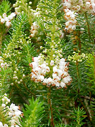

# [[Ericales]] 

     

## #has_/text_of_/abstract 

> The **Ericales** are a large and diverse order of flowering plants in the asterid group of the eudicots. Well-known and economically important members of this order include tea and ornamental camellias, persimmon, ebony, blueberry, cranberry, lingonberry, huckleberry, kiwifruit, Brazil nut, argan, sapote, azaleas and rhododendrons, heather, heath, impatiens, phlox, Jacob's ladder, primroses, cyclamens, shea, sapodilla, pouterias, and trumpet pitchers.
>
> The order includes 22 families, according to the APG IV system of classification.
>
> The Ericales include trees, bushes, lianas, and herbaceous plants. Together with ordinary autophytic plants, they include chlorophyll-deficient mycoheterotrophic plants (e.g., Sarcodes sanguinea) and carnivorous plants (e.g., genus Sarracenia). Mycorrhizal associations are quite common among the order representatives, and three kinds of mycorrhiza are found exclusively among Ericales (namely, ericoid, arbutoid and monotropoid mycorrhiza). In addition, some families among the order are notable for their exceptional ability to accumulate aluminum.
>
> Many species have five petals, often grown together. Fusion of the petals as a trait was traditionally used to place the order in the subclass Sympetalae.
>
> Ericales are a cosmopolitan order. Areas of distribution of families vary largely – while some are restricted to tropics, others exist mainly in Arctic or temperate regions. The entire order contains over 8,000 species, of which the Ericaceae account for 2,000–4,000 species (by various estimates).
>
> According to molecular studies, the lineage that led to Ericales diverged from other plants about 127 million years or diversified 110 million years ago.
>
> [Wikipedia](https://en.wikipedia.org/wiki/Ericales) 

## Phylogeny 

-   « Ancestral Groups  
    -   [Asterids](../../Asterids.md)
    -   [Core Eudicots](Core_Eudicots)
    -   [Eudicots](../../../../Eudicots.md)
    -   [Flowering_Plant](../../../../../Flowering_Plant.md)
    -   [Seed_Plant](../../../../../../Seed_Plant.md)
    -   [Land_Plant](../../../../../../../Land_Plant.md)
    -   [Green plants](../../../../../../../../Plants.md)
    -   [Eukaryotes](Eukaryotes)
    -   [Tree of Life](../../../../../../../../../Tree_of_Life.md)

-   ◊ Sibling Groups of  Asterids
    -   [Cornales](../Cornales.md)
    -   Ericales
    -   [Solanales](../Solanales.md)
    -   [Lamiales](../Lamiales.md)
    -   [Gentianales](../Gentianales.md)
    -   [Garryales](../Garryales.md)
    -   [Asterales](../Asterales.md)
    -   [Apiales](../Apiales.md)
    -   [Dipsacales](../Dipsacales.md)
    -   [Aquifoliales](../Aquifoliales.md)

-   » Sub-Groups
    -   [Polemoniaceae](Ericales/Polemoniaceae.md)
    -   [Fouquieria](Fouquieria)

## Title Illustrations

---------------------------------------------------------------------

Scientific Name ::  Erica vagans
Comments          Cornish heath (Ericaceae)
Copyright ::         © [Kurt Stüber](http://www.biolib.de/) 

-------------------------------------------------------------------------

Scientific Name ::     Primula patens
Location ::           Kiparisovo village near Vladivostok, Primorsky Territory
Comments             grown in a garden
Specimen Condition   Live Specimen
Source Collection    [CalPhotos](http://calphotos.berkeley.edu/)
Copyright ::            © 2000 [Nick Kurzenko](mailto:kurzenko@ibss.dvo.ru) 

---------------------

Scientific Name ::     Sarracenia alabamensis
Location ::           Near Selma (Alabama, USA)
Comments             Pitcher plant (Sarraceniaceae)
Specimen Condition   Live Specimen
Source Collection    [CalPhotos](http://calphotos.berkeley.edu/)
Copyright ::            © 2001 [Barry Meyers-Rice](mailto:bamrice@ucdavis.edu)

