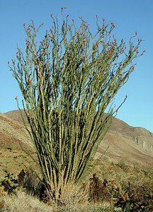
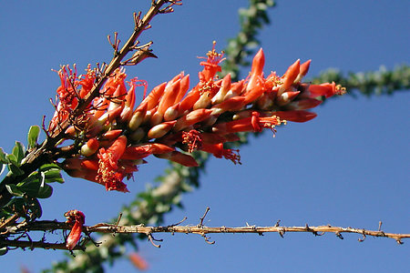

## Phylogeny 

-   « Ancestral Groups  
    -   [Ericales](../Ericales.md)
    -   [Asterids](../../../Asterids.md)
    -   [Core Eudicots](Core_Eudicots)
    -   [Eudicots](../../../../../Eudicots.md)
    -   [Flowering_Plant](../../../../../../Flowering_Plant.md)
    -   [Seed_Plant](../../../../../../../Seed_Plant.md)
    -   [Land_Plant](../../../../../../../../Land_Plant.md)
    -   [Green plants](../../../../../../../../../Plants.md)
    -   [Eukaryotes](Eukaryotes)
    -   [Tree of Life](../../../../../../../../../../Tree_of_Life.md)

-   ◊ Sibling Groups of  Ericales
    -   [Polemoniaceae](Polemoniaceae.md)
    -   Fouquieria

-   » Sub-Groups 

## Fouquieriaceae 

# *Fouquieria* 

Containing group: [Ericales](../Ericales.md)

### References

Henrickson, J. 1972. A taxonomic revision of Fouquieriaceae. Aliso
7:439-537.

Kubitzki, K. 2004. Fouquieraceae. Pages 195-198 in Kubitzki, K. (ed.),
The Families and Genera of Vascular Plants. VI. Flowering Plants.
Dicotyledons. Celastrales, Oxalidales, Rosales, Cornales, Ericales.
Springer, Berlin.

Schultheis, L. and B. G. Baldwin. 1999. Molecular phylogenetics of
Fouquieriaceae: Evidence from nuclear rDNA ITS studies. American Journal
of Botany 86:578-589.

##### Title Illustrations



  -------------------------------------------------------------
  Scientific Name ::     Fouquieria splendens
  Location ::           Anza-Borrego Desert State Park, California, USA
  Specimen Condition   Live Specimen
  Source               [Ocotillo, 2003-04-01B 127](http://flickr.com/photos/anitagould/9061906/)
  Source Collection    [Flickr](http://flickr.com/)
  ToL Image Use        [Attribution-NonCommercial 2.0 Creative Commons License](http://creativecommons.org/licenses/by-nc/2.0/).
  Copyright ::            © 2003 [Anita Gould](http://flickr.com/people/anitagould/)
  -------------------------------------------------------------


  -------------------------------------------------------------
  Scientific Name ::     Fouquieria splendens
  Location ::           Anza-Borrego Desert State Park, California, USA
  Specimen Condition   Live Specimen
  Body Part            flower
  Source               [Ocotillo, 2003-04-01B 132](http://flickr.com/photos/anitagould/9062136/)
  Source Collection    [Flickr](http://flickr.com/)
  ToL Image Use        [Attribution-NonCommercial 2.0 Creative Commons License](http://creativecommons.org/licenses/by-nc/2.0/).
  Copyright ::            © 2003 [Anita Gould](http://flickr.com/people/anitagould/)
  -------------------------------------------------------------
