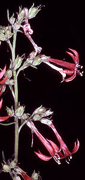
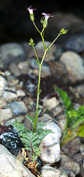
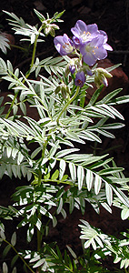
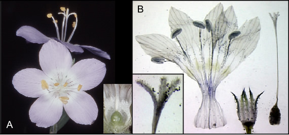
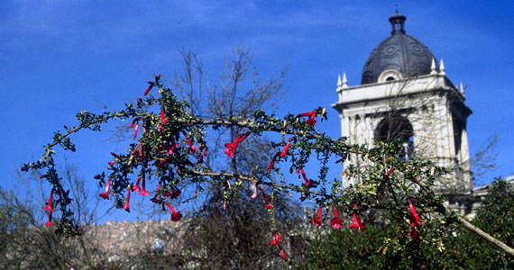
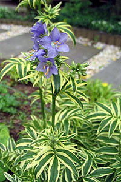
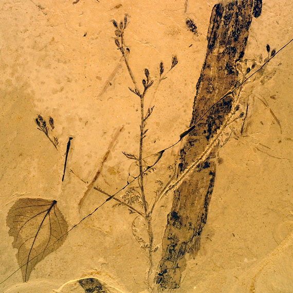

## Phylogeny 

-   « Ancestral Groups  
    -   [Ericales](../Ericales.md)
    -   [Asterids](../../../Asterids.md)
    -   [Core Eudicots](Core_Eudicots)
    -   [Eudicots](../../../../../Eudicots.md)
    -   [Flowering_Plant](../../../../../../Flowering_Plant.md)
    -   [Seed_Plant](../../../../../../../Seed_Plant.md)
    -   [Land_Plant](../../../../../../../../Land_Plant.md)
    -   [Green plants](../../../../../../../../../Plants.md)
    -   [Eukaryotes](Eukaryotes)
    -   [Tree of Life](../../../../../../../../../../Tree_of_Life.md)

-   ◊ Sibling Groups of  Ericales
    -   Polemoniaceae
    -   [Fouquieria](Fouquieria)

-   » Sub-Groups
    -   [Lathrocasis tenerrima](Lathrocasis_tenerrima)
    -   [Saltugilia](Saltugilia)

# Polemoniaceae

## Phlox Family 

[Leigh Johnson](http://www.tolweb.org/)

Tree compiled from Johnson et al., 1996; Porter 1996; Johnson and Soltis
1998; Prather et al., 2000, Bell and Patterson, 2000; Fegusson, Johnson
and Weese 2000; and additional unpublished sequences from L. Johnson and
J. M. Porter. Generic circumscriptions follow Porter and Johnson 2000.
Position of fossil genera inferred from Krutzsch (1966) and Lott et al.
(1998).

Containing group: [Ericales](../Ericales.md)

### Information on the Internet

**Ethnobotany (not restricted to just Polemoniaceae)**

-   [Native American Ethnobotany](http://herb.umd.umich.edu/)
-   [Ethnobotany of the     INEEL](http://www.stoller-eser.com/Flora/ethnobotany_table.htm)
-   [Luiseño Ethnobotany](http://daphne.palomar.edu/scrout/luisenob.htm)
-   [Compendium of natural and alternative medicine (in     Spanish)](http://www.podernatural.com/index.html)

**Threatened and Endangered Species**

-   [US Fish and Wildlife Service Threatened and Endangered     Species](http://endangered.fws.gov/wildlife.html)

**Family Descriptions**

-   [Find Polemoniaceae descriptive information under Ericales at the     Angiosperm Phylogeny     Website](http://www.mobot.org/MOBOT/Research/APweb/welcome.html)
-   [The Families of Flowering Plants - Polemoniaceae     Juss.](http://biodiversity.uno.edu/delta/angio/www/polemoni.htm)

**Images**

-   [Texas A&M Vascular Plant Image Library -     Polemoniaceae](http://www.csdl.tamu.edu/FLORA/imaxxplm.htm)
-   [Wild Flowers of Southern     California](http://ww1.clunet.edu/wf/mtn/idxfam43.htm)

**Directories and Data bases**

-   [Polemoniaceae (Texas A&M Vascular Plant Family Access     System)](http://www.csdl.tamu.edu/FLORA/cgi/gateway_family?fam=Polemoniaceae)

### Introduction

Polemoniaceae, the phlox family, includes about 400 species of herbs,
shrubs, small trees, and vines. Some members of this family are common
desert, montane, or woodland wildflowers that form spectacular displays
during their brief blooming periods. Scarlet gilia (*Ipomopsis
aggregata*), with showy, bright red flowers, is one of the most obvious
and frequently collected summer wildflowers in its range. Few species in
this family are economically important, although some are commonly grown
in home gardens, and others are found in herbal dietary supplements. In
the plant sciences, the phlox family is an important model for
investigating pollination biology and evolutionary patterns (e.g. Galen,
2000; Mayfield et al., 2001; Campbell et al., 2003; Lendvai and Levin,
2003). Various species are adapted for pollination by bats,
hummingbirds, bees, both short- and long-tongued flies, beetles,
butterflies, or moths (Grant and Grant, 1965). Important insights into
plant speciation, especially among annual plants, have been gained from
studies of species in this family (Grant, 1981). Many interesting
patterns of variation that can further enlighten our understanding of
diversification modes and mechanisms remain to be addressed.

### Characteristics

No single morphological feature uniquely identifies a member of the
Phlox family. However, a combination of flower traits is useful for
distinguishing Polemoniaceae from other families of flowering plants.
These identifying features are: five sepals, five fused petals, five
stamens that alternate with the corolla lobes, and an ovary of three
fused carpels. Stamens may be superficially connected to the corolla in
some lineages, but are fused completely into the corolla tube in most
species. The three-parted ovary, in combination with the other floral
features, is key. Many asterid families have a similar arrangement of
petals and stamens, but in these families the primitive number of
carpels is two. Allied families with three carpels, such as
Fouquieriaceae and Diapensiaceae, differ in stamen features and other
particulars (Johnson et al., 1999). Only a few scattered species of
Polemoniaceae in *Linanthus* and *Navarretia* depart from this formula
by being four- or six-merous, or having just two carpels. The
phylogenetic placement of these exceptional taxa within the family
indicates that the common floral pattern is primitive in this family and
deviations are derived.

Typical Polemoniaceae flowers. A. *Polemonium occidentale*, fresh
flowers. The three stigmatic lobes, indicating that three carpels form
the ovary, are apparent in the topmost flower. Inset is a close up of
the ovary, resting on a thin nectary disk. B. *Saltugilia latimeri*,
pressed flower rehydrated in Pohl\'s solution and dissected. Inset is a
close-up of the three stigmatic lobes with long papillae and several
pollen grains attached. From L-R : open corolla showing five stamens
attached to corolla tube, calyx tube with five segments joined by a thin
membrane, and ovary with style and three stigmatic lobes. Images
copyright © 2003 L. Johnson.

Other common features of Polemoniaceae include a nectary disk at the
base of the ovary, typically the mature fruit is a loculicidal capsule
(septicidal in *Cobaea*), and the petals lobes overlap each other on one
edge in bud (convolute aestivation; but aestivation is imbricate in some
Cantua). Foliage leaves are arranged either opposite or alternate each
other along the stem (or lacking in *Gymnosteris*), and vary from entire
to dissected, compound, and even compound with the terminal leaflet
modified into a tendril (*Cobaea*). In life history, many Polemoniaceae
are annual plants that germinate, flower, and die within a twelve-month
period. Many others, however, are perennial and polycarpic (persist more
than two years and flower multiple times over their lives) and a few are
biennial (two-year lifespan). Habit varies from delicate herbs to woody
shrubs to rare small trees (*Cantua*) and woody vines (*Cobaea*).

### Geographic Distribution

The majority of the phlox family grows natively in western North
America. The diversity of species and genera is particularly high in
California, USA, where 17 genera and over 170 species occur. Significant
diversity also exists elsewhere in the world. A principle lineage
consisting of *Cantua, Cobaea,* and *Bonplandia* is distributed natively
only in Mexico, central America, and northwestern South America. In
Eastern North America, the genus *Phlox* is unusually diverse compared
to the rest of the family. Other than members of *Phlox*, only a few
species occur natively east of the Mississippi River in the United
States, such as *Ipomopsis rubra*, *Collomia linearis*, and a few
*Polemonium.* A few *Phlox* and *Polemonium* species are also found
natively in Eurasia. Central and South America, particularly the western
regions of South America, are also home to some members of the phlox
family. A small number of species from several genera that are most
abundant in North America, such as *Collomia*, *Gilia*, *Navarretia*,
and *Leptosiphon*, are found only in western South America, indicating
multiple instances of long distance dispersal (Grant 1959; Morrell et
al. 2000). Occasional species, such as skunkweed (*Navarretia
squarrosa*) and *Collomia grandiflora*, have become weedy in parts of
Europe and Australia, and some cultivated species, such as members of
*Cobaea*, have become naturalized outside their native range (Grant,
1959; Hussey et al., 1997; Pysek et al., 2002; Anon., 2003).

### Popular Culture and Ethnobotany

The beauty of Polemoniaceae has brought their flowers into popular
culture in different regions of the world. Kantuta (*Cantua buxiolia*)
is the national flower of Bolivia and Peru. Known also as \"magic
flower\" and \"sacred flower of the Incas\", the colors of the flower
match the red, yellow, and green stripes on the Bolivian flag. A latin
dance band from New Zealand, with three albums as of 2003, is named
Kantuta after this flower. In Sonthofen, Germany, \"Phlox: food and
motion\" is a café and vinothek that uses artwork of phlox flowers as a
motif in their logo and interior decoration. The Sanford Winery, located
in the Santa Ynez Valley of California, USA, has used various
Polemoniaceae on their trademark wildflower labels that mark each
vintage and year.

*Cantua buxifolia* in La Paz, Bolivia. Image copyright © 1998 Lynn Bohs.

Historically, many Polemoniaceae species have been exploited by native
American cultures for a wide range of uses. Over 40 species from eight
genera were used by native tribes in North America (Moerman, 1998), with
uses ranging from utilitarian (leaves to cover berry baskets), food
(from seeds), hygiene (face and hair washing) to general (fever) or
specific (scorpion stings) medicinal treatments. Brand (1907) indicates
Peruvian Indians made use of a soapy solution derived from *Cantua
pyrifolia* leaves for laundry. Espinolla, one of several common names
for *Loeselia coccinea,* a popular herb in Mexico, is becoming more
common in the herbal industry worldwide, and is reputedly useful for
treating respiratory diseases, stomach inflammation, and postchildbirth
fever.

### Horticulture

All but the smallest-flowered genera have species suitable for
cultivation in a variety of settings (rock and container gardens, formal
borders, naturalized wildflower areas; Huxley et al., 1992). However,
only *Phlox* (moss pinks, garden phlox, wild sweet williams) and
*Polemonium* (Jacob\'s ladder, skypilot) are commonly available for use
in home landscapes. Seeds of bird\'s eye-gilia (*Gilia tricolor*),
cathedral bells (*Cobaea scandens*, also known as cup-and-saucer vine),
and a few other species can also be found from regional sources or more
specialized retailers.

(Left) *Phlox subulata* \'Candystripe\'. Image copyright © 2003 Leigh
Johnson. (Right) *Polemonium caeruleum* \'Brise d\' Anjou\'. Variegated
Jacob\'s Ladder. Image copyright © 2003 Paula Squitiere.

### Conservation

As of 2004, eight species (10 taxa) of Polemoniaceae from five genera
within the United States are listed on the U.S. Federal Register as
either threatened (two species) or endangered (six species). Several
additional species are narrowly distributed or restricted to specialized
habitats, and many of these are listed as threatened, endangered, or as
species of concern by individual states. Additional species of
conservation concern are known from areas outside the United States,
such as Baja California, but formal conservation status is uncertain for
most of these.

### Fossil Record

Few species of Polemoniaceae inhabit environments where burial,
sedimentation, and ultimately fossilization are likely to occur.
Consequently, the fossil record of Polemoniaceae is poor. Lott et al.
(1998) review the fossil history of this family, which consists
primarily of pollen grains: from the middle Eocene in Spain, from the
Pliocene in Europe (attributed to a fossil-genus, *Polemoniopollis*),
and *Gilia* type 1-like pollen (Stuchlik, 1967) from Miocene deposits in
Northern California. The only megafossil currently contributed to
Polemoniaceae, *Gilisenium hueberi*, is a nicely preserved
compression-impression fossil from mid-eocene shale deposits taken from
the Green River Formation in Utah (USA; Lott et al., 1998). This fossil
of a taprooted, herbaceous plant is very similar to extant *Gilia*
species and provides an important calibration point for estimating the
timing of the origin of the phlox family and various groups within this
family.

*Gilisenium hueberi*, Type specimen. This is the sole macrofossil of
Polemoniaceae. Image copyright © 2003, courtesy of the Department of
Paleobiology, National Museum of Natural History, Smithsonian
Institution.

### Discussion of Phylogenetic Relationships

The monophyly of Polemoniaceae is strongly supported by cladistic
analyses of DNA sequence data. The branch uniting Polemoniaceae shows a
high level of character support in chloroplast matK (Johnson et al.
1996), chloroplast ndhF (Prather et al. 2000) and nuclear rDNA 18S
(Johnson et al. 1999) sequence analyses. Although a cladistic analysis
to assess the monophyly of the phlox family has not been conducted with
morphology, monophyly can be inferred by a unique combination of
morphological features that center on floral and reproductive characters
(see discussion above and in Johnson et al. 1999). Historically, there
has been little questioning of the limits of this family although
*Cobaea* has sometimes been segregated into its own family, Cobaeaceae,
based on its vining habit, septicidal capsules, and other distinctive
morphological features (Hutchinson, 1959). Cladistic analyses, all
currently DNA-sequence based, strongly indicate a derived position for
Cobaea within Polemoniaceae, rather than a sister relationship to all
other genera (see also Prather, 1999).

Phylogenetic reconstruction within the phlox family is a work in
progress. Cladistic analyses of nuclear rDNA ITS sequences (Porter 1996)
and chloroplast matK (Johnson et al. 1996) and ndhF (Prather et al.
1999) sequences generally agree in recognizing six major lineages of
Polemoniaceae that have been recognized taxonomically at either the
tribal or subfamily level (Porter and Johnson 2000). Support for
relationships within and among these lineages varies and additional work
is needed to resolve the relationships among these major groups.
Furthermore, while the clades ranked as tribes and subfamilies by Porter
and Johnson (2000), particularly in subfamily Polemonioideae (all genera
except *Acanthogilia*, *Bonplandia*, *Cobaea*, and *Cantua*), are
supported to greater or lesser degrees by molecular data, well-defined
morphological synapomorphies exclusive to these groups are lacking in
many cases. Taxon descriptions for super-generic groups include ranges
of morphological variation that are rarely unique to a single,
higher-level taxon. Consequently, meaningful taxonomic diagnoses are
difficult to construct and terminal taxa for the phylogenetic hypothesis
presented above are genera (or species when genera are monotypic) rather
than tribes or subfamilies. In general, polytomies in this phylogenetic
hypothesis indicate relationships that are weakly supported in all data
sets.

Prather et al. (1999) summarize disagreement among molecular studies in
the placement of *Acanthogilia gloriosa*. Based on ndhF sequences, these
authors favor a sister relationship between *Acanthogilia* and
*Bonplandia*+*Cantua*+*Cobaea*. However, this relationship is only
weakly supported, and is in disagreement with other published analyses
that, similarly, disagree with each other. *Acanthogilia* represents an
important lineage in the early diversification of Polemoniaceae and is
either sister to all other Polemoniaceae, to just
*Bonplandia*+*Cantua*+*Cobaea*, or to all other Polemoniaceae except
these three genera.

*Bonplandia*+*Cantua*+*Cobaea* form a monophyletic group. In most
studies, *Bonplandia* is sister to *Cobaea*, and these two genera
combined are sister to *Cantua*. However, any resolution among these
genera is presently only weakly supported.

The remaining genera of Polemoniaceae, are well supported as a
monophyletic group composed of four principal lineages: Polemonieae
(*Polemonium* and *Polemoniopollis*); Gilieae (*Saltugilia*, *Gilia*,
*Gilisenium*, *Collomia*, *Navarretia*, *Allophyllum* and
*Lathrocasis*); Phlocideae (*Linanthus*, *Gymnosteris*, *Leptosiphon*,
*Phlox*, and *Microsteris*); and Loeselieae (*Aliciella*, *Dayia*,
*Loeselia*, *Giliastrum*, *Bryantiella*, *Ipomopsis*, *Microgilia*,
*Eriastrum*, *Langloisia*, and *Loeseliastrum*). Relationships among
these groups are unclear and any resolution is presently only weakly
supported.

Polemonieae contains the single extant genus *Polemonium*, which has
uncertain sister relationships to the other major clades in subfamily
Polemonioideae. Fossil *Polemonium*-like pollen grains from Pliocene
deposits in Europe have been described as *Polemonipollis majewskii*
(Krutzsch, 1966; Muller, 1981). This taxon is inferred from the scanty
morphological evidence available to be allied with *Polemonium*.

Within Gilieae, *Saltugilia* is strongly supported as sister to the
remainder of the tribe and *Lathrocasis* is unresolved. Published data
suggest *Lathrocasis* is sister to *Gilia*,
*Collomia*+*Navarretia*+*Allophyllum*, or both groups of these groups
combined (Johnson and Weese, 2000). *Gilisenium*, a fossil genus, has an
inferred relationship near *Gilia* based on readily apparent
morphological similarities (Lott et al. 1998), but has not been directly
included in cladistic analyses. *Allophyllum*, *Collomia*, and
*Navarretia* form a very well support clade. Some early analyses with
incomplete sampling suggested *Collomia* may be paraphyletic with
*Navarretia* derived within this genus. However, more extensive
DNA-based sampling agrees with several unique morphological and
chromosomal features suggesting *Collomia* is monophyletic (Johnson and
Wilken, in manuscript).

Within Phlocideae, relationships among genera are largely resolved with
molecular data. *Linanthus* shows some indications, mostly surrounding
the taxon *Linanthus inyoensis*, of being paraphyletic with respect to
the rest of the tribe, and support for monophyly of *Linanthus* is the
weakest among genera in this tribe (Bell and Patterson, 2000).
Additional morphological and molecular analyses are needed to resolve
relationships with robustness at the base of this tribe. *Microsteris*,
which has been treated within *Phlox* by various authors, remains
supported as sister to *Phlox* in published analyses (Ferguson and
Jansen 2002).

Among major lineages, tribe Loeselieae has the weakest support for
monophyly in the family, but this clade is consistently recovered in
molecular analyses. The radiation of lineages appears to have occurred
rapidly relative to rates of molecular evolution in sampled genes,
giving little resolution among many of the genera in this clade.
Although several genera are well-supported as monophyletic, such as
*Aliciella*, *Giliastrum*, and *Eriastrum*, others are questionable at
present. Additional work by J. M. Porter (Rancho Santa Ana Botanic
Garden, unpublished), indicates *Bryantiella* may not be monophyletic.
These same data show that *Ipomopsis* as presently circumscribed also
contains lineages that lack most recent common ancestry with the bulk of
this genus. Further morphological and molecular work focused on
*Loeseliastrum* is also warranted to resolve the affinities and
evolutionary history of *L. depressum*, a species recently transferred
to this genus but with discordant affinities in ITS versus chloroplast
sequence data.

### Classification of Polemoniaceae

A phylogeny-based classification that places Polemoniaceae genera into
tribes and subfamilies has been proposed that recognizes well-supported
nodes from a growing body of comparative DNA sequence studies and
non-cladistic consideration of morphology (Porter and Johnson, 2000).
This classification is subject to revision as additional data that bear
on phylogenetic branching patterns are brought forth, with an emphasis
on recognizing monophyletic groups that include all descendents of a
common ancestor. Driven by this philosophy, some changes to the
classification of Porter and Johnson (2000) will be forthcoming as
relationships in groups of questionable monophyly are addressed, and
polytomies are resolved. For example, based on resolution of
*Acanthogilia* as sister to *Cobaea*, *Bonplandia*, and *Cantua*,
Prather et al (2000) suggested that *Acanthogilia* be included in
subfamily Cobeaoideae. An alternative classification that reflects this
same phylogenetic branching pattern could also be proposed by
maintaining Cobeaoideae as circumscribed phylogenetically by Porter and
Johnson (2000), and erecting a new, super subfamilial taxon that
circumscribes this subfamily + *Acanthogilia.*

An alternative classification for Polemoniaceae based on interpretations
of overall similarity has also been proposed, and revised, in recent
years (Grant 1998a,b, Grant and Day 1998, Grant 2003b). This
classification adheres to a broader definition of monophyly that allows
paraphyletic groups, and considers phylogenetic patterns of secondary
importance (Grant 2003a).

### References

Anon. 2003. APNI: Australian Plant Names Index.
<http://www.anbg.gov.au/cpbr/databases/apni.html>.

Bell, C. D. and R. W. Patterson. 2000. Molecular phylogeny and
biogeography of Linanthus (Polemoniaceae). Am. J. Bot. 87:1857-1870.

Brand, A. 1907. Polemoniaceae. Pages 1-203 in A Engler, ed. Das
Pflanzenreich IV(250). Engelmann, Leipzig.

Campbell, D.R., R. Alarcon, and C. A. Wu. 2003. Reproductive isolation
and hybrid pollen disadvantage in Ipomopsis. J. Evolution. Biol.
16:536-540.

Carlquist, S., V. M. Eckhart, and D. C. Michener. 1984. Wood anatomy of
Polemoniaceae. Aliso 10:547-572.

Dawson, M. L. 1936. The floral morphology of the Polemoniaceae. Am. J.
Bot. 23: 501-511.

Ferguson, C. J. and R. K. Jansen. 2002. A chloroplast DNA phylogeny of
eastern Phlox (Polemoniaceae): implications of congruence and
incongruence with the ITS phylogeny. Am. J. Bot. 89:1324-1335.

Galen, C. 2000. High and dry: Drought stress, sex-allocation trade-offs,
and selection on flower size in the alpine wildflower Polemonium
viscosum (Polemoniaceae). Am. Nat. 156:72-83.

Grant, V. 1981. Plant speciation. Columbia University Press, New York,
NY.

Grant, V. 2002. Frequency of spontaneous amphiploids in Gilia
(Polemoniaceae) hybrids. Am. J. Bot. 89:1197-1202.

Grant, V. 1959. Natural history of the phlox family. Martinus Nijhoff,
The Hague, Netherlands.

Grant, V. 1998a Primary classification and phylogeny of the
Polemoniaceae, with comments on molecular cladistics. Am. J. Bot.
85:741-752.

Grant, V. 1998b \[1999\] Classification of the genus Gilia
(Polemoniaceae). Phytologia 84:69-86.

Grant, V. 2003a. Incongruence between cladistic and taxonomic systems.
American Journal of Botany 90: 1263-1270.

Grant, V. 2003b. Taxonomy of the Polemoniaceae: the subfamilies and
tribes. Sida 20: 1371-1385.

Grant, V., and A. G. Day. 1998 \[1999\]. Transfer of some species of
Gilia to Allophyllum and Tintinabulum, and the effects of the transfer
on the generic definition of Gilia (Polemoniaceae). Phytologia
84:368-382.

Grant, V. and K. A. Grant. 1965. Flower pollination in the Phlox family.
Columbia University Press, New York, NY.

Harborne, J. B., and D. M. Smith. 1978. Correlations between anthocyanin
chemistry and pollination ecology in the Polemoniaceae. Biochem. Syst.
Ecol. 6:127-130.

Hussey, B. M. J., G. J. Keighery, R. D. Cousens, J. Dodd, and S. G.
Lloyd. 1997. Western weeds: a guide to the weeds of Western Australia.
The Plant Protection Society of Western Australia , Victoria Park.

Hutchinson, J. 1959. The families of flowering plants, 2nd edition.
Clarendon Press, Oxford.

Huxley, A., M. Griffiths, and M. Levy (eds.) 1992. The New Royal
Horticultural Society Dictionary of Gardening, Vol. 1. Macmillan Press
Ltd., London.

Johnson, L. A. and T. L. Weese. 2000. Geographic distribution,
morphological and molecular characterization, and relationships of
Lathrocasis tenerrima (Polemoniaceae). W. N. Am. Nat. 60:355-373.

Johnson, L. A., D. E. Soltis, and P. S. Soltis. 1999. Phylogenetic
affinities of Polemoniaceae inferred from nuclear ribosomal 18S DNA
sequences. Plant Syst. Evol. 214:65-89.

Johnson, L. A., J. L. Schultz, D. E. Soltis, and P. S. Soltis. 1996.
Monophyly and generic relationships of Polemoniaceae based on matK
sequences. Am. J. Bot. 83:1207-1224.

Johnson, L. A., K. H. Holt, and J. M. Porter. 2004. Seed surface
sculpturing and its systematic significance in Gilia (Polemoniaceae) and
segregate genera. International Journal of Plant Sciences, in press.

Kapil, R. N., P. N. Rustagi, and R. Venkataraman. 1968. A contribution
to the embryology of Polemoniaceae. Phytomorphology 18:403-411.

Krutzsch, W. 1966. Zur Kenntnis der präquartären perporaten
Pollenformen. Geologie 15:16-71.

Lendvai, G., and D. A. Levin. 2003. Rapid response to artificial
selection on flower size in Phlox. Heredity 90:336-342.

Lott, T.A., S. R. Manchester, D. L. Dilcher. 1998. A unique and complete
polemoniaceous plant from the middle Eocene of Utah, USA. Rev.
Palaeobot. Palyn. 104:39-49.

Mayfield, M. M., N. M. Waser, and M.V. Price. 2001. Exploring the \'most
effective pollinator principle\' with complex flowers: Bumblebees and
Ipomopsis aggregata. Ann. Bot-London 88:591-596.

Moerman, D. E. 1998. Native American Ethnobotany. Timber Press,
Portland, OR.

Morrell, P. L., J. M. Porter, and E. A. Friar. 2000. Intercontinental
dispersal: the origin of the widespread South American plant species
Gilia laciniata ( Polemoniaceae ) from a rare California and Oregon
coastal endemic. Plant Syst. Evol. 224:13-32.

Muller, J. 1981. Fossil pollen records of extant angiosperms. Bot. Rev.
47:1-142.

Plitmann, U. and D. Levin. 1983. Pollen-pistil relationships in the
Polemoniaceae. Evol. 37:957-967.

Plitmann, U. and D. Levin. 1990. Breeding systems in the Polemoniaceae.
Pl. Syst. Evol. 170:205-214.

Porter, J. M. 1996 \[1997\]. Phylogeny of Polemoniaceae based on nuclear
ribosomal internal transcribed spacer DNA sequences. Aliso 15:57-77.

Porter, J. M. and L. A. Johnson. 1998. Phylogenetic relationships of
Polemoniaceae: inferences from mitochondrial nad1 intron sequences.
Aliso 17:157-188.

Porter, J. M., and L. A. Johnson. 2000. A phylogenetic classification of
Polemoniaceae. Aliso 19:55-91.

Prather, L. A. 1999. Systematics of Cobaea (Polemoniaceae). Syst. Bot.
Monogr. 57:1-81.

Prather, L. A., C. J. Ferguson, and R. K. Jansen. 2000. Polemoniaceae
phylogeny and classification: implications of sequence data from the
chloroplast gene ndhF. Am. J. Bot. 87:1300-1308.

Pysek, P., Sadlo J. and B. Mandak. 2002. Catalogue of alien plants of
the Czech Republic. Preslia, Praha 74:97-186.

Smith, D. M, C. W. Glennie, and J. B. Harborne. 1982. Flavonoid patterns
in Leptodactylon and Linanthus. Biochem. Syst. Ecol. 10:37-42.

Smith, D. M, C. W. Glennie, J. B. Harborne and C. A. Williams. 1977.
Flavonoid diversification in the Polemoniaceae. Biochem. Syst. Ecol.
5:107-115

Steele, K. P., and R. Vilgalys. 1994. Phylogenetic analysis of
Polemoniaceae using nucleotide sequences of the plastid gene matK. Syst.
Bot. 19:126-142.

Stuchlik, L. 1967a. Pollen morphology in the Polemoniaceae. Grana
Palynol. 7:146-240.

Stuchlik, L. 1967b. Pollen morphology and taxonomy of the family
Polemoniaceae. Rev. Palaeobot. Palynol. 4:325-333.

Taylor, T. N., and D. A. Levin. 1975. Pollen morphology of Polemoniaceae
in relation to systematics and pollination systems: scanning electron
microscopy. Grana 15:91-112.

Wherry, E. T. 1940. A provisional key to the Polemoniaceae. Bartonia
20:14-17.

##### Title Illustrations



  ------------------------------------------------------------------------
  Scientific Name ::  Phlox amoena
  Location ::        USA: North Carolina Botanic Garden, Cultivated.
  Sex ::             Perfect flowers
  Body Part         Inflorescence
  Copyright ::         © 2003 [Leigh Johnson](mailto:leigh_johnson@byu.edu) 
  ------------------------------------------------------------------------


  ------------------------------------------------------------------------
  Scientific Name ::  Ipomopsis aggregata
  Location ::        USA: Utah Co., Utah
  Sex ::             Perfect flowers
  Body Part         Inflorescence
  Copyright ::         © 2003 [Leigh Johnson](mailto:leigh_johnson@byu.edu) 
  ------------------------------------------------------------------------


  ------------------------------------------------------------------------
  Scientific Name ::  Gilia Stellata
  Location ::        USA: Washington Co., Utah
  Sex ::             Perfect flowers
  Body Part         Full plant
  Copyright ::         © 2003 [Leigh Johnson](mailto:leigh_johnson@byu.edu) 
  ------------------------------------------------------------------------


  ------------------------------------------------------------------------
  Scientific Name ::  Polemonium occidentale
  Location ::        USA: Juab Co., Utah
  Sex ::             Perfect flowers
  Body Part         upper 2/3 of plant
  Copyright ::         © 2003 [Leigh Johnson](mailto:leigh_johnson@byu.edu) 
  ------------------------------------------------------------------------
