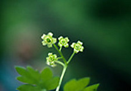
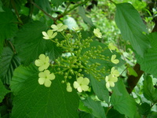
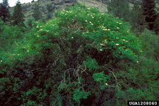

## Phylogeny 

-   « Ancestral Groups  
    -   [Dipsacales](../Dipsacales.md)
    -   [Asterids](../../Asterids.md)
    -   [Core Eudicots](Core_Eudicots)
    -   [Eudicots](../../../../Eudicots.md)
    -   [Flowering_Plant](../../../../../Flowering_Plant.md)
    -   [Seed_Plant](../../../../../../Seed_Plant.md)
    -   [Land_Plant](../../../../../../../Land_Plant.md)
    -   [Green plants](../../../../../../../../Plants.md)
    -   [Eukaryotes](Eukaryotes)
    -   [Tree of Life](../../../../../../../../../Tree_of_Life.md)

-   ◊ Sibling Groups of  Dipsacales
    -   Adoxaceae
    -   [Morinaceae](Morinaceae.md)
    -   [Valerianaceae](Valerianaceae.md)

-   » Sub-Groups 

# Adoxaceae 

[Charles D. Bell](http://www.tolweb.org/)

Containing group: [Dipsacales](../Dipsacales.md)

### References

Backlund, A. A. & Bremer, K. (1997): Phylogeny of the Asteridae s. str.
based on rbcL sequences, with particular reference to the Dipsacales.
Pl. Syst. Evol. 207:225-254.

Backlund, A. A. & Bremer, K. (1998): To be or not to be- principles of
classification and monotypic plant families. Taxon 47:391-400.

Backlund, A. A. & Donoghue, M. J. (1996): Morphology and phylogeny of
the order Dipsacales. In Phylogeny of the Dipsacales, A. A. Backlund,
Doctoral Dissertation. Uppsala: Department of Systematic Botany, Uppsala
Univ.

Backlund A. A. & Pyck, N. (1998): Diervillaceae and Linnaeaceae, two new
families of caprifolioids. Taxon 47:657-661.

Bell, C. D. and M. J. Donoghue. Phylogeny and biogeography of Morinaceae
(Dipsacales) based on nuclear and chloroplast DNA sequences. Organisms,
Diversity, and Evolution.

Bell, C. D., Edwards, E. J., Kim, S.-T. & Donoghue, M. J. (2001):
Dipsacales phylogeny based on chloroplast DNA sequences. Harvard Pap. in
Bot. 6:481-499.

Blackmore, S. & Cannon, M. J. (1983): Palynology and systematics of
Morinaceae. Rev. Palaeobot. and Palyn.40:207-226.

Cannon, M. J. & Cannon, J. F. M. (1984): A revision of the Morinaceae
(Magnoliophyta-Dipsacales). Bull. Brit. Mus. (Nat. Hist.) Bot. 12:1-35.

Caputo, P. & Cozzolino, S. (1994): A cladistic analysis of Dipsacaceae
(Dipsacales). Pl. Syst. Evol. 189:41-61.

Cronquist, A. (1988): The Evolution and Classification of Flowering
Plants. New York Botanical Garden, Bronx, New York.

Donoghue, M. J. , Eriksson, T., Reeves, P. A. & Olmstead, R. G. (2001):
Phylogeny and phylogenetic taxonomy of Dipsacales, with special
reference to Sinadoxa and Tetradoxa (Adoxaceae). Harvard Pap. in
Bot.6:459-479.

Donoghue, M. J., Bell, C. D., & Winkworth, R. C. (in press): The
evolution of reproductive characters in Dipsacales. Int. J. Plant Sci.

Hofman, U. & Gottmann, J. (1990): Morina L. und Triplostegia Wall. Ex
DC. Im vergleich mit Valerianaceae und Dipsacaceae. Bot. Jahrb. Syst.
111:499-553.

Judd, W. S., Sanders, R. W. & Donoghue, M. J. (1994): Angiosperm family
pairs preliminary phylogenetiic analyses. Harvard Pap. in Bot. 5:1-51.

Peng, C.-I., Tobe, H. & Takahashi, M. (1995): Reproductive morphology
and relationships of Triplostegia (Dipsacales). Bot. Jahrb. Syst.
116:505-516.

Pyck, N., Roels, P. & Smets, E. (1999): Tribal relationships in
Caprifoliaceae: evidence from a cladistic analysis using ndhF sequences.
Syst. Geogr. Pl. 69:145-159.

Pyck, N. & Smets, E. (2000): A search for the position of the seven-son
flower (Heptacodium, Dipsacales): combining molecular and morphological
evidence. Pl. Syst. Evol. 225:185-199.

Pyck, N., Van Lysebetten, A., Stessens, J. & Smets, E. (2002): The
phylogeny of Patrinieae sensu Grabner (Valerianaceae) revisited:
additional evidence from ndhF sequence data. Pl. Syst. Evol. 233:29-46.

Roels, P. & Smets, E. (1996): A floral ontogenetic study in Dipsacales.
Int. J. Plant Sci. 157:203-218.

Zhang, W-H., Chen, Z-D., Li, J-H., Chen, H-B. & Tang, Y-C. (2003):
Phylogeny of the Dipsacales s.l. based on chloroplast trnL-F and ndhF
sequences. Mol. Phylo. Evol. 26:176-189.

##### Title Illustrations



  ---------------------------------------------------------------------------
  Scientific Name ::     Tetradoxa omeiensis
  Specimen Condition   Live Specimen
  Identified By        Michael J. Donoghue
  Copyright ::            © [Michael Donoghue](mailto:michael.donoghue@yale.edu) 
  ---------------------------------------------------------------------------


  ---------------------------------------------------------------------------
  Scientific Name ::     Viburnum opulus
  Location ::           Romania
  Comments             Opened flowers on the edges represent sterile flowers. Central, fertila flowers open little later. V. opulus is a shrub growing in shaddy or semi-sunny places
  Specimen Condition   Live Specimen
  Identified By        Ilisoi Gabriel
  Body Part            Inflorescence
  Copyright ::            © [Gabriel Ilisoi](mailto:ilisoi_gabriel@yahoo.co.uk) 
  ---------------------------------------------------------------------------


  --------------------
  Scientific Name ::     Sambucus nigra cerulea
  Comments             blue elderberry, one shrub in typical habitat
  Acknowledgements     Photograph courtesy InsectImages.org (#1208060)
  Specimen Condition   Live Specimen
  Source Collection    [InsectImages.org](http://www.insectimages.org/)
  Copyright ::            © Dave Powell, USDA Forest Service
  --------------------
