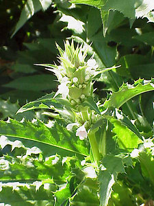

## Phylogeny 

-   « Ancestral Groups  
    -   [Dipsacales](../Dipsacales.md)
    -   [Asterids](../../Asterids.md)
    -   [Core Eudicots](Core_Eudicots)
    -   [Eudicots](../../../../Eudicots.md)
    -   [Flowering_Plant](../../../../../Flowering_Plant.md)
    -   [Seed_Plant](../../../../../../Seed_Plant.md)
    -   [Land_Plant](../../../../../../../Land_Plant.md)
    -   [Green plants](../../../../../../../../Plants.md)
    -   [Eukaryotes](Eukaryotes)
    -   [Tree of Life](../../../../../../../../../Tree_of_Life.md)

-   ◊ Sibling Groups of  Dipsacales
    -   [Adoxaceae](Adoxaceae.md)
    -   Morinaceae
    -   [Valerianaceae](Valerianaceae.md)

-   » Sub-Groups 

# [[Morinaceae]] 

 

Containing group: [Dipsacales](../Dipsacales.md)

## #has_/text_of_/abstract 

> Morinoideae is a subfamily of plants in the family Caprifoliaceae, order Dipsacales. 
> It was at one time recognized as the separate family **Morinaceae**. 
> The genus Morina has also been included in a separate family Dipsacaceae, 
> currently included in Caprifoliaceae.  Three genera have been included in this subfamily:
>
> 
>
> Acanthocalyx
>
> A. alba, A. albus, A. delavayi, A. nepalensis.
>
> Cryptothladia
>
> C. chinensis, C. chlorantha, C. kokonorica, C. polyphylla
>
> Morina
>
> M. couteriana, M. longifolia, M. persica
>
> M. longifolia has the common names "whorl flower" and "Persian steppe flower." This species has cultivars: M. delavaya and M. wallichii.
>
> [Wikipedia](https://en.wikipedia.org/wiki/Morinoideae) 

## Introduction

[Charles D. Bell]() 

An excellent taxonomic revision of Morinaceae was published by Cannon
and Cannon in 1984. They recognized 13 species extending from
south-eastern Europe and Israel to the Himalayas of Nepal, Bhutan, and
China, and further east and north in the Qinghai-Tibetan Plateau. These
plants most often grow at high elevations, sometimes in excess of 4,200
meters, but they occupy a range of habitats, including rock ledges,
alpine meadows, dry slopes, the margins of pine forests, and even
swamps.

### Characteristics

Within Morinaceae, Cannon & Cannon (1984) recognized three genera:
*Morina*, *Acanthocalyx*, and *Cryptothladia*. *Acanthocalyx* has basal,
opposite leaves, corolla lobes that are more or less equal in size, four
fertile stamens, and pollen grains that lack prominent protrusions. In
contrast, *Morina* and *Cryptothladia* share whorled leaves, distinctly
zygomorphyic, 2-lipped corollas with unequal lobes, two fertile stamens
and two reduced sterile stamens, and a unique pollen form with three
prominent equatorial protrusions (Blackmore & Cannon, 1983; Cannon &
Cannon, 1984). *Cryptothladia* differs from *Morina* in having 2-4
corolla lobes as opposed to five, and in that the corolla is equal to
or, in most cases, shorter than the calyx. *Cryptothladia* flowers
appear to be predominantly cleistogamous.

Cannon & Cannon (1984) compared Morinaceae to Valerianaceae and
Dipsacaceae, but did not specifically hypothesize relationships among
these groups. Morinaceae have sometimes been united with Dipsacaceae,
and in some treatments are even considered to be a tribe within
Dipsacaceae (e.g., Cronquist, 1988). Such treatments highlight the
presence of a distinctive epicalyx surrounding the ovary in these groups
plus Triplostegia (which has a double epicalyx). Other authors have
highlighted similarities shared by Morinaceae, Valerianaceae, and
Triplostegia, such as the presence of three distinct carpels (two of
which abort), and of clearly zygomorphic corollas. Backlund & Bremer
(1998) summarized the varying taxonomic treatments of the group.

### Relationships of Morinaceae to Other Dipsacales

In recent years a variety of phylogenetic analyses have supported the
monophyly of the Morinaceae and clarified its relationships within
Dipsacales (Caputo & Cozzolino, 1994; Peng et al., 1995; Backlund &
Donoghue, 1996; Backlund & Bremer, 1997; Bell et al., 2001; Donoghue et
al., 2001; Pyck, 2001; Pyck et al., 2002; Donoghue et al., in press;
Zhang et al., in press). The more recent and most comprehensive of these
analyses have agreed that Morinaceae, Valerianaceae, *Triplosetgia*, and
Dipsacaceae form a clade (the Valerina clade of Donoghue et al. 2001),
and that this is in turn united with the Linnaeeae of the traditional
Caprifoliaceae (together forming the Linnina clade of Donoghue et al.,
2001). Within Valerina there have been some differences among
phylogenetic analyses, although these have been weakly supported.
Several analyses combining different data sources have supported the
hypothesis that Morinaceae form the sister group of a clade containing
Valerianaceae plus a clade containing Dipsacaceae plus *Triplostegia*.

### Discussion of Phylogenetic Relationships

Representatives of the three genera of Morinaceae have been included in
several previous phylogenetic studies (Caputo & Cozzolino, 1994; Peng et
al., 1995; Backlund & Donoghue, 1996; Bell et al., 2001; Donoghue et
al., 2001; Pyck, 2001; Donoghue et al., in press). In all of these
cases, Acanthocalyx has been found to be the sister group of Morina plus
Cryptothladia. However, only one species has been included from each of
these groups, and it has therefore not been possible to test their
monophyly.

## Title Illustrations

---------------------------------------------------------------------

Scientific Name ::     Morina longifolia
Specimen Condition   Live Specimen
Copyright ::            © [Kurt Stüber](http://www.biolib.de/) 

