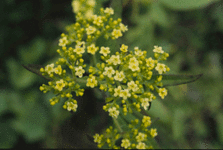
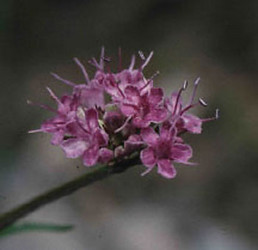

# [[Valerianaceae]] 

 

## #has_/text_of_/abstract 

> The **Valerianaceae** Batsch, the valerian family, was a family of flowering plants that is now considered part of the Caprifoliaceae. Plants are generally herbaceous, and their foliage often has a strong, disagreeable odor. They are found native in most regions of the world except for Australia. Some species are cultivated as ornamentals or used in herbal medicine for inducing relaxation and sleep.
>
> The genera that were placed in this family, along with some species, include:
>
> 
>
> Centranthus
>
> C. ruber (red valerian, spur valerian or red spur valerian)
>
> Fedia
>
> F. cornucopiae (African valerian, horn of plenty)
>
> Nardostachys
>
> N. jatamansi (Spikenard)
>
> N. chinensis
>
> Patrinia
>
> Plectritis
>
> Valeriana
>
> V. dioica (marsh valerian)
>
> V. officinalis (valerian)
>
> Valerianella
>
> V. locusta (corn salad, lamb's lettuce)
>
> DNA studies have found Valeriana to be paraphyletic with respect to Centranthus and Valerianella, and Valerianella with respect to Fedia. Some sources now include Centranthus, Fedia and Valerianella within Valeriana.
>
> [Wikipedia](https://en.wikipedia.org/wiki/Valerianaceae) 

## Phylogeny 

-   « Ancestral Groups  
    -   [Dipsacales](../Dipsacales.md)
    -   [Asterids](../../Asterids.md)
    -   [Core Eudicots](Core_Eudicots)
    -   [Eudicots](../../../../Eudicots.md)
    -   [Flowering_Plant](../../../../../Flowering_Plant.md)
    -   [Seed_Plant](../../../../../../Seed_Plant.md)
    -   [Land_Plant](../../../../../../../Land_Plant.md)
    -   [Green plants](../../../../../../../../Plants.md)
    -   [Eukaryotes](Eukaryotes)
    -   [Tree of Life](../../../../../../../../../Tree_of_Life.md)

-   ◊ Sibling Groups of  Dipsacales
    -   [Adoxaceae](Adoxaceae.md)
    -   [Morinaceae](Morinaceae.md)
    -   Valerianaceae

-   » Sub-Groups 

## Introduction

[Charles D. Bell]() 

Originally described by Linnaeus (1753); Linnaeus (1754), Valerianaceae
is traditionally subdivided into three tribes (Graebner, 1906); 1)
Patrinieae, 2) Triplostegieae, and 3) Valerianeae. Many authors (see
Weberling (1970), Cronquist (1988), Backlund (1996a), Brummitt (1992),
and Mabberley (1997)) recognize 14 genera; two in the tribe Patrinieae
(*Patrinia* and *Nardostachys*), a single genus (*Triplostegia*) in the
tribe Triplostegieae, and 11 genera assigned to five subtribes in the
Valerianeae. Six genera besides *Valeriana* have been recognized in
South America (*Aretiastrum*, *Astrephia*, *Belonanthus*, *Phuodendron*,
*Phyllactis*, and *Stangea*). Recent treatments of the South American
taxa have argued for placing these species in Valeriana, reducing the
number of recognized genera within Valerianaceae to eight (Eriksen, 1989
a; Borsini, 1944; Larsen, 1986).

### Characteristics

Valerianaceae has long been thought to represent a natural group of ca.
350 species distributed throughout much of the world, with the exception
of Australia and New Zealand. The group is characterized by a)
sympetalous, asymmetric flowers, b) inferior, three-carpelate ovaries,
c) one fertile carpel with a single anatropous ovule, d) an achene fruit
type, and e) lack of endosperm in the ripe seed (with the exception of
*Triplostegia*). The presence of iridoids of the Valepotriate type in
many of the species, including *Triplostegia* (Backlund and Moritz,
1998), is also characteristic the group. Although the group appears to
have a center of origin in Asia, the majority of the species occur in
the Andes of South America.

Within Valerianaceae there is a degree of differentiation/specialization
in flower and fruit morphology. The most noticeable difference in floral
morphologies across Valerianaceae is in the number of stamens, which
varies from four to one \[five stamens have also been reported in
*Patrinia* (Eriksen, 1989 a)\]. The trend in the group is toward the
reduction in the number of stamens. Donoghue et al. (in press b)
inferred from a large chloroplast data set, combined with ITS sequences,
that there was an initial reduction in stamen number from the ancestral
condition of four to three, then two additional, independent reductions
in number to two (in *Fedia*) and to a single stamen (in species of
*Centranthus*; see Donoghue et al., 2003). The calyx of species of
Valerianaceae is either persistent (leafy, as in *Nardostachys*; reduced
to small teeth, as in *Fedia* and *Valerianella*; or pappus-like, as in
*Centranthus* and species of *Valeriana*) or completely lacking. Eriksen
(1989 a) hypothesized that the complete reduction of the calyx has
occurred independently several times within Valerianaceae (e.g., within
the Latin American species of *Valeriana*). Likewise, the degree of
reduction of the two abaxial sterile locules is quite heterogeneous
among species of Valerianaceae; from highly reduced to extremely
inflated (as seen in some species of Valerianella and Valeriana). These
modifications, of both the calyx and the sterile locules, are most
likely correlated with means of dispersal.

### Relationships of Valerianaceae to other Dipsacales

The relationship of Valerianaceae within Dipsacales has been
investigated quite extensively using morphological data (Judd et al.,
1994; Backlund, 1996b). These phylogenetic analyses place Valerianaceae
as sister to Dipsacaceae. Both of these herbaceous groups are united by
having distinctive pollen morphology and chlorophyllous embryos, a trait
unique within Dipsacales (Backlund, 1996b). The link between
Valerianaceae and Dipsacaceae is further supported by simple vessel
perforations, modification of calyx lobes, and reduction in the amount
of endosperm (Judd et al., 1994; Backlund, 1996b; Manchester and
Donoghue, 1995). Various molecular data sets, including sequence data
from the chloroplast genes *rbcL* (Donoghue et al., 1992) and *ndhF*
(Pyck et al., 1999; Pyck et al., 2002), restriction site data (Downie
and Palmer, 1992), as well as combined morphological and molecular data
(Backlund, 1996b) have now been analyzed. These molecular phylogenetic
studies also support the close relationship between Valerianaceae and
Dipsacaceae, with this Valerianaceae- Dipsacaceae clade being sister to
the Morinaceae, another herbaceous lineage \[the Valerina clade sensu
Donoghue et al. (2001)\]. These data do not tend to support the grouping
of *Triplostegia* with Valerianaceae, but instead place it in a basal
position in the clade consisting of species of Dipsacaceae.

### Discussion of Phylogenetic Relationships

More recently, phylogenetic analyses based on chloroplast DNA (*trnL-F*
intergenic spacer (IGS), *trnL* intron, *ndhF*, *matK*) (Zhang et al.,
2003; Bell et al., 2001) have provided additional insights into the
relationships within Valerianaceae. All these analyses (with the
exception of *matK*) place *Patrinia* at the base of Valerianaceae (with
very strong bootstrap support, from both maximum parsimony and maximum
likelihood analyses), followed by *Nardostachys*. The chloroplast data
also support a clade consisting of *Valeriana*, *Centranthus*, and
*Plectritis* that is sister to a clade containing *Fedia* and
*Valerianella*. These data also consistently find *Triplostegia* to be
more closely related to species of Dipsacaceae than to Valerianaceae.
Pyck et al. (2002) investigated the phylogeny of the tribe Patrinieae
(Graebner, 1906), which consists of *Patrinia* and *Nardostachys*, using
*ndhF* sequence data. The author\'s findings were consistent with other
molecular data sets (Donoghue et al., 2001b; Bell et al., 2001). There
data suggested that the Patrinieae is not monophyletic and that
*Patrinia* is sister to the rest of Valerianaceae (with the exception of
*Triplostegia*, which was not included in their study), followed by
*Nardostachys*.

An additional study looked at sequence data from the atpB-rbcL
intergenic spacer region (Raymundez et al., 2002). These authors found
results that were highly consistent with all the other studies. They did
not, however, sequence any species of Nardostachys, Plectritis,
Triplostegia, or species of Dipsacaceae. This study did, however, find
support for the grouping of Fedia and Valerianella as a clade. In
addition, their data supported a clade consisting of species of
Valeriana and Centranthus.

## Title Illustrations

----------------------------------------------------------------------------

Scientific Name ::  Patrinia triloba
Comments          Flowers
Copyright ::         © 2004 [Charles D. Bell](http://www.phylodiversity.net/cbell/) 

---------------------------------------------------------------------------

Scientific Name ::     Nardostachys jatamansi
Specimen Condition   Live Specimen
Identified By        C. Bell
Copyright ::            © [Michael Donoghue](mailto:michael.donoghue@yale.edu) 

## Confidential Links & Embeds: 

### #is_/same_as :: [Valerianaceae](/_Standards/bio/bio~Domain/Eukaryotes/Plants/Land_Plant/Seed_Plant/Flowering_Plant/Eudicots/Core_Eudicots/Asterids/Dipsacales/Valerianaceae.md) 

### #is_/same_as :: [Valerianaceae.public](/_public/bio/bio~Domain/Eukaryotes/Plants/Land_Plant/Seed_Plant/Flowering_Plant/Eudicots/Core_Eudicots/Asterids/Dipsacales/Valerianaceae.public.md) 

### #is_/same_as :: [Valerianaceae.internal](/_internal/bio/bio~Domain/Eukaryotes/Plants/Land_Plant/Seed_Plant/Flowering_Plant/Eudicots/Core_Eudicots/Asterids/Dipsacales/Valerianaceae.internal.md) 

### #is_/same_as :: [Valerianaceae.protect](/_protect/bio/bio~Domain/Eukaryotes/Plants/Land_Plant/Seed_Plant/Flowering_Plant/Eudicots/Core_Eudicots/Asterids/Dipsacales/Valerianaceae.protect.md) 

### #is_/same_as :: [Valerianaceae.private](/_private/bio/bio~Domain/Eukaryotes/Plants/Land_Plant/Seed_Plant/Flowering_Plant/Eudicots/Core_Eudicots/Asterids/Dipsacales/Valerianaceae.private.md) 

### #is_/same_as :: [Valerianaceae.personal](/_personal/bio/bio~Domain/Eukaryotes/Plants/Land_Plant/Seed_Plant/Flowering_Plant/Eudicots/Core_Eudicots/Asterids/Dipsacales/Valerianaceae.personal.md) 

### #is_/same_as :: [Valerianaceae.secret](/_secret/bio/bio~Domain/Eukaryotes/Plants/Land_Plant/Seed_Plant/Flowering_Plant/Eudicots/Core_Eudicots/Asterids/Dipsacales/Valerianaceae.secret.md)

