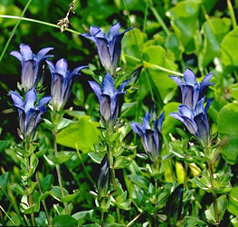

## Phylogeny 

-   « Ancestral Groups  
    -   [Asterids](../Asterids.md)
    -   [Core Eudicots](Core_Eudicots)
    -   [Eudicots](../../../Eudicots.md)
    -   [Flowering_Plant](../../../../Flowering_Plant.md)
    -   [Seed_Plant](../../../../../Seed_Plant.md)
    -   [Land_Plant](../../../../../../Land_Plant.md)
    -   [Green plants](../../../../../../../Plants.md)
    -   [Eukaryotes](Eukaryotes)
    -   [Tree of Life](../../../../../../../../Tree_of_Life.md)

-   ◊ Sibling Groups of  Asterids
    -   [Cornales](Cornales.md)
    -   [Ericales](Cornales/Ericales.md)
    -   [Solanales](Solanales.md)
    -   [Lamiales](Lamiales.md)
    -   Gentianales
    -   [Garryales](Garryales.md)
    -   [Asterales](Asterales.md)
    -   [Apiales](Apiales.md)
    -   [Dipsacales](Dipsacales.md)
    -   [Aquifoliales](Aquifoliales.md)

-   » Sub-Groups 

# Gentianales 

Containing group: [Asterids](../Asterids.md)

### References

Albach, D. C., P. S. Soltis, D. E. Soltis, and R. G. Olmstead. 2001.
Phylogenetic analysis of asterids based on sequences of four genes.
Annals of the Missouri Botanical Garden 88:163-212.

Backlund, M., B. Oxelman, and B. Bremer. 2000. Phylogenetic
relationships within the Gentianales based on ndhF and rbcL sequences,
with particular reference to the Loganiaceae. American Journal of Botany
87:1029-1043.

Bremer, B. and L. Struwe. 1992. Phylogeny of the Rubiaceae and
Loganiaceae: Congruence or conflict between morphological and molecular
data. American Journal of Botany 79:1171-1194.

Bremer, K., A. Backlund, B. Sennblad, U. Swenson, K. Andreasen, M.
Hjertson, J. Lundberg, M. Backlund, and B. Bremer. 2001. A phylogenetic
analysis of 100+ genera and 50+ families of euasterids based on
morphological and molecular data with notes on possible higher level
morphological synapomorphies. Plant Systematics and Evolution
229:137-169.

Bremer, B., K. Bremer, N. Heidari, P. Erixon, R. G. Olmstead, A. A.
Anderberg, M. Källersjö, and E. Barkhordarian. 2002. Phylogenetics of
asterids based on 3 coding and 3 non-coding chloroplast DNA markers and
the utility of non-coding DNA at higher taxonomic levels. Molecular
Phylogenetics and Evolution 24: 274-301.

Fay, M. F., B. Bremer, G. T. Prance, M. van der Bank, D. Bridson, and M.
W. Chase. 2000. Plastid rbcL sequence data show Dialypetalanthus to be a
member of Rubiaceae. Kew Bulletin 55:853-864.

Olmstead, R. G., K.-J. Kim, R. K. Jansen, and S. J. Wagstaff. 2000. The
phylogeny of the Asteridae sensu lato based on chloroplast ndhF gene
sequences. Molecular Phylogenetics and Evolution 16:96-112.

Savolainen, V., M. F. Fay, D. C. Albach, A. Backlund, M. van der Bank,
K. M. Cameron, S. A. Johnson, M. D. Lledó, J.-C. Pintaud, M. Powell, M.
C. Sheahan, D. E. Soltis, P. S. Soltis, P. Weston, W. M. Whitten, K. J.
Wurdack, and M. W. Chase. 2000. Phylogeny of the eudicots: a nearly
complete familial analysis based on rbcl gene sequences. Kew Bulletin
55:257-309.

Sennblad, B. and B. Bremer. 1996. The familial and subfamilial
relationships of Apocynaceae and Asclepiadaceae evaluated with rbcL
data. Plant Systematics and Evolution 202:153-175.

Soltis, D. E., P. S. Soltis, M. W. Chase, M. E. Mort, D. C. Albach, M.
Zanis, V. Savolainen, W. H. Hahn, S. B. Hoot, M. F. Fay, M. Axtell, S.
M. Swensen, L. M. Prince, W. J. Kress, K. C. Nixon, and J. S. Farris.
2000. Angiosperm phylogeny inferred from 18S rDNA, rbcL, and atpB
sequences. Botanical Journal of the Linnean Society 133:381-461.

Struwe L. and V. A. Albert, eds. 2002. Gentianaceae: Systematics and
Natural History. Cambridge University Press, Cambridge.

Struwe, L., V. A. Albert, and B. Bremer. 1995. Cladistics and
family-level classification of the Gentianales. Cladistics 10:175-206.

##### Title Illustrations



  ------------------------------------------------------------------------
  Scientific Name ::   Piaranthus foetidus
  Comments           Carrion flower (Apocynaceae). Cultivated at the Botanical Garden Basel, Switzerland.
  Acknowledgements   courtesy [Botanical Image Database](http://www.unibas.ch/botimage/)
  Copyright ::          © 2001 University of Basel, Basel, Switzerland 
  ------------------------------------------------------------------------


  ---------------------------------------
  Scientific Name ::    Gentiana calycosa (Gentianaceae)
  Location ::          Kidd Basin, near Kidd Creek, north of Black Mountain in the Trinity Alps (Siskiyou County, California, USA).
  Comments            Rainier pleated gentian
  Source Collection   [CalPhotos](http://calphotos.berkeley.edu/)
  Copyright ::           © 1999 [John Game](mailto:jcgame@lbl.gov)
  ---------------------------------------


  ---------------------------------------------------------------------------------
  Scientific Name ::     Galium ambiguum
  Location ::           Low Divide (California, USA).
  Comments             Rubiaceae
  Creator              Photograph by Brother Alfred Brousseau
  Specimen Condition   Live Specimen
  Source Collection    [CalPhotos](http://calphotos.berkeley.edu/)
  Copyright ::            © 1995 [Saint Mary\'s College of California](mailto:rpolowin@stmarys-ca.edu) 
  ---------------------------------------------------------------------------------
