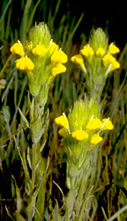

## Phylogeny 

-   « Ancestral Groups  
    -   [Asterids](../Asterids.md)
    -   [Core Eudicots](Core_Eudicots)
    -   [Eudicots](../../../Eudicots.md)
    -   [Flowering_Plant](../../../../Flowering_Plant.md)
    -   [Seed_Plant](../../../../../Seed_Plant.md)
    -   [Land_Plant](../../../../../../Land_Plant.md)
    -   [Green plants](../../../../../../../Plants.md)
    -   [Eukaryotes](Eukaryotes)
    -   [Tree of Life](../../../../../../../../Tree_of_Life.md)

-   ◊ Sibling Groups of  Asterids
    -   [Cornales](Cornales.md)
    -   [Ericales](Cornales/Ericales.md)
    -   [Solanales](Solanales.md)
    -   Lamiales
    -   [Gentianales](Gentianales.md)
    -   [Garryales](Garryales.md)
    -   [Asterales](Asterales.md)
    -   [Apiales](Apiales.md)
    -   [Dipsacales](Dipsacales.md)
    -   [Aquifoliales](Aquifoliales.md)

-   » Sub-Groups
    -   [Oleaceae](Lamiales/Oleaceae.md)
    -   [Acanthaceae](Lamiales/Acanthaceae.md)
    -   [Gesneriaceae](Lamiales/Gesneriaceae.md)

# Lamiales 

Containing group: [Asterids](../Asterids.md)

### Information on the Internet

-   [A Synoptical Classification of the     Lamiales](http://depts.washington.edu/phylo/classifications/Lamiales.html).
    Compiled by Richard Olmstead.
-   [International Carnivorous Plant     Society](http://www.carnivorousplants.org/).
-   [Carnivorous Plant     Database](http://www.omnisterra.com/bot/cp_home.cgi).

### References

Albach, D. C., H. M. Meudt, and B. Oxelman. 2005. Piecing together the
\"new\" Plantaginaceae. American Journal of Botany 92:297-315.

Albach, D. C., P. S. Soltis, D. E. Soltis, and R. G. Olmstead. 2001.
Phylogenetic analysis of asterids based on sequences of four genes.
Annals of the Missouri Botanical Garden 88:163-212.

Backlund, A. and B. Bremer, B. 1997. Phylogeny of Asteridae s. str.
based on rbcL sequences, with particular reference to Dipsacales. Plant
Systematics and Evolution 207:225-254.

Beardsley P. M. and R. G. Olmstead. 2002. Redefining Phrymaceae: the
placement of Mimulus, tribe Mimuleae, and Phryma. American Journal of
Botany 89:1093-1102.

Bremer, K., A. Backlund, B. Sennblad, U. Swenson, K. Andreasen, M.
Hjertson, J. Lundberg, M. Backlund, and B. Bremer. 2001. A phylogenetic
analysis of 100, genera and 50, families of euasterids based on
morphological and molecular data with notes on possible higher level
morphological synapomorphies. Plant Systematics and Evolution
229:137-169.

Bremer, B., K. Bremer, N. Heidari, P. Erixon, R. G. Olmstead, A. A.
Anderberg, M. Källersjö, and E. Barkhordarian. 2002. Phylogenetics of
asterids based on 3 coding and 3 non-coding chloroplast DNA markers and
the utility of non-coding DNA at higher taxonomic levels. Molecular
Phylogenetics and Evolution 24:274-301.

Olmstead, R. G., C. W. DePamphilis, A. D. Wolfe, N. D. Young, W. J.
Elisons, and P. A. Reeves. 2001. Disintegration of the Scrophulariaceae.
American Journal of Botany 88:348-361.

Olmstead, R. G., K.-J. Kim, R. K. Jansen, and S. J. Wagstaff. 2000. The
phylogeny of the Asteridae sensu lato based on chloroplast ndhF gene
sequences. Molecular Phylogenetics and Evolution 16:96-112.

Olmstead, R. G., H. Michaels, K. M. Scott, and J. D. Palmer. 1992.
Monophyly of the Asteridae and identification of their major lineages
inferred from DNA sequences of rbcL. Annals of the Missouri Botanical
Garden 79:249-265.

Olmstead, R. G. and P. A. Reeves. 1995. Evidence for the polyphyly of
the Scrophulariaceae based on chloroplast rbcL and ndhF sequences.
Annals of the Missouri Botanical Garden 82:176-193.

Ryding, O. 1995. Pericarp structure and phylogeny of the
Lamiaceae-Verbenaceae. Plant Systematics and Evolution 198:101-141.

Savolainen, V., M. F. Fay, D. C. Albach, A. Backlund, M. van der Bank,
K. M. Cameron, S. A. Johnson, M. D. Lledó, J.-C. Pintaud, M. Powell, M.
C. Sheahan, D. E. Soltis, P. S. Soltis, P. Weston, W. M. Whitten, K. J.
Wurdack, and M. W. Chase. 2000. Phylogeny of the eudicots: a nearly
complete familial analysis based on rbcl gene sequences. Kew Bulletin
55:257-309.

Schwarzbach, A. E. and L. A. McDade. 2002. Phylogenetic relationships of
the mangrove family Avicenniaceae based on chloroplast and nuclear
ribosomal DNA sequences. Systematic Botany 27:84-98.

Smith, J. F., K. D. Brown, C. L. Carroll, and D. S. Denton. 1997.
Familial placement of Cyrtandromoea, Titanotrichum, and Sanango, three
problematic genera of the Lamiales. Taxon 46:65-74.

Soltis, D. E., P. S. Soltis, M. W. Chase, M. E. Mort, D. C. Albach, M.
Zanis, V. Savolainen, W. H. Hahn, S. B. Hoot, M. F. Fay, M. Axtell, S.
M. Swensen, L. M. Prince, W. J. Kress, K. C. Nixon, and J. S. Farris.
2000. Angiosperm phylogeny inferred from 18S rDNA, rbcL, and atpB
sequences. Botanical Journal of the Linnean Society 133:381-461.

Wagstaff S. J., L. Hickerson, R. Spangler, P. A. Reeves, and R. G.
Olmstead. 1998. Phylogeny in Labiatae s. l., inferred from cpDNA
sequences. Plant Systematics and Evolution 209:265-274.

Wagstaff, S. J. and R. G. Olmstead. 1997. Phylogeny of Labiatae and
Verbenaceae inferred from rbcL sequences. Systematic Botany 22:165-179.

Wortley, A., P. Rudall, D. Harris, and R. Scotland. 2005. How much data
are needed to resolve a difficult phylogeny? Case study in Lamiales.
Systematic Biology 54(5):697-709.

##### Title Illustrations



  ------------------------------------------------------------------------------
  Scientific Name ::     Castilleja rubicundula ssp. lithospermoides
  Location ::           Napa County, California, US.
  Comments             Cream sacs (Scrophulariaceae)
  Creator              Photograph by Robert Thomas and Margaret Orr
  Specimen Condition   Live Specimen
  Source Collection    [CalPhotos](http://calphotos.berkeley.edu/)
  Copyright ::            © 1999 [California Academy of Sciences](http://www.calacademy.org/) 
  ------------------------------------------------------------------------------


  ------------------------------------------------------------------------
  Scientific Name ::   Satureja thymbra
  Location ::         Samos, Greece.
  Comments           Lamiaceae
  Acknowledgements   courtesy [Botanical Image Database](http://www.unibas.ch/botimage/)
  Copyright ::          © 2001 University of Basel, Basel, Switzerland 
  ------------------------------------------------------------------------


  ------------------------------------------------------------------------
  Scientific Name ::   Globularia punctata
  Location ::         Strangenberg, Haut-Rhin, Dép. Westhalten, France.
  Comments           Antirrhinaceae
  Acknowledgements   courtesy [Botanical Image Database](http://www.unibas.ch/botimage/)
  Copyright ::          © 2001 University of Basel, Basel, Switzerland 
  ------------------------------------------------------------------------
