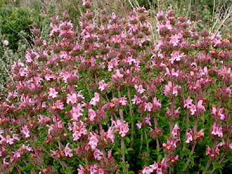
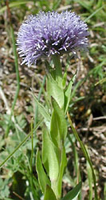

# [[Lamiales]] 

     

## #has_/text_of_/abstract 

> The **Lamiales** (also known as the mint order) are an order of flowering plants in the asterids clade of the Eudicots. Under the APG IV system of flowering plant classification the order consists of 24 families, and includes about 23,810 species and 1,059 genera with representatives found all over the world. Well-known or economically important members of this order include aromatic, culinary, and medicinal herbs such as basil, mint, rosemary, sage, savory, marjoram, oregano, hyssop, thyme, lavender, perilla, lemon verbena, catnip, bee balm, wild dagga, and oriental motherwort, as well as olives, ash trees, teak, foxgloves, lilacs, jasmine, snapdragons, African violets, Jacarandas, Paulownias, butterfly bushes, sesame, and psyllium.
>
> [Wikipedia](https://en.wikipedia.org/wiki/Lamiales) 

## Phylogeny 

-   « Ancestral Groups  
    -   [Asterids](../Asterids.md)
    -   [Core Eudicots](Core_Eudicots)
    -   [Eudicots](../../../Eudicots.md)
    -   [Flowering_Plant](../../../../Flowering_Plant.md)
    -   [Seed_Plant](../../../../../Seed_Plant.md)
    -   [Land_Plant](../../../../../../Land_Plant.md)
    -   [Green plants](../../../../../../../Plants.md)
    -   [Eukaryotes](Eukaryotes)
    -   [Tree of Life](../../../../../../../../Tree_of_Life.md)

-   ◊ Sibling Groups of  Asterids
    -   [Cornales](Cornales.md)
    -   [Ericales](Cornales/Ericales.md)
    -   [Solanales](Solanales.md)
    -   Lamiales
    -   [Gentianales](Gentianales.md)
    -   [Garryales](Garryales.md)
    -   [Asterales](Asterales.md)
    -   [Apiales](Apiales.md)
    -   [Dipsacales](Dipsacales.md)
    -   [Aquifoliales](Aquifoliales.md)

-   » Sub-Groups
    -   [Oleaceae](Lamiales/Oleaceae.md)
    -   [Acanthaceae](Lamiales/Acanthaceae.md)
    -   [Gesneriaceae](Lamiales/Gesneriaceae.md)

## Title Illustrations

------------------------------------------------------------------------------

Scientific Name ::     Castilleja rubicundula ssp. lithospermoides
Location ::           Napa County, California, US.
Comments             Cream sacs (Scrophulariaceae)
Creator              Photograph by Robert Thomas and Margaret Orr
Specimen Condition   Live Specimen
Source Collection    [CalPhotos](http://calphotos.berkeley.edu/)
Copyright ::            © 1999 [California Academy of Sciences](http://www.calacademy.org/) 

------------------------------------------------------------------------

Scientific Name ::   Satureja thymbra
Location ::         Samos, Greece.
Comments           Lamiaceae
Acknowledgements   courtesy [Botanical Image Database](http://www.unibas.ch/botimage/)
Copyright ::          © 2001 University of Basel, Basel, Switzerland 

------------------------------------------------------------------------

Scientific Name ::   Globularia punctata
Location ::         Strangenberg, Haut-Rhin, Dép. Westhalten, France.
Comments           Antirrhinaceae
Acknowledgements   courtesy [Botanical Image Database](http://www.unibas.ch/botimage/)
Copyright ::          © 2001 University of Basel, Basel, Switzerland 

## Confidential Links & Embeds: 

### #is_/same_as :: [Lamiales](/_Standards/bio/bio~Domain/Eukaryotes/Plants/Land_Plant/Seed_Plant/Flowering_Plant/Eudicots/Core_Eudicots/Asterids/Lamiales.md) 

### #is_/same_as :: [Lamiales.public](/_public/bio/bio~Domain/Eukaryotes/Plants/Land_Plant/Seed_Plant/Flowering_Plant/Eudicots/Core_Eudicots/Asterids/Lamiales.public.md) 

### #is_/same_as :: [Lamiales.internal](/_internal/bio/bio~Domain/Eukaryotes/Plants/Land_Plant/Seed_Plant/Flowering_Plant/Eudicots/Core_Eudicots/Asterids/Lamiales.internal.md) 

### #is_/same_as :: [Lamiales.protect](/_protect/bio/bio~Domain/Eukaryotes/Plants/Land_Plant/Seed_Plant/Flowering_Plant/Eudicots/Core_Eudicots/Asterids/Lamiales.protect.md) 

### #is_/same_as :: [Lamiales.private](/_private/bio/bio~Domain/Eukaryotes/Plants/Land_Plant/Seed_Plant/Flowering_Plant/Eudicots/Core_Eudicots/Asterids/Lamiales.private.md) 

### #is_/same_as :: [Lamiales.personal](/_personal/bio/bio~Domain/Eukaryotes/Plants/Land_Plant/Seed_Plant/Flowering_Plant/Eudicots/Core_Eudicots/Asterids/Lamiales.personal.md) 

### #is_/same_as :: [Lamiales.secret](/_secret/bio/bio~Domain/Eukaryotes/Plants/Land_Plant/Seed_Plant/Flowering_Plant/Eudicots/Core_Eudicots/Asterids/Lamiales.secret.md)

