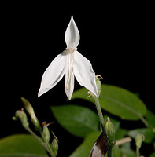
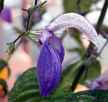
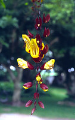
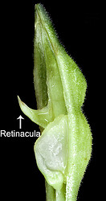
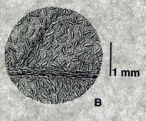

## Phylogeny 

-   « Ancestral Groups  
    -   [Lamiales](../Lamiales.md)
    -   [Asterids](../../Asterids.md)
    -   [Core Eudicots](Core_Eudicots)
    -   [Eudicots](../../../../Eudicots.md)
    -   [Flowering_Plant](../../../../../Flowering_Plant.md)
    -   [Seed_Plant](../../../../../../Seed_Plant.md)
    -   [Land_Plant](../../../../../../../Land_Plant.md)
    -   [Green plants](../../../../../../../../Plants.md)
    -   [Eukaryotes](Eukaryotes)
    -   [Tree of Life](../../../../../../../../../Tree_of_Life.md)

-   ◊ Sibling Groups of  Lamiales
    -   [Oleaceae](Oleaceae.md)
    -   Acanthaceae
    -   [Gesneriaceae](Gesneriaceae.md)

-   » Sub-Groups
    -   [Ruellieae](Acanthaceae/Ruellieae.md)
    -   [Acantheae](Acanthaceae/Acantheae.md)

# Acanthaceae 

[Lucinda A. McDade and Carrie Kiel](http://www.tolweb.org/)

Containing group: [Lamiales](../Lamiales.md)

### Introduction

The large and largely tropical plant family Acanthaceae includes at
least 4000 species. The group is part of the order
[Lamiales](http://tolweb.org/Lamiales) which includes plants such as the
familiar snap dragon (Plantaginaceae), mint (Lamiaceae) and African
violet ([Gesneriaceae](http://tolweb.org/Gesneriaceae)). These plants
have sympetalous corollas (i.e., with petals fused into a tube) and four
stamens (sometimes reduced further to two).\

Acanthaceae includes the 221 genera treated by Scotland & Vollesen
(2000) plus the black mangrove genus, *Avicennia*. Notably, as a result
of the largely tropical distribution of Acanthaceae, species-level
diversity remains poorly understood, and there is little doubt that many
new species remain to be discovered. In particular, the Neotropics house
the richest and most poorly documented angiosperm flora on Earth. It is
thus not surprising that Neotropical acanths remain incompletely known,
and we expect many more species to be described from this region. As a
quantitative indication of the pace of new discovery in Acanthaceae,
Index Kewensis reports 81 new species described in the genus *Justicia*
alone between 1986 and 1995.  We expect the species count eventually to
exceed 4000.\

### Characteristics

Plants belonging to the Core Acanthaceae (i.e., Acantheae through
Ruellieae as indicated in the phylogeny presented at the top of this
page; Acanthoideae sensu Scotland & Vollesen 2001) may be recognized by
their fruit: a few-seeded, explosively dehiscent capsule within which
seeds are borne on hook-like structures called retinacula (the lignified
derivatives of the funiculus). These retinacula are a unique and
unreversed synapomorphy for Acanthoideae: among these plants--all 4000
of them--fruits vary in size and in seed number but are otherwise
remarkably homogeneous. The hooks presumably serve to propel the seeds
away from the parent plant when the fruit dehisces but studies are
lacking.

\

Retinacula of the fruit of Asystasia gangetica.  © 2006 [Gerald Carr](http://www.botany.hawaii.edu/Faculty/Carr/acanth.htm)

Within Core Acanthaceae, Acantheae are well marked as monophyletic by
morphological and molecular synapomorphies. Its sister group which we
have here called Ruellioideae is also marked by a number of
morphological synapomorphies including cystoliths (crystals) in most
plant structures.

Cystoliths are the small linear structures that \'dot\' the lower
surface of this leaf of a South American *Ruellia* species. © C. Ezcurra

In addition to this core group, four other small lineages are very
closely related and are now treated as part of a broad Acanthaceae: the
pantropical and subtropical black mangroves, *Avicennia*; Old World
*Thunbergia* (including the commonly cultivated black-eyed Susan,
Elytraria, Staurogyne, a handful of other small genera). Each of these
four groups has its own distinctive fruit type. Unfortunately, we have
yet to identify a synapomorphy for all Acanthaceae that is as notable
and easy to recognize as fruit type is for the core group.  Compared to
most other Lamiales, Acanthaceae have relatively few ovules.\

Beyond fruits of Acanthaceae, diversity in other traits is spectacular.
Plants are rosette and caulescent herbs, shrubs and trees (rarely vines
except *Thunbergia* and *Mendoncia* which are almost entirely climbing
plants). Most acanths have solid green leaves, but a few have remarkably
colored leaves, and some are cultivated for their foliage (e.g., polka
dot plant, *Hypoestes phyllostashya*; Persian shield, *Strobilanthes
dyerianus*). Inflorescences of many acanths have large, colorful bracts
that often eclipse the corollas in showiness (e.g., *Pachystachys,
Megaskepasma*; see images below). However, bracts of plants of many
other species are diminutive, green and clearly not involved in
attracting pollinators. Many species have extremely showy flowers and a
number are cultivated for their beauty (e.g.,  *Justicia brandegeana*
and many other species belonging to this large genus*, Aphelandra
squarrosa*; you will see examples below); however, many others have
diminutive green bracts and very small flowers. Across the family,
flowers range in size from a few mm to more than 10 cm, with a parallel
range of variation in shape and color. Variation in these corolla traits
is no doubt associated with a wide range of animal pollinators, although
studies are remarkably few.\

*Pachystachys lutea* Nees (left, © 2006 Lucinda A. McDade) and
*Megaskepasma erythrochlamys* Lindau (middle, © 2003 [Shigenobu Aoki Botanical Garden](http://aoki2.si.gunma-u.ac.jp/BotanicalGarden/HTMLs/Megaskepasma.html))
have large, colorful bracts. *Justicia betonica* L. (right, © Gerald D.
Carr) is cultivated because of its showy flowers.\
### Pollen and Chromosomes

Structural diversity continues below the visible level in Acanthaceae.
In terms of number and type of apertures and, especially in terms of
ultrasculpturing, pollen grains of Acanthaceae are without doubt as
diverse as any other family-level lineage regardless of size.  

Pollen grains of Acanthaceae. From left to right: *Crossandra
sulphurea*, © 1990 Carol Furness. *Acanthus mollis*, *Acanthus
spinosus*, *Neriacanthus grandiflorus*, *Aphelandra flammea*, and
*Crossandra pungens*, © T. F. Daniel.

Chromosome numbers are similarly diverse, with documented haploid
numbers ranging from 7 to 68, thus indicating many evolutionary
transitions via both dysploidy and polyploidy.

### Discussion of Phylogenetic Relationships

There is at present little disagreement among students of Acanthaceae
regarding membership in the family and delineation of the main clades as
presented in the phylogeny above.  There is, however, quite a bit of
work to be done to resolve relationships at a number of levels.  For
example, the results of Schwarzbach & McDade (2001) placed *Avicennia*
sister to Thunbergioideae but without strong support from molecular data
for this relationship and with no identifiable morphological
synapomorphies supporting the relationship.  Similarly, the placement of
*Neuracanthus* among the lineages of core Acanthaceae (i. e., the
lineages with retinacula) have yet to be fully resolved.

There also remains a great deal of work to be done on relationships
within lineages.  At present (August 2006), we present intra-lineage
phylogenetic information for Acantheae, for Isoglossinae and the
Tetramerium Lineage within Justicieae, and for Ruellieae.  Our
continuing work and that of our colleagues will gradually add knowledge
of relationships within the other lineages.     

### References

Benoist, R. 1930. Descriptons d'espèces nouvelles d'Acanthacées de
Madagascar. Bulletin de la Société botanique de France 76: 1031-1038.

Benoist, R. 1967. Acanthacées. In H. Humbert, Flore de Madagascar et des
Comores 182, tome 1: 1-230.

Bentham, G. and J. D. Hooker. 1876. Genera Plantarum 2: 1060-1122.
London: Reeve.

Daniel, T. F. 1983. Systematics of Holographis (Acanthaceae). Journal of
the Arnold Arboretum 64: 129-160.

Daniel, T. F. 1985. A revision of Stenandrium (Acanthaceae) in Mexico
and adjacent regions. Annals of the Missouri Botanical Garden 71:
1028-1043.

Daniel, T. F. 1991. A revision of Aphelandra (Acanthaceae) in Mexico.
Proceedings of the California Academy of Sciences 47: 235-274.

Daniel, T. F. 2000. Additional chromosome numbers of American
Acanthaceae. Systematic Botany 25: 15-25.

Daniel, T. F and T. I. Chuang. 1998. Chromosome numbers of cultivated
Acanthaceae and systematic implications. Pp. 309-330 in Diversity and
taxonomy of tropical flowering plants, eds. P. Mathew and M. Sivadasan.
Calicut, India: Mentor Books.

Daniel, T. F., T. I. Chuang and M. A. Baker. 1990. Chromosome numbers of
American Acanthaceae. Systematic Botany 15: 13-25.

Furness, C. A. 1990. Pollen morphology of Crossandra Salisbury and
Crossandrella C. B. Clarke (Acanthaceae: Acantheae). Grana 29: 161-176.

Furness, C. A. 1994. The caveate pollen of Streptosiphon hirsutus
(Acanthaceae: Acantheae) and its taxonomic significance. Kew Bulletin
49: 409-414.

Grisebach, A. 1858. Novitiae florae panamensis. Bonplandia 6: 2-12.

Grisebach, A. H. R. 1864. Flora of the British West Indian Islands.
London: Reeve and Co.

Heine, H. 1966. Acanthacées. Vol. 13 in Flore de Gabon, A. Aubréville
(ed.). Paris: Muséum National D'Histoire Naturelle.

Hooker, W. J. 1837. Icones Plantarum, Volume 2. London: Longman, Rees,
Orme, Brown, Green and Longman.

Hooker, W. J. 1845. Curtis's botanical magazine, Volume 71. London:
Reeve Bros.

Kiel, C. A. 2006. Phylogenetic Delimitation of Isoglossinae and
relationships among constituent genera. Taxon 55:3.

Leonard, E. C. 1953. The Acanthaceae of Colombia, II. Contributions from
the United States National Herbarium 31: 119-322.

Mangenot, S. and G. Mangenot. 1962. Enquête sur les nombres
chromosomiques dans une collection d\'espèces tropicales. Revue de
Cytologie et de Biologie Végetales 25: 411-447.

Manktelow, M. 1996. Phaulopsis (Acanthaceae)---a monograph. Symbolae
Botanicae Upsalienses 31: 1-184.

Manktelow, M., L. A. McDade, B. Oxelman, C. A. Furness, and M.-J.
Balkwill. 2001. The enigmatic tribe Whitfieldieae (Acanthaceae):
delimitation and phylogenetic relationships based on molecular and
morphological data. Systematic Botany 26: 104-119.

McDade, L. A. 1982. Three new species of Aphelandra (Acanthaceae) from
Central America. Annals of the Missouri Botanical Garden 69: 402-411.

McDade, L. A. 1984. Systematics and reproductive biology of the Central
American species of the Aphelandra pulcherrima complex (Acanthaceae).
Annals of the Missouri Botanical Garden 71: 104-165.

McDade, L. A. 1992. Pollinator relationships, biogeography, and
phylogenetics. BioScience 42: 21-26.

McDade, L. A. and M. L. Moody. 1999. Phylogenetic relationships among
Acanthaceae: evidence from non-coding trnL-trnF chloroplast DNA
sequences. American Journal of Botany 86: 70-80.

McDade, L. A. and M. D. Turner. 1997. Extrafloral nectaries in
Aphelandra: anatomy, development and systematic implications. American
Journal of Botany 84: 1 15.

McDade, L. A., T. F. Daniel, S. E. Masta, and K. M. Riley. 2000a.
Phylogenetic relationships within the tribe Justicieae (Acanthaceae):
evidence from molecular sequences, morphology, and cytology. Annals of
the Missouri Botanical Garden 87: 435-458.

McDade, L. A., S. E. Masta, M. L. Moody, and E. Waters. 2000b.
Phylogenetic relationships among Acanthaceae: evidence from two genomes.
Systematic Botany 25: 105-120.

Moylan, E. C., J. R. Bennett, M. A. Carine, R. G. Olmstead, and R. W.
Scotland. 2004. Phylogenetic relationships among Strobilanthes s.l.
(Acanthaceae): evidence from ITS nrDNA, trnL-F cpDNA, and morphology.
American Journal of Botany 91: 724-735.

Schwarzbach, A. E. and L. A. McDade. 2002. Phylogenetic relationships of
the mangrove family Avicenniaceae based on chloroplast and nuclear
ribosomal DNA sequences. Systematic Botany 27: 84-98.

Scotland, R.W. and K. Vollesen. 2000. Classification of Acanthaceae. Kew
Bulletin 55: 513-589.

Scotland, R.W., J. A. Sweere, P. A. Reeves, and R. G. Olmstead. 1995.
Higher-level systematics of Acanthaceae determined by chloroplast DNA
sequences. American Journal of Botany 82: 266-275.

Swofford, D. L. 2000. PAUP\*. Phylogenetic analysis using parsimony
(\*And Other Methods). Version 4. Sunderland: Sinauer Associates.

Taberlet, P., L. Gielly, G. Pautou, and J. Bouvet. 1991. Universal
primers for amplification of three non-coding regions of chloroplast
DNA. Plant Molecular Biology 17: 1105-1109.

Tomlinson, P. B. 1986. The botany of mangroves. Cambridge: Cambridge
University Press.

Vollesen, K. 1990a. Notes on Crossandra (Acanthaceae). Kew Bulletin
45:121-135.

Vollesen, K. 1990b. The genus Crossandra (Acanthaceae) in the African
continent. Kew Bulletin 45: 503-534.

Vollesen, K. 1991. A revision of the African genus Sclerochiton
(Acanthaceae: Acantheae). Kew Bulletin 46: 1-50.

Vollesen, K. 1992. The Old World species of Stenandrium (Acanthaceae:
Acantheae). Kew Bulletin 47: 169-202.

Vollesen, K. 1994. The genus Streptosiphon (Acanthaceae: Acantheae). Kew
Bulletin 9: 401-407.

Vollesen, K. 1997. Synopsis of the genus Crossandra (Acanthaceae) in
Madagascar. Kew Bulletin 52: 379-415.

Vollesen, K. 1999. Cynarospermum, a new genus of Acanthaceae from India.
Kew Bulletin 54: 171-177.

Vollesen, K. 2000. Blepharis (Acanthaceae): a taxonomic revision. Kew:
Royal Botanic Gardens.

Wasshausen, D. C. 1975. The genus Aphelandra (Acanthaceae). Smithsonian
Contributions to Botany no. 18.

##### Title Illustrations



  --------------------------
  Scientific Name ::     Carlowrightia hintonii T.F.Daniel (Justicieae: Tetramerium Lineage)
  Specimen Condition   Live Specimen
  Copyright ::            © Thomas F. Daniel
  --------------------------


  ------------------------------------------------------------------------
  Scientific Name ::     Brillantaisia nyanzarum Burkill (Ruellieae)
  Location ::           Greenhouse, Duke University
  Specimen Condition   Live Specimen
  Identified By        E. A. Tripp
  Copyright ::            © 2006 [Erin Tripp](mailto:erin.tripp@duke.edu) 
  ------------------------------------------------------------------------


  -----------------
  Scientific Name ::     Aphelandra impressa Lindau (Acantheae)
  Location ::           Venezuela
  Specimen Condition   Live Specimen
  Identified By        L. A. McDade
  Copyright ::            © 2006 Mark Skinner
  -----------------


  ---------------------------------------------------------------------------
  Scientific Name ::     Thunbergia mysorensis T.Anders. ex Bedd. (Thunbergioideae)
  Location ::           Oribi Gorge, Tourist Lodge, South Africa
  Specimen Condition   Live Specimen
  Copyright ::            © 2006 [Lucinda A. McDade](mailto:lucinda.mcdade@cgu.edu) 
  ---------------------------------------------------------------------------
