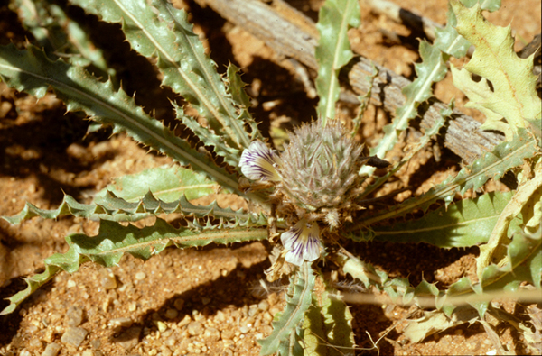

# [[Acanthopsis]] 

	
## #has_/text_of_/abstract 

> **Acanthopsis** is a genus of flowering plants in the family Acanthaceae. It includes 20 species native to Namibia and the Cape Provinces of South Africa.
>
> [Wikipedia](https://en.wikipedia.org/wiki/Acanthopsis) 

## Phylogeny 

-   « Ancestral Groups  
    -   [Acantheae](../Acantheae.md)
    -   [Acanthaceae](../../Acanthaceae.md)
    -   [Lamiales](../../../Lamiales.md)
    -   [Asterids](../../../../Asterids.md)
    -   [Core Eudicots](Core_Eudicots)
    -   [Eudicots](../../../../../../Eudicots.md)
    -   [Flowering_Plant](../../../../../../../Flowering_Plant.md)
    -   [Seed_Plant](../../../../../../../../Seed_Plant.md)
    -   [Land_Plant](../../../../../../../../../Land_Plant.md)
    -   [Green plants](../../../../../../../../../../Plants.md)
    -   [Eukaryotes](Eukaryotes)
    -   [Tree of Life](../../../../../../../../../../../Tree_of_Life.md)

-   ◊ Sibling Groups of  Acantheae
    -   [Acanthus Clade](Acanthus_Clade)
    -   Acanthopsis
    -   [Blepharis](Blepharis.md)
    -   [Cynarospermum         asperrimum](Cynarospermum_asperrimum)
    -   [Crossandrella dusenii](Crossandrella_dusenii)
    -   [Streptosiphon hirsutus](Streptosiphon_hirsutus)
    -   [Sclerochiton](Sclerochiton.md)
    -   [Crossandra](Crossandra.md)
    -   [Stenandriopsis Clade](Stenandriopsis_Clade)
    -   [Stenandrium Clade](Stenandrium_Clade)
    -   [Other New World         Acantheae](Other_New_World_Acantheae)

-   » Sub-Groups 
	-   *Acanthopsis carduifolia*[ Shinz]
	-   *Acanthopsis hoffmannseggiana*[ C. B. Clarke]
	-   *Acanthopsis disperma*[ Nees]

## Introduction

[Lucinda A. McDade and Carrie Kiel](http://www.tolweb.org/) 

The small southern African genus *Acanthopsis* is monophyletic in
phylogenetic studies to date (McDade et al. 2005).  These plants have
unusual bracts with 3-5 apical spines that are themselves spinescent and
branched hygroscopic trichomes on the seeds.  Although phylogenetic
results based on DNA data place *Acanthopsis* sister to *Acanthus*, we
do not know of morphological data that support this relationship. 
Indeed, the fact that *Acanthopsis* and *Blepharis* have unusual
branched hygroscopic trichomes on their seeds (the seeds of *Acanthus*
are glabrous or puberulous) would suggest a closer relationship between
the former two genera than is supported by our results.

## Title Illustrations

--------------------------------------------------------------------------

Scientific Name ::     Acanthopsis sp. Harv.
Location ::           South Africa
Specimen Condition   Live Specimen
Copyright ::            © [Lucinda A. McDade](mailto:lucinda.mcdade@cgu.edu) 

