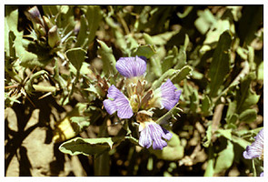

## Phylogeny 

-   « Ancestral Groups  
    -   [Acantheae](../Acantheae.md)
    -   [Acanthaceae](../../Acanthaceae.md)
    -   [Lamiales](../../../Lamiales.md)
    -   [Asterids](../../../../Asterids.md)
    -   [Core Eudicots](Core_Eudicots)
    -   [Eudicots](../../../../../../Eudicots.md)
    -   [Flowering_Plant](../../../../../../../Flowering_Plant.md)
    -   [Seed_Plant](../../../../../../../../Seed_Plant.md)
    -   [Land_Plant](../../../../../../../../../Land_Plant.md)
    -   [Green plants](../../../../../../../../../../Plants.md)
    -   [Eukaryotes](Eukaryotes)
    -   [Tree of Life](../../../../../../../../../../../Tree_of_Life.md)

-   ◊ Sibling Groups of  Acantheae
    -   [Acanthus Clade](Acanthus_Clade)
    -   [Acanthopsis](Acanthopsis.md)
    -   Blepharis
    -   [Cynarospermum         asperrimum](Cynarospermum_asperrimum)
    -   [Crossandrella dusenii](Crossandrella_dusenii)
    -   [Streptosiphon hirsutus](Streptosiphon_hirsutus)
    -   [Sclerochiton](Sclerochiton.md)
    -   [Crossandra](Crossandra.md)
    -   [Stenandriopsis Clade](Stenandriopsis_Clade)
    -   [Stenandrium Clade](Stenandrium_Clade)
    -   [Other New World         Acantheae](Other_New_World_Acantheae)

-   » Sub-Groups 

# *Blepharis* 

[Lucinda A. McDade and Carrie Kiel](http://www.tolweb.org/)

-   *Blepharis acuminata* [ Oberm.]
-   *Blepharis asteracanthus* [ C. B. Clarke]
-   *Blepharis buchneri* [ Lindau]
-   *Blepharis calcitrapa* [ Benoist]
-   *Blepharis diversipina*[ (Nees) C. B. Clarke]
-   *Blepharis edulis*[ (Forssk.) Pers.]
-   *Blepharis integrifolia*[ (L.f.) E. Mey. ex Schinz]
-   *Blepharis katangensis* [ De Wild.]
-   *Blepharis maderaspatensis* [ (L.) Roth.]
-   *Blepharis natalensis* [ Oberm.]
-   *Blepharis sinuata*[ (Nees) C. B. Clarke]
-   *Blepharis subvolubilis* [ C. B. Clarke]
-   *Blepharis tenuiramea* [ S. Moore]
-   *Blepharis trispina* [ Napper]

Note: this taxon list is still under construction. It does not yet
contain all known *Blepharis* subgroups.

The list above includes only taxa that were sampled by McDade et al.
(2005).  There are many other species of *Blepharis* as treated by
Vollesen (2000); these likely belong to this clade but this needs to be
confirmed with further study.

Containing group: [Acantheae](../Acantheae.md)

### Introduction

*Blepharis* is the largest genus of Acantheae in the Old World; it was
recently monographed by Vollesen (2000) as containing 129 species. 
Phylogenetic analyses using molecular data indicate that the genus is
monophyletic with the somewhat enigmatic exception of *B. dhofarensis*
which is placed with species of *Acanthus*, with strong support. Our
results also clearly point to two very well supported subclades within
*Blepharis*;  these correspond  to Vollesen\'s (2000) subgenera
*Acanthodium* and *Blepharis*.

### Characteristics

Plants belonging to this genus have leaves in pseudowhorls and extremely
odd dimorphic filaments:  the anterior pair is laterally flattened and
bears a remarkable appendage distally (i. e., near the anther).  This
appendage is usually tooth- or finger-like but is sometimes rounded. 
The posterior pair is \'normal\':  narrower and unappendaged.  These
plants also have seeds with hygroscopic (i. e., water absorbing)
trichomes.

The two subclades of *Blepharis* are both very strongly supported by
molecular data and one, subgenus *Blepharis*, is also extremely well
marked by morphological synapomorphies:  inflorescences are reduced, the
corolla limb has three (rather than five) lobes, and the fertile portion
of each anther locule is reduced to 1/2 - 2/3 of the total anther
length.  In contrast,  subgenus *Acanthodium* is not marked by
synapomorphies that we have been able to identify.  It is interesting in
this context that Vollesen suggested that *Acanthodium* is the least
advanced of the two subgenera.\

### References

McDade, L. A., T. F. Daniel, C. A. Kiel, and K. Vollesen. 2005.
Phylogenetic relatinships among Acantheae (Acanthaceae): Major lineages
present contrasting patterns of molecular evolution and morphological
differentiation. Systematic Botany 30: 834-862.

Vollesen, K. 2000. Blepharis (Acanthaceae): a taxonomic revision. Kew:
Royal Botanic Gardens.

##### Title Illustrations



  ---------------------------------------------------------------------------
  Scientific Name ::     Blepharis sinuata (Nees) C.B Clarke, McDade & Dold
  Location ::           South Africa
  Specimen Condition   Live Specimen
  Copyright ::            © 2006 [Lucinda A. McDade](mailto:lucinda.mcdade@cgu.edu) 
  ---------------------------------------------------------------------------


  ---------------------------------------------------------------------------
  Scientific Name ::     Blepharis natalensis Oberm.
  Location ::           Kwazulu-Natal, near Weenen, South Africa
  Specimen Condition   Live Specimen
  Identified By        K. Balkwill
  Collection           J
  Collector            K. Balkwill et al.
  Copyright ::            © 2006 [Lucinda A. McDade](mailto:lucinda.mcdade@cgu.edu) 
  ---------------------------------------------------------------------------


  ---------------------------------------------------------------------------
  Scientific Name ::     Blepharis Juss.
  Location ::           Davenham, South Africa
  Specimen Condition   Live Specimen
  Collection           J
  Copyright ::            © 2006 [Lucinda A. McDade](mailto:lucinda.mcdade@cgu.edu) 
  ---------------------------------------------------------------------------


  ---------------------------------------------------------------------------
  Scientific Name ::     Blepharis longispica C.B. Clarke
  Location ::           Kwazulu-Natal, Green Fram, South Africa
  Specimen Condition   Live Specimen
  Collection           J
  Collector            K. Balkwill et al
  Copyright ::            © 2006 [Lucinda A. McDade](mailto:lucinda.mcdade@cgu.edu) 
  ---------------------------------------------------------------------------
