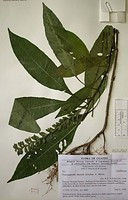
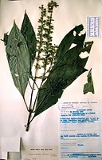

## Phylogeny 

-   « Ancestral Groups  
    -   [Acantheae](../Acantheae.md)
    -   [Acanthaceae](../../Acanthaceae.md)
    -   [Lamiales](../../../Lamiales.md)
    -   [Asterids](../../../../Asterids.md)
    -   [Core Eudicots](Core_Eudicots)
    -   [Eudicots](../../../../../../Eudicots.md)
    -   [Flowering_Plant](../../../../../../../Flowering_Plant.md)
    -   [Seed_Plant](../../../../../../../../Seed_Plant.md)
    -   [Land_Plant](../../../../../../../../../Land_Plant.md)
    -   [Green plants](../../../../../../../../../../Plants.md)
    -   [Eukaryotes](Eukaryotes)
    -   [Tree of Life](../../../../../../../../../../../Tree_of_Life.md)

-   ◊ Sibling Groups of  Acantheae
    -   [Acanthus Clade](Acanthus_Clade)
    -   [Acanthopsis](Acanthopsis.md)
    -   [Blepharis](Blepharis.md)
    -   [Cynarospermum         asperrimum](Cynarospermum_asperrimum)
    -   Crossandrella dusenii
    -   [Streptosiphon hirsutus](Streptosiphon_hirsutus)
    -   [Sclerochiton](Sclerochiton.md)
    -   [Crossandra](Crossandra.md)
    -   [Stenandriopsis Clade](Stenandriopsis_Clade)
    -   [Stenandrium Clade](Stenandrium_Clade)
    -   [Other New World         Acantheae](Other_New_World_Acantheae)

-   » Sub-Groups 

## *Crossandrella* 

# *Crossandrella dusenii* [(Lindau) S. Moore] 

[Lucinda A. McDade and Carrie Kiel](http://www.tolweb.org/)

Note: this taxon list is still under construction. It does not yet
contain all known Crossandrella subgroups.

Containing group: [Acantheae](../Acantheae.md)

### Introduction

*Crossandrella* is a West African genus of two species.  These plants
are unique among Acantheae in having beaked capsules that crack
transversely at maturity.  Although our molecular data place
*Crossandrella* as part of the *Schlerochiton* clade, other characters
suggest other affinities.  For example, with *Cynarospermum,*
*Blepharis,* *Acanthopsis* and the *Acanthus* clade, plants of
*Crossandrella* share the four-lobed, \"fused, sheathing, reduced\"
calyx.  In contrast, with *Sclerochiton* and some species of
*Crossandra,* plants of *Crossandrella* share remarkable pollen that is
shaped rather like a Toblerone chocolate bar:  triangular in polar view,
elongate in equatorial view, and with open areas (caveae) at the
\'points\' of the triangle.  In sum, *Crossandrella* presents a mosaic
of characters that do not permiit an entirely satisfactory placement of
the genus.

### References

McDade, L. A., T. F. Daniel, C. A. Kiel, and K. Vollesen. 2005.
Phylogenetic relatinships among Acantheae (Acanthaceae): Major lineages
present contrasting patterns of molecular evolution and morphological
differentiation. Systematic Botany 30: 834-862.

##### Title Illustrations



  ---------------------------------------------------------------------------
  Scientific Name ::     Crossandrella dusenii (Lindau) S. Moore
  Location ::           Uganda
  Reference            KEW (K)
  Specimen Condition   Dead Specimen
  Collection           \(K\)
  Collector            Poulsen et al. 912
  Copyright ::            © 2006 [Lucinda A. McDade](mailto:lucinda.mcdade@cgu.edu) 
  ---------------------------------------------------------------------------


  ---------------------------------------------------------------------------
  Scientific Name ::     Crossandrella dusenii (Lindau) S. Moore
  Location ::           Uganda
  Specimen Condition   Dead Specimen
  Copyright ::            © 2006 [Lucinda A. McDade](mailto:lucinda.mcdade@cgu.edu) 
  ---------------------------------------------------------------------------


  ---------------------------------------------------------------------------
  Scientific Name ::     Crossandrella dusenii (Lindau) S. Moore
  Location ::           Republic of Cameroon
  Reference            KEW
  Specimen Condition   Dead Specimen
  Collection           KEW
  Collector            Letzy 8179
  Copyright ::            © 2006 [Lucinda A. McDade](mailto:lucinda.mcdade@cgu.edu) 
  ---------------------------------------------------------------------------
