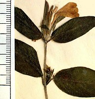
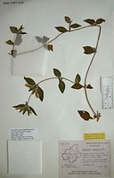
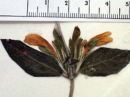

## Phylogeny 

-   « Ancestral Groups  
    -   [Acantheae](../Acantheae.md)
    -   [Acanthaceae](../../Acanthaceae.md)
    -   [Lamiales](../../../Lamiales.md)
    -   [Asterids](../../../../Asterids.md)
    -   [Core Eudicots](Core_Eudicots)
    -   [Eudicots](../../../../../../Eudicots.md)
    -   [Flowering_Plant](../../../../../../../Flowering_Plant.md)
    -   [Seed_Plant](../../../../../../../../Seed_Plant.md)
    -   [Land_Plant](../../../../../../../../../Land_Plant.md)
    -   [Green plants](../../../../../../../../../../Plants.md)
    -   [Eukaryotes](Eukaryotes)
    -   [Tree of Life](../../../../../../../../../../../Tree_of_Life.md)

-   ◊ Sibling Groups of  Acantheae
    -   [Acanthus Clade](Acanthus_Clade)
    -   [Acanthopsis](Acanthopsis.md)
    -   [Blepharis](Blepharis.md)
    -   Cynarospermum asperrimum
    -   [Crossandrella dusenii](Crossandrella_dusenii)
    -   [Streptosiphon hirsutus](Streptosiphon_hirsutus)
    -   [Sclerochiton](Sclerochiton.md)
    -   [Crossandra](Crossandra.md)
    -   [Stenandriopsis Clade](Stenandriopsis_Clade)
    -   [Stenandrium Clade](Stenandrium_Clade)
    -   [Other New World         Acantheae](Other_New_World_Acantheae)

-   » Sub-Groups 

## *Cynarospermum* 

# *Cynarospermum asperrimum* [(Nees) Vollesen] 

[Lucinda A. McDade and Carrie Kiel](http://www.tolweb.org/)

Containing group: [Acantheae](../Acantheae.md)

### Introduction

*Cynarospermum* is an Indian genus with a single species.  This species
was treated as a member of *Blepharis* until Vollesen (1999) pointed out
that it lacks the synapomorphies of that genus (i.e., leaves are
opposite rather than in pseudowhorls, and the anterior pair of filaments
is normal rather than appendaged).  Plants of this species also have a
number of apomorphies that further distinguish them from *Blepharis*. 
Inflorescences are reduced to solitary or paired flowers in the axils of
vegetatives leaves, the bracteoles are three parted at the apex, and the
seeds have conical tubercles.

### References

Vollesen, K. 1999. Cynarospermum, a new genus of Acanthaceae from India.
Kew Bulletin 54: 171-177.

##### Title Illustrations



  --------------------------------------------------------------------------
  Scientific Name ::     Cynarospermum asperrimum (Ness) Vollesen
  Location ::           Mysore, India
  Specimen Condition   Dead Specimen
  Copyright ::            © [Lucinda A. McDade](mailto:lucinda.mcdade@cgu.edu) 
  --------------------------------------------------------------------------


  ---------------------------------------------------------------------------
  Scientific Name ::     Cynarospermum asperrimum (Ness) Vollesen
  Location ::           Mysore, India
  Reference            KEW
  Specimen Condition   Dead Specimen
  Collection           KEW
  Collector            Saldanha 1193
  Copyright ::            © 2006 [Lucinda A. McDade](mailto:lucinda.mcdade@cgu.edu) 
  ---------------------------------------------------------------------------


  --------------------------------------------------------------------------
  Scientific Name ::     Cynarospermum asperrimum (Ness) Vollesen
  Location ::           Mysore, India
  Specimen Condition   Dead Specimen
  Copyright ::            © [Lucinda A. McDade](mailto:lucinda.mcdade@cgu.edu) 
  --------------------------------------------------------------------------
