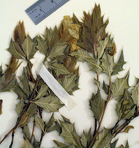

## Phylogeny 

-   « Ancestral Groups  
    -   [Acantheae](../Acantheae.md)
    -   [Acanthaceae](../../Acanthaceae.md)
    -   [Lamiales](../../../Lamiales.md)
    -   [Asterids](../../../../Asterids.md)
    -   [Core Eudicots](Core_Eudicots)
    -   [Eudicots](../../../../../../Eudicots.md)
    -   [Flowering_Plant](../../../../../../../Flowering_Plant.md)
    -   [Seed_Plant](../../../../../../../../Seed_Plant.md)
    -   [Land_Plant](../../../../../../../../../Land_Plant.md)
    -   [Green plants](../../../../../../../../../../Plants.md)
    -   [Eukaryotes](Eukaryotes)
    -   [Tree of Life](../../../../../../../../../../../Tree_of_Life.md)

-   ◊ Sibling Groups of  Acantheae
    -   [Acanthus Clade](Acanthus_Clade)
    -   [Acanthopsis](Acanthopsis.md)
    -   [Blepharis](Blepharis.md)
    -   [Cynarospermum         asperrimum](Cynarospermum_asperrimum)
    -   [Crossandrella dusenii](Crossandrella_dusenii)
    -   [Streptosiphon hirsutus](Streptosiphon_hirsutus)
    -   Sclerochiton
    -   [Crossandra](Crossandra.md)
    -   [Stenandriopsis Clade](Stenandriopsis_Clade)
    -   [Stenandrium Clade](Stenandrium_Clade)
    -   [Other New World         Acantheae](Other_New_World_Acantheae)

-   » Sub-Groups 

# *Sclerochiton* 

[Lucinda A. McDade and Carrie Kiel](http://www.tolweb.org/)

-   *Sclerochiton harveyanus* [ Nees]
-   *Sclerochiton ilicifolius* [ Meeuse]
-   *Sclerochiton triacanthus* [ Meeuse]
-   *Sclerochiton vogelii*[ (Nees) T. Anderson]

Note: this taxon list is still under construction. It does not yet
contain all known *Sclerochiton* subgroups.

The list above includes only taxa that were sampled by McDade et al.
(2005).  There are other species of *Sclerochiton* that likely belong to
this clade but this needs to be confirmed with further study.

Containing group: [Acantheae](../Acantheae.md)

### Introduction

*Sclerochiton* is a mostly eastern and southern African genus of 18
species (Vollesen 1991). There is support from DNA sequence data for
monophyly of this genus, and the plants share a small prickle on the
medial ventral surface of the anthers. As described in our discussion of
*Streptosiphon* and *Crossandrella*, molecular data place these last two
genera with *Sclerochiton* with strong support but morphological
evidence is not as clear. Notably, *Sclerochiton* shared remarkably bony
filaments and insertion of the filaments into of thickened flange of the
internal corolla surface with *Cynarospermum* - *Acanthus* clade;
*Streptosiphon* and *Crossandrella* lack these androecial traits. On the
other hand, *Crossandrella* shares the remarkable four lobed , \"fused,
sheathing, reduced\" calyx with *Cynarospermum* - *Acanthus* clade where
*Sclerochiton* lacks this trait. It will be interesting to see whether
more data and/or study of additional characters clarifies these enigmas.

### References

McDade, L. A., T. F. Daniel, C. A. Kiel, and K. Vollesen. 2005.
Phylogenetic relatinships among Acantheae (Acanthaceae): Major lineages
present contrasting patterns of molecular evolution and morphological
differentiation. Systematic Botany 30: 834-862.

Vollesen, K. 1991. A revision of the African genus Sclerochiton
(Acanthaceae: Acantheae). Kew Bulletin 46: 1-50.

##### Title Illustrations



  ---------------------------------------------------------------------------
  Scientific Name ::     Sclerochiton harveyanus Nees
  Specimen Condition   Live Specimen
  Copyright ::            © 2006 [Lucinda A. McDade](mailto:lucinda.mcdade@cgu.edu) 
  ---------------------------------------------------------------------------


  ---------------------------------------------------------------------------
  Scientific Name ::     Sclerochiton ilicifolius A. Meeuse
  Location ::           South Africa
  Reference            Lieden Herbarium (L)
  Specimen Condition   Dead Specimen
  Collection           L
  Collector            Meeuse 9657
  Copyright ::            © 2006 [Lucinda A. McDade](mailto:lucinda.mcdade@cgu.edu) 
  ---------------------------------------------------------------------------


  ---------------------------------------------------------------------------
  Scientific Name ::  Sclerochiton bequaertii De Wild.
  Reference         Vollesen, Kaj. 1991. A revision of the African genus Sclerochiton (Acanthaceae: Acantheae). Kew Bulletin 46(1):38.
  Creator           Drawn by Eleanor Catherine
  Copyright ::         © 2006 [Lucinda A. McDade](mailto:lucinda.mcdade@cgu.edu) 
  ---------------------------------------------------------------------------


  ---------------------------------------------------------------------------
  Scientific Name ::     Sclerochiton ilicifolius A. Meeuse
  Location ::           South Africa
  Specimen Condition   Dead Specimen
  Copyright ::            © 2006 [Lucinda A. McDade](mailto:lucinda.mcdade@cgu.edu) 
  ---------------------------------------------------------------------------
