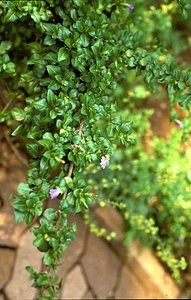
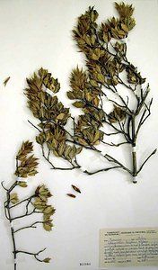
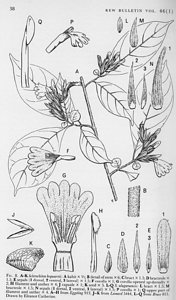

# [[Sclerochiton]] 

 

	
## #has_/text_of_/abstract 

> **Sclerochiton** is a genus of flowering plants in the family Acanthaceae. 
> It includes 18 species native to tropical and southern Africa.
>
> [Wikipedia](https://en.wikipedia.org/wiki/Sclerochiton) 

## Phylogeny 

-   « Ancestral Groups  
    -   [Acantheae](../Acantheae.md)
    -   [Acanthaceae](../../Acanthaceae.md)
    -   [Lamiales](../../../Lamiales.md)
    -   [Asterids](../../../../Asterids.md)
    -   [Core Eudicots](Core_Eudicots)
    -   [Eudicots](../../../../../../Eudicots.md)
    -   [Flowering_Plant](../../../../../../../Flowering_Plant.md)
    -   [Seed_Plant](../../../../../../../../Seed_Plant.md)
    -   [Land_Plant](../../../../../../../../../Land_Plant.md)
    -   [Green plants](../../../../../../../../../../Plants.md)
    -   [Eukaryotes](Eukaryotes)
    -   [Tree of Life](../../../../../../../../../../../Tree_of_Life.md)

-   ◊ Sibling Groups of  Acantheae
    -   [Acanthus Clade](Acanthus_Clade)
    -   [Acanthopsis](Acanthopsis.md)
    -   [Blepharis](Blepharis.md)
    -   [Cynarospermum         asperrimum](Cynarospermum_asperrimum)
    -   [Crossandrella dusenii](Crossandrella_dusenii)
    -   [Streptosiphon hirsutus](Streptosiphon_hirsutus)
    -   Sclerochiton
    -   [Crossandra](Crossandra.md)
    -   [Stenandriopsis Clade](Stenandriopsis_Clade)
    -   [Stenandrium Clade](Stenandrium_Clade)
    -   [Other New World         Acantheae](Other_New_World_Acantheae)

-   » Sub-Groups 
	-   *Sclerochiton harveyanus* [ Nees]
	-   *Sclerochiton ilicifolius* [ Meeuse]
	-   *Sclerochiton triacanthus* [ Meeuse]
	-   *Sclerochiton vogelii*[ (Nees) T. Anderson]

## Introduction

[Lucinda A. McDade and Carrie Kiel]() 

*Sclerochiton* is a mostly eastern and southern African genus of 18
species (Vollesen 1991). There is support from DNA sequence data for
monophyly of this genus, and the plants share a small prickle on the
medial ventral surface of the anthers. As described in our discussion of
*Streptosiphon* and *Crossandrella*, molecular data place these last two
genera with *Sclerochiton* with strong support but morphological
evidence is not as clear. Notably, *Sclerochiton* shared remarkably bony
filaments and insertion of the filaments into of thickened flange of the
internal corolla surface with *Cynarospermum* - *Acanthus* clade;
*Streptosiphon* and *Crossandrella* lack these androecial traits. On the
other hand, *Crossandrella* shares the remarkable four lobed , \"fused,
sheathing, reduced\" calyx with *Cynarospermum* - *Acanthus* clade where
*Sclerochiton* lacks this trait. It will be interesting to see whether
more data and/or study of additional characters clarifies these enigmas.

## Title Illustrations

---------------------------------------------------------------------------

Scientific Name ::     Sclerochiton harveyanus Nees
Specimen Condition   Live Specimen
Copyright ::            © 2006 [Lucinda A. McDade](mailto:lucinda.mcdade@cgu.edu) 

---------------------------------------------------------------------------
 
Scientific Name ::     Sclerochiton ilicifolius A. Meeuse
Location ::           South Africa
Reference            Lieden Herbarium (L)
Specimen Condition   Dead Specimen
Collection           L
Collector            Meeuse 9657
Copyright ::            © 2006 [Lucinda A. McDade](mailto:lucinda.mcdade@cgu.edu) 

---------------------------------------------------------------------------

Scientific Name ::  Sclerochiton bequaertii De Wild.
Reference         Vollesen, Kaj. 1991. A revision of the African genus Sclerochiton (Acanthaceae: Acantheae). Kew Bulletin 46(1):38.
Creator           Drawn by Eleanor Catherine
Copyright ::         © 2006 [Lucinda A. McDade](mailto:lucinda.mcdade@cgu.edu) 

---------------------------------------------------------------------------

Scientific Name ::     Sclerochiton ilicifolius A. Meeuse
Location ::           South Africa
Specimen Condition   Dead Specimen
Copyright ::            © 2006 [Lucinda A. McDade](mailto:lucinda.mcdade@cgu.edu) 

## Confidential Links & Embeds: 

### #is_/same_as :: [Sclerochiton](/_Standards/bio/bio~Domain/Eukaryotes/Plants/Land_Plant/Seed_Plant/Flowering_Plant/Eudicots/Core_Eudicots/Asterids/Lamiales/Acanthaceae/Acantheae/Sclerochiton.md) 

### #is_/same_as :: [Sclerochiton.public](/_public/bio/bio~Domain/Eukaryotes/Plants/Land_Plant/Seed_Plant/Flowering_Plant/Eudicots/Core_Eudicots/Asterids/Lamiales/Acanthaceae/Acantheae/Sclerochiton.public.md) 

### #is_/same_as :: [Sclerochiton.internal](/_internal/bio/bio~Domain/Eukaryotes/Plants/Land_Plant/Seed_Plant/Flowering_Plant/Eudicots/Core_Eudicots/Asterids/Lamiales/Acanthaceae/Acantheae/Sclerochiton.internal.md) 

### #is_/same_as :: [Sclerochiton.protect](/_protect/bio/bio~Domain/Eukaryotes/Plants/Land_Plant/Seed_Plant/Flowering_Plant/Eudicots/Core_Eudicots/Asterids/Lamiales/Acanthaceae/Acantheae/Sclerochiton.protect.md) 

### #is_/same_as :: [Sclerochiton.private](/_private/bio/bio~Domain/Eukaryotes/Plants/Land_Plant/Seed_Plant/Flowering_Plant/Eudicots/Core_Eudicots/Asterids/Lamiales/Acanthaceae/Acantheae/Sclerochiton.private.md) 

### #is_/same_as :: [Sclerochiton.personal](/_personal/bio/bio~Domain/Eukaryotes/Plants/Land_Plant/Seed_Plant/Flowering_Plant/Eudicots/Core_Eudicots/Asterids/Lamiales/Acanthaceae/Acantheae/Sclerochiton.personal.md) 

### #is_/same_as :: [Sclerochiton.secret](/_secret/bio/bio~Domain/Eukaryotes/Plants/Land_Plant/Seed_Plant/Flowering_Plant/Eudicots/Core_Eudicots/Asterids/Lamiales/Acanthaceae/Acantheae/Sclerochiton.secret.md)

