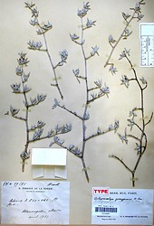
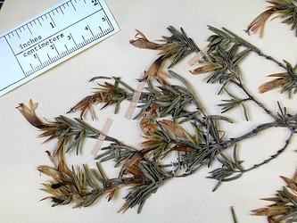
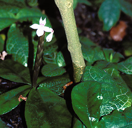
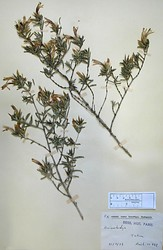

## Phylogeny 

-   « Ancestral Groups  
    -   [Acantheae](../Acantheae.md)
    -   [Acanthaceae](../../Acanthaceae.md)
    -   [Lamiales](../../../Lamiales.md)
    -   [Asterids](../../../../Asterids.md)
    -   [Core Eudicots](Core_Eudicots)
    -   [Eudicots](../../../../../../Eudicots.md)
    -   [Flowering_Plant](../../../../../../../Flowering_Plant.md)
    -   [Seed_Plant](../../../../../../../../Seed_Plant.md)
    -   [Land_Plant](../../../../../../../../../Land_Plant.md)
    -   [Green plants](../../../../../../../../../../Plants.md)
    -   [Eukaryotes](Eukaryotes)
    -   [Tree of Life](../../../../../../../../../../../Tree_of_Life.md)

-   ◊ Sibling Groups of  Acantheae
    -   [Acanthus Clade](Acanthus_Clade)
    -   [Acanthopsis](Acanthopsis.md)
    -   [Blepharis](Blepharis.md)
    -   [Cynarospermum         asperrimum](Cynarospermum_asperrimum)
    -   [Crossandrella dusenii](Crossandrella_dusenii)
    -   [Streptosiphon hirsutus](Streptosiphon_hirsutus)
    -   [Sclerochiton](Sclerochiton.md)
    -   [Crossandra](Crossandra.md)
    -   Stenandriopsis Clade
    -   [Stenandrium Clade](Stenandrium_Clade)
    -   [Other New World         Acantheae](Other_New_World_Acantheae)

-   » Sub-Groups 

# *Stenandriopsis Clade* 

[Lucinda A. McDade and Carrie Kiel](http://www.tolweb.org/)

-   *Achyrocalyx decaryi* [ Benoist]
-   *Stenandrium afromontanum*[ (Mildbr.) Vollesen]
    [(=Stenandriopsis afromontana (Mildbr.) Benoist)]
-   *Stenandrium guineensis*[ (Nees) Vollesen ]
    [(=Stenandriopsis guineense (Nees) Benoist)]
-   *Stenandrium humile Benoist Vollesen* [ (Benoist ) Vollesen
    ] [(=Stenandriopsis humile Benoist)]
-   *Stenandrium thompsonii*[ (S. Moore) Vollesen ]
    [(=Stenandriopsis thompsonii S. Moore)]
-   *Stenandrium warneckei*[ (S. Moore) Vollesen ] [(=
    Stenandriopsis warneckei (S. Moore) Napper)]

Note: this taxon list is still under construction. It does not yet
contain all known *Stenandriopsis Clade* subgroups.

The list presented here is of taxa that were included in the analyses of
McDade et al. (2005).  We use the genus name *Stenandrium* for these
plants because they have been most recently treated by Vollesen (1992)
as members of that genus.  Vollesen (1992) treated a number of
additional Old World plants as closely related to those listed above;
these likely belong here but this remains to be confirmed by additional
study.\

Containing group: [Acantheae](../Acantheae.md)

### Introduction

The basal clade of the \"Two-lipped Corolla\" lineage apparently
includes all Old World Acantheae that retain the primitive corolla
morphology. *Stenandriopsis* is a genus of 17 species that are
distributed in Africa and Madagascar. Based in part on the similar (but
plesiomorphic) corolla morphology, Vollesen (1992) transferred species
of *Stenandriopsis* to *Stenandrium,* but molecular data indicate that
the Old World and New World plants instead form two distinct lineages.
The small Malagasy genus *Achyrocalyx* (3 species) is also part of the
*Stenandriopsis* clade and our data indicate that recognition of this
genus as distinct from *Stenandriopsis* may be unwarranted.

### References

McDade, L. A., T. F. Daniel, C. A. Kiel, and K. Vollesen. 2005.
Phylogenetic relatinships among Acantheae (Acanthaceae): Major lineages
present contrasting patterns of molecular evolution and morphological
differentiation. Systematic Botany 30: 834-862.

Vollesen, K. 1992. The Old World species of Stenandrium (Acanthaceae:
Acantheae). Kew Bulletin 47: 169-202.

##### Title Illustrations



  ---------------------------------------------------------------------------
  Scientific Name ::     Achyrocalyx gossypinus Benoist
  Location ::           Madagascar
  Reference            \(P\) Herbarium Museum Paris
  Specimen Condition   Dead Specimen
  Collector            Perrier de la Bathie
  Copyright ::            © 2006 [Lucinda A. McDade](mailto:lucinda.mcdade@cgu.edu) 
  ---------------------------------------------------------------------------


  ---------------------------------------------------------------------------
  Scientific Name ::     Achyrocalyx pungens Benoist
  Location ::           Madagascar
  Specimen Condition   Dead Specimen
  Copyright ::            © 2006 [Lucinda A. McDade](mailto:lucinda.mcdade@cgu.edu) 
  ---------------------------------------------------------------------------


  ---------------------------------------------------------------------------
  Scientific Name ::     Stenandrium guineensis (Nees) Vollesen
  Location ::           Greenhouses, Kew Botanical Garden, Richmond England
  Specimen Condition   Live Specimen
  Identified By        K. Vollesen
  Copyright ::            © 2006 [Lucinda A. McDade](mailto:lucinda.mcdade@cgu.edu) 
  ---------------------------------------------------------------------------


  ---------------------------------------------------------------------------
  Scientific Name ::     Achyrocalyx pungens Benoist
  Location ::           Madagascar
  Reference            \(P\) Herbarium Museum Paris
  Specimen Condition   Dead Specimen
  Collector            Rauh
  Copyright ::            © 2006 [Lucinda A. McDade](mailto:lucinda.mcdade@cgu.edu) 
  ---------------------------------------------------------------------------
