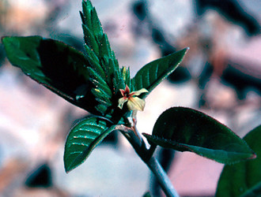

## Phylogeny 

-   « Ancestral Groups  
    -   [Acantheae](../Acantheae.md)
    -   [Acanthaceae](../../Acanthaceae.md)
    -   [Lamiales](../../../Lamiales.md)
    -   [Asterids](../../../../Asterids.md)
    -   [Core Eudicots](Core_Eudicots)
    -   [Eudicots](../../../../../../Eudicots.md)
    -   [Flowering_Plant](../../../../../../../Flowering_Plant.md)
    -   [Seed_Plant](../../../../../../../../Seed_Plant.md)
    -   [Land_Plant](../../../../../../../../../Land_Plant.md)
    -   [Green plants](../../../../../../../../../../Plants.md)
    -   [Eukaryotes](Eukaryotes)
    -   [Tree of Life](../../../../../../../../../../../Tree_of_Life.md)

-   ◊ Sibling Groups of  Acantheae
    -   [Acanthus Clade](Acanthus_Clade)
    -   [Acanthopsis](Acanthopsis.md)
    -   [Blepharis](Blepharis.md)
    -   [Cynarospermum         asperrimum](Cynarospermum_asperrimum)
    -   [Crossandrella dusenii](Crossandrella_dusenii)
    -   [Streptosiphon hirsutus](Streptosiphon_hirsutus)
    -   [Sclerochiton](Sclerochiton.md)
    -   [Crossandra](Crossandra.md)
    -   [Stenandriopsis Clade](Stenandriopsis_Clade)
    -   Stenandrium Clade
    -   [Other New World         Acantheae](Other_New_World_Acantheae)

-   » Sub-Groups 

	-   *Aphelandra verticillata* [ Nees]
	-   *Holographis ehrenbergiana* [ Nees]
	-   *Holographis pallida* [ Leonard & Gentry]
	-   *Holographis velutifolia*[ (House) T. F. Daniel]
	-   *Neriacanthus purdieanus* [ Benth.]
	-   *Salpixantha coccinea* [ Hook.]
	-   *Stenandrium mandioccanum* [ Nees]
	-   *Stenandrium pilosulum*[ (S. F. Blake) T. F. Daniel]
# [[Stenandrium]] 

     

## #has_/text_of_/abstract 

> **Stenandrium**  is a genus of flowering plants in the family Acanthaceae native to the Americas, with 50 species of perennial herbs ranging from the southern United States to northern Argentina and central Chile.
>
> [Wikipedia](https://en.wikipedia.org/wiki/Stenandrium) 

## Introduction

[Lucinda A. McDade and Carrie Kiel]() 

The *Stenandrium* clade includes the New World genera *Stenandrium* and
*Holographis* plus three surprises: the two Jamaican Acantheae,
*Salpixantha* (with a single species) and *Neriacanthus* *purdieanus*
(one of five species, the others occur in mainly South America and
Panama) are part of the *Stenandrium* clade as is at least one species
of *Aphelandra*, *A. verticillata* (so far as we know, the other species
of *Aphelandra* are part of the \"Other New World Acantheae\" clade).
Interestingly, so far as is known, plants belonging to this clade share
a base chromosome number of 13 which appears to be a synapomorphy and
distinguishes these plants from other New World Acantheae which (again,
so far as is known) have x = 14. Chromosome numbers are not known for
*Salpixantha*, *N. purdieanus* or *A. verticillata* but we predict x =
13 for these taxa. This clade is remarkable for its diversity of corolla
morphologies, presumably associated with adaptation for different
pollinators although empirical studies are few.

## Title Illustrations

--------------------------------------------------------------------------

Scientific Name ::     Salpixantha coccinea Hook.
Reference            British Museum (BM)
Specimen Condition   Dead Specimen
Collection           BM
Collector            George R. Procter 11046
Copyright ::            © [Lucinda A. McDade](mailto:lucinda.mcdade@cgu.edu) 

--------------------------------------------------------------------------

Scientific Name ::     Holographis argyrea (Leonard) T.F. Daniel
Specimen Condition   Live Specimen
Copyright ::            © [Lucinda A. McDade](mailto:lucinda.mcdade@cgu.edu) 

---------------------------------------------------------------------------

Scientific Name ::     Holographis ehrenbergiana Nees
Location ::           Mexico
Reference            Kew Botanical Gardens (KEW)
Specimen Condition   Dead Specimen
Collection           K
Collector            C. A. Purpose
Copyright ::            © 2006 [Lucinda A. McDade](mailto:lucinda.mcdade@cgu.edu) 

## Confidential Links & Embeds: 

### [Stenandrium](/_Standards/bio/bio~Domain/Eukaryotes/Plants/Land_Plant/Seed_Plant/Flowering_Plant/Eudicots/Core_Eudicots/Asterids/Lamiales/Acanthaceae/Acantheae/Stenandrium.md) 

### [Stenandrium.public](/_public/bio/bio~Domain/Eukaryotes/Plants/Land_Plant/Seed_Plant/Flowering_Plant/Eudicots/Core_Eudicots/Asterids/Lamiales/Acanthaceae/Acantheae/Stenandrium.public.md) 

### [Stenandrium.internal](/_internal/bio/bio~Domain/Eukaryotes/Plants/Land_Plant/Seed_Plant/Flowering_Plant/Eudicots/Core_Eudicots/Asterids/Lamiales/Acanthaceae/Acantheae/Stenandrium.internal.md) 

### [Stenandrium.protect](/_protect/bio/bio~Domain/Eukaryotes/Plants/Land_Plant/Seed_Plant/Flowering_Plant/Eudicots/Core_Eudicots/Asterids/Lamiales/Acanthaceae/Acantheae/Stenandrium.protect.md) 

### [Stenandrium.private](/_private/bio/bio~Domain/Eukaryotes/Plants/Land_Plant/Seed_Plant/Flowering_Plant/Eudicots/Core_Eudicots/Asterids/Lamiales/Acanthaceae/Acantheae/Stenandrium.private.md) 

### [Stenandrium.personal](/_personal/bio/bio~Domain/Eukaryotes/Plants/Land_Plant/Seed_Plant/Flowering_Plant/Eudicots/Core_Eudicots/Asterids/Lamiales/Acanthaceae/Acantheae/Stenandrium.personal.md) 

### [Stenandrium.secret](/_secret/bio/bio~Domain/Eukaryotes/Plants/Land_Plant/Seed_Plant/Flowering_Plant/Eudicots/Core_Eudicots/Asterids/Lamiales/Acanthaceae/Acantheae/Stenandrium.secret.md)

