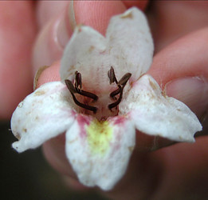
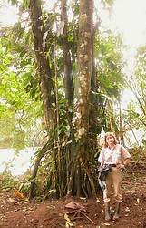

# [[Bravaisia]] 

 
 

## Phylogeny 

-   « Ancestral Groups  
    -   [Ruellieae](../Ruellieae.md)
    -   [Acanthaceae](../../Acanthaceae.md)
    -   [Lamiales](../../../Lamiales.md)
    -   [Asterids](../../../../Asterids.md)
    -   [Core Eudicots](Core_Eudicots)
    -   [Eudicots](../../../../../../Eudicots.md)
    -   [Flowering_Plant](../../../../../../../Flowering_Plant.md)
    -   [Seed_Plant](../../../../../../../../Seed_Plant.md)
    -   [Land_Plant](../../../../../../../../../Land_Plant.md)
    -   [Green plants](../../../../../../../../../../Plants.md)
    -   [Eukaryotes](Eukaryotes)
    -   [Tree of Life](../../../../../../../../../../../Tree_of_Life.md)

-   ◊ Sibling Groups of  Ruellieae
    -   [Ruellia s. l.](Ruellia_s._l.)
    -   [Acanthopale](Acanthopale.md)
    -   [Brillantaisia](Brillantaisia.md)
    -   [Hemigraphis + Strobilanthes +         relatives](Hemigraphis_%2B_Strobilanthes_%2B_relatives)
    -   Bravaisia
    -   [Suessenguthia](Suessenguthia.md)
    -   [Sanchezia](Sanchezia.md)
    -   [Louteridium](Louteridium.md)
    -   [Dyschoriste](Dyschoriste.md)
    -   [Phaulopsis](Phaulopsis.md)

-   » Sub-Groups 

## Introduction

[Erin Tripp]()

*Bravaisia* is a genus of three species native to Mexico through
northern South America. They are distinct among Acanthaceae in being
moderately-sized trees, with *Bravaisia integerrima* reaching some 20 m
in height (a few other genera contain small trees, e.g. *Louteridium,
Ruellia,* and *Trichanthera*). *Bravaisia* species inhabit riparian or
mangrove environments and possess prop roots (see photo above) to 8 m
above ground level (Daniel 1988). Flowers of *B. integerrima* are
possibly fragrant, also notable in Acanthaceae.

## Title Illustrations

----------------------------------------------------------------------

Scientific Name ::  Bravaisia integerrima Standl.
Location ::        La Selva, Costa Rica
Copyright ::         © [Erin Tripp](mailto:erin.tripp@duke.edu) 

-----------------------------------------------------------------------

Scientific Name ::     Bravaisia integerrima Standl.
Location ::           La Selva, Costa Rica
Specimen Condition   Live Specimen
Copyright ::            © [Erin Tripp](mailto:erin.tripp@duke.edu) 

## Confidential Links & Embeds: 

### #is_/same_as :: [Bravaisia](/_Standards/bio/bio~Domain/Eukaryotes/Plants/Land_Plant/Seed_Plant/Flowering_Plant/Eudicots/Core_Eudicots/Asterids/Lamiales/Acanthaceae/Ruellieae/Bravaisia.md) 

### #is_/same_as :: [Bravaisia.public](/_public/bio/bio~Domain/Eukaryotes/Plants/Land_Plant/Seed_Plant/Flowering_Plant/Eudicots/Core_Eudicots/Asterids/Lamiales/Acanthaceae/Ruellieae/Bravaisia.public.md) 

### #is_/same_as :: [Bravaisia.internal](/_internal/bio/bio~Domain/Eukaryotes/Plants/Land_Plant/Seed_Plant/Flowering_Plant/Eudicots/Core_Eudicots/Asterids/Lamiales/Acanthaceae/Ruellieae/Bravaisia.internal.md) 

### #is_/same_as :: [Bravaisia.protect](/_protect/bio/bio~Domain/Eukaryotes/Plants/Land_Plant/Seed_Plant/Flowering_Plant/Eudicots/Core_Eudicots/Asterids/Lamiales/Acanthaceae/Ruellieae/Bravaisia.protect.md) 

### #is_/same_as :: [Bravaisia.private](/_private/bio/bio~Domain/Eukaryotes/Plants/Land_Plant/Seed_Plant/Flowering_Plant/Eudicots/Core_Eudicots/Asterids/Lamiales/Acanthaceae/Ruellieae/Bravaisia.private.md) 

### #is_/same_as :: [Bravaisia.personal](/_personal/bio/bio~Domain/Eukaryotes/Plants/Land_Plant/Seed_Plant/Flowering_Plant/Eudicots/Core_Eudicots/Asterids/Lamiales/Acanthaceae/Ruellieae/Bravaisia.personal.md) 

### #is_/same_as :: [Bravaisia.secret](/_secret/bio/bio~Domain/Eukaryotes/Plants/Land_Plant/Seed_Plant/Flowering_Plant/Eudicots/Core_Eudicots/Asterids/Lamiales/Acanthaceae/Ruellieae/Bravaisia.secret.md)

