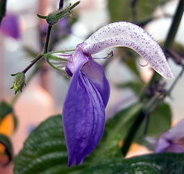
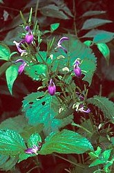

# [[Brillantaisia]] 

   

## #has_/text_of_/abstract 

> **Brillantaisia** is a genus of plants in the family Acanthaceae. 
> They are native to the African tropics and subtropics, including Madagascar. 
> They may grow from 20 cm to 2 m in height. 
> Their hirsute stems are square in cross-section 
> and their heart-shaped leaves have an opposite arrangement. 
> 
> Their purple or white pea-like flowers produce long, cigar-shaped seed pods. 
> They reproduce easily from seeds or vegetatively. 
> One species, B. lamium, is invasive in Queensland.
>
> [Wikipedia](https://en.wikipedia.org/wiki/Brillantaisia)

## Phylogeny 

-   « Ancestral Groups  
    -   [Ruellieae](../Ruellieae.md)
    -   [Acanthaceae](../../Acanthaceae.md)
    -   [Lamiales](../../../Lamiales.md)
    -   [Asterids](../../../../Asterids.md)
    -   [Core Eudicots](Core_Eudicots)
    -   [Eudicots](../../../../../../Eudicots.md)
    -   [Flowering_Plant](../../../../../../../Flowering_Plant.md)
    -   [Seed_Plant](../../../../../../../../Seed_Plant.md)
    -   [Land_Plant](../../../../../../../../../Land_Plant.md)
    -   [Green plants](../../../../../../../../../../Plants.md)
    -   [Eukaryotes](Eukaryotes)
    -   [Tree of Life](../../../../../../../../../../../Tree_of_Life.md)

-   ◊ Sibling Groups of  Ruellieae
    -   [Ruellia s. l.](Ruellia_s._l.)
    -   [Acanthopale](Acanthopale.md)
    -   Brillantaisia
    -   [Hemigraphis + Strobilanthes +         relatives](Hemigraphis_%2B_Strobilanthes_%2B_relatives)
    -   [Bravaisia](Bravaisia.md)
    -   [Suessenguthia](Suessenguthia.md)
    -   [Sanchezia](Sanchezia.md)
    -   [Louteridium](Louteridium.md)
    -   [Dyschoriste](Dyschoriste.md)
    -   [Phaulopsis](Phaulopsis.md)

-   » Sub-Groups 

## Introduction

[Erin Tripp]()

The genus *Brillantaisia* contains ca. 20 species distributed in
tropical Africa and Madagascar. Species are large herbs with prominent,
quadrangular stems. Plants have attractive purple, bilabiate flowers
that are "hooded" in appearance. They are likely predominantly
bee-pollinated. The articulation of the fused corolla lobes permits a
pivoting motion that brings stamens into contact with floral visitors
(K. Sidwell, unpub. data). *Brillantaisia* species have two fertile
stamens (and two staminodes), like other genera in Ruellieae (e.g.
*Eranthemum, Louteridium*, and *Sanchezia*). The filament curtain in
*Brillantaisia* is of a particular type, being formed in part by the
inward folding of portions of the corolla (Manktelow 2000). This
morphology probably aids in the floral movement mechcanism.

## Title Illustrations

------------------------------------------------------------------------

Scientific Name ::     Brillantaisia nyanzarum Burkill (Ruellieae)
Location ::           Greenhouse, Duke University
Specimen Condition   Live Specimen
Identified By        E. A. Tripp
Copyright ::            © 2006 [Erin Tripp](mailto:erin.tripp@duke.edu) 

-------------------------------------

Scientific Name ::     Brillantaisia owariensis P. Beauv.
Specimen Condition   Live Specimen
Copyright ::            © 2003 [J. B. Carroll, M. Gage, L. Hurst & N. Maddison](http://www.rbgkew.org.uk/scihort/wta/mefou.html)

## Confidential Links & Embeds: 

### [Brillantaisia](/_Standards/bio/bio~Domain/Eukaryotes/Plants/Land_Plant/Seed_Plant/Flowering_Plant/Eudicots/Core_Eudicots/Asterids/Lamiales/Acanthaceae/Ruellieae/Brillantaisia.md) 

### [Brillantaisia.public](/_public/bio/bio~Domain/Eukaryotes/Plants/Land_Plant/Seed_Plant/Flowering_Plant/Eudicots/Core_Eudicots/Asterids/Lamiales/Acanthaceae/Ruellieae/Brillantaisia.public.md) 

### [Brillantaisia.internal](/_internal/bio/bio~Domain/Eukaryotes/Plants/Land_Plant/Seed_Plant/Flowering_Plant/Eudicots/Core_Eudicots/Asterids/Lamiales/Acanthaceae/Ruellieae/Brillantaisia.internal.md) 

### [Brillantaisia.protect](/_protect/bio/bio~Domain/Eukaryotes/Plants/Land_Plant/Seed_Plant/Flowering_Plant/Eudicots/Core_Eudicots/Asterids/Lamiales/Acanthaceae/Ruellieae/Brillantaisia.protect.md) 

### [Brillantaisia.private](/_private/bio/bio~Domain/Eukaryotes/Plants/Land_Plant/Seed_Plant/Flowering_Plant/Eudicots/Core_Eudicots/Asterids/Lamiales/Acanthaceae/Ruellieae/Brillantaisia.private.md) 

### [Brillantaisia.personal](/_personal/bio/bio~Domain/Eukaryotes/Plants/Land_Plant/Seed_Plant/Flowering_Plant/Eudicots/Core_Eudicots/Asterids/Lamiales/Acanthaceae/Ruellieae/Brillantaisia.personal.md) 

### [Brillantaisia.secret](/_secret/bio/bio~Domain/Eukaryotes/Plants/Land_Plant/Seed_Plant/Flowering_Plant/Eudicots/Core_Eudicots/Asterids/Lamiales/Acanthaceae/Ruellieae/Brillantaisia.secret.md)

