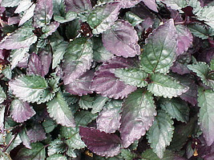
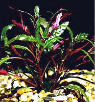

# *Hemigraphis + Strobilanthes + relatives* 

   

## #has_/text_of_/abstract 

> **Hemigraphis** is a genus of plants in the family Acanthaceae, 
> consisting of 34 species native to tropical Asia. 
> 
> Hemigraphis is similar to plants the genus Strobilanthes, with some species now placed there. 
> Its native range is Nansei-shoto and from Indo-China to New Guinea.
>
> [Wikipedia](https://en.wikipedia.org/wiki/Hemigraphis) 

## Phylogeny 

-   « Ancestral Groups  
    -   [Ruellieae](../Ruellieae.md)
    -   [Acanthaceae](../../Acanthaceae.md)
    -   [Lamiales](../../../Lamiales.md)
    -   [Asterids](../../../../Asterids.md)
    -   [Core Eudicots](Core_Eudicots)
    -   [Eudicots](../../../../../../Eudicots.md)
    -   [Flowering_Plant](../../../../../../../Flowering_Plant.md)
    -   [Seed_Plant](../../../../../../../../Seed_Plant.md)
    -   [Land_Plant](../../../../../../../../../Land_Plant.md)
    -   [Green plants](../../../../../../../../../../Plants.md)
    -   [Eukaryotes](Eukaryotes)
    -   [Tree of Life](../../../../../../../../../../../Tree_of_Life.md)

-   ◊ Sibling Groups of  Ruellieae
    -   [Ruellia s. l.](Ruellia_s._l.)
    -   [Acanthopale](Acanthopale.md)
    -   [Brillantaisia](Brillantaisia.md)
    -   Hemigraphis + Strobilanthes + relatives
    -   [Bravaisia](Bravaisia.md)
    -   [Suessenguthia](Suessenguthia.md)
    -   [Sanchezia](Sanchezia.md)
    -   [Louteridium](Louteridium.md)
    -   [Dyschoriste](Dyschoriste.md)
    -   [Phaulopsis](Phaulopsis.md)

-   » Sub-Groups 

## Introduction

[Erin Tripp]() 

*Hemigraphis* is a taxonomically difficult genus 
with a center of diversity in the Philippines and Malesia. 
As of 1998, there were approximately 146 published names, 
but several of these are likely synonyms (Moylan 1999). 

*Strobilanthes* is a large genus of ca. 300 species. 
Species are distributed throughout southern, southeast, 
and peninsular Asia as well as northern Australia. 

*Strobilanthes* is commonly characterized 
by having flowers with two rows of hairs 
on the posterior corolla surface that retain style. 

The filament curtain in *Strobilanthes* is of a particular type, 
consisting of a partially developed 5th (posterior) filament 
that forms a small lobe or ridge 
between the other four, fused filaments (Manktelow 2000). 

Some species of *Strobilanthes* and *Hemigraphis* 
are cultivated for their attractive, vegetative
qualities. 

Recent phylogenetic analyses (Moylan et al. 2004) suggest
*Strobilanthes*, along with *Hemigraphis* and *Sericocalyx* are
non-monophyletic. These authors proposed an expanded genus
*Strobilanthes* s.l. to include *Aechmanthera, Clarkeasia, Hemigraphis,
Sericocalyx*, and *Stenosiphonium*. *Strobilanthes* s.l. replaces
several small, segregate genera of Strobilanthinae (sensu Bremekamp
1944).

## Title Illustrations

-------------------------------------

Scientific Name ::     Hemigraphis alternata T.Anders.
Specimen Condition   Live Specimen
Copyright ::            © [Missouri Botanical Garden (MO)](http://www.mobot.org/gardeninghelp/plantfinder/Plant.asp?Code=A514)

-------------------------

Scientific Name ::     Hemigraphis repanda Lindau
Specimen Condition   Live Specimen
Copyright ::            © 2005 [www.akva.sk](http://www.shop.akva.sk/index.php?cPath=32)

## Confidential Links & Embeds: 

### [Hemigraphis](/_Standards/bio/bio~Domain/Eukaryotes/Plants/Land_Plant/Seed_Plant/Flowering_Plant/Eudicots/Core_Eudicots/Asterids/Lamiales/Acanthaceae/Ruellieae/Hemigraphis.md) 

### [Hemigraphis.public](/_public/bio/bio~Domain/Eukaryotes/Plants/Land_Plant/Seed_Plant/Flowering_Plant/Eudicots/Core_Eudicots/Asterids/Lamiales/Acanthaceae/Ruellieae/Hemigraphis.public.md) 

### [Hemigraphis.internal](/_internal/bio/bio~Domain/Eukaryotes/Plants/Land_Plant/Seed_Plant/Flowering_Plant/Eudicots/Core_Eudicots/Asterids/Lamiales/Acanthaceae/Ruellieae/Hemigraphis.internal.md) 

### [Hemigraphis.protect](/_protect/bio/bio~Domain/Eukaryotes/Plants/Land_Plant/Seed_Plant/Flowering_Plant/Eudicots/Core_Eudicots/Asterids/Lamiales/Acanthaceae/Ruellieae/Hemigraphis.protect.md) 

### [Hemigraphis.private](/_private/bio/bio~Domain/Eukaryotes/Plants/Land_Plant/Seed_Plant/Flowering_Plant/Eudicots/Core_Eudicots/Asterids/Lamiales/Acanthaceae/Ruellieae/Hemigraphis.private.md) 

### [Hemigraphis.personal](/_personal/bio/bio~Domain/Eukaryotes/Plants/Land_Plant/Seed_Plant/Flowering_Plant/Eudicots/Core_Eudicots/Asterids/Lamiales/Acanthaceae/Ruellieae/Hemigraphis.personal.md) 

### [Hemigraphis.secret](/_secret/bio/bio~Domain/Eukaryotes/Plants/Land_Plant/Seed_Plant/Flowering_Plant/Eudicots/Core_Eudicots/Asterids/Lamiales/Acanthaceae/Ruellieae/Hemigraphis.secret.md)

