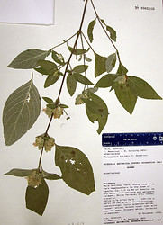

## Phylogeny 

-   « Ancestral Groups  
    -   [Ruellieae](../Ruellieae.md)
    -   [Acanthaceae](../../Acanthaceae.md)
    -   [Lamiales](../../../Lamiales.md)
    -   [Asterids](../../../../Asterids.md)
    -   [Core Eudicots](Core_Eudicots)
    -   [Eudicots](../../../../../../Eudicots.md)
    -   [Flowering_Plant](../../../../../../../Flowering_Plant.md)
    -   [Seed_Plant](../../../../../../../../Seed_Plant.md)
    -   [Land_Plant](../../../../../../../../../Land_Plant.md)
    -   [Green plants](../../../../../../../../../../Plants.md)
    -   [Eukaryotes](Eukaryotes)
    -   [Tree of Life](../../../../../../../../../../../Tree_of_Life.md)

-   ◊ Sibling Groups of  Ruellieae
    -   [Ruellia s. l.](Ruellia_s._l.)
    -   [Acanthopale](Acanthopale.md)
    -   [Brillantaisia](Brillantaisia.md)
    -   [Hemigraphis + Strobilanthes +         relatives](Hemigraphis_%2B_Strobilanthes_%2B_relatives)
    -   [Bravaisia](Bravaisia.md)
    -   [Suessenguthia](Suessenguthia.md)
    -   [Sanchezia](Sanchezia.md)
    -   [Louteridium](Louteridium.md)
    -   [Dyschoriste](Dyschoriste.md)
    -   Phaulopsis

-   » Sub-Groups 

# *Phaulopsis* 

[Erin Tripp](http://www.tolweb.org/)

Containing group: [Ruellieae](../Ruellieae.md)

### Introduction

*Phaulopsis* is predominantly an African genus with a center of
diversity in southern Zaire. Most species occur within 10 degrees of the
northern and southern parallels. Manktelow (1996) treated 22 species
(plus a few intraspecific names) in her monograph of the genus. Species
are mostly insect pollinated or autogamous. Some have medicinal,
cultural, or nutritional uses.

### References

Manktelow, M. 1996. Phaulopsis (Acanthaceae) -- a monograph. Symb. Bot.
Ups. 31 (2): 1-184.

##### Title Illustrations



  ------------------------------------------------------------------------
  Scientific Name ::     Phaulopsis barteri T. Anderson
  Location ::           Ghana
  Specimen Condition   Dead Specimen
  Collector            Schmidt
  Copyright ::            © 2006 [Erin Tripp](mailto:erin.tripp@duke.edu) 
  ------------------------------------------------------------------------


  ------------------------------------------------------------------------
  Scientific Name ::     Phaulopsis barteri T. Anderson
  Location ::           Ghana
  Specimen Condition   Dead Specimen
  Collector            Schmidt
  Copyright ::            © 2006 [Erin Tripp](mailto:erin.tripp@duke.edu) 
  ------------------------------------------------------------------------
